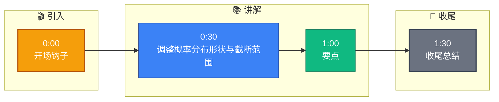

# LLM 的解码策略有哪些?Temperature 和 Top-p 怎么影响输出

**回答：** 
1. **贪心解码:**
每一步选择概率最高的 token.
确定性输出,适合代码生成或数学计算等需要精确结果的场景.
**缺点**:容易陷入死循环重复或缺乏多样性.

2. **采样:**
按概率分布随机采样下一个 token.
引入随机性,输出更多样化,适合创意写作.

3. **Temperature (温度参数):**
控制概率分布的平滑程度。
- **T = 0**: 等同于贪心解码，完全确定性。
- **T = 1**: 标准分布，正常采样。
- **T > 1**: 分布更平坦 (Smooth)，低概率 token 被选择的概率增大 → 更随机，更有创造力，但容易产生幻觉。
  - 公式: $P(token_i) = \frac{\exp(logit_i / T)}{\sum \exp(logit_j / T)}$
- **T < 1**: 分布更尖锐，高概率 token 更容易被选择 → 更确定，事实性更严谨。
  **建议：** 事实性任务 T=0~0.2, 创意任务 T=0.7-1.0.

4. **Top-p (Nucleus Sampling):**
动态截断概率累积质量。只从概率总和达到 p 的最小 token 集合中采样.
- 例如 top_p=0.9: 将概率从高到低排序，取累加概率达到 90% 的最少数量的 tokens。
- **自适应地控制候选集大小**：对比 top-k 固定大小，top-p 能适应分布的陡峭或平坦。

5. **Top-k:**
只从概率最高的 k 个 token 中采样.
- 简单有效,但 k 的最优值因场景而异.
- **缺点**: 当概率分布极其不均匀时（如某 token 0.9，其余 0.1 分散），k=50 可能引入过多噪声。

6. **组合使用:**
**实际应用中通常组合使用：** 先用 temperature 调整分布平滑度，再用 top-p (或 top-k) 截断低概率尾部。
- **常见配置**: temperature=0.7, top_p=0.9.
- **注意**: 通常不建议同时开启 top-p 和 top-k，除非有特殊调优经验。

---

### 深化补充

**实战案例**：
在开发 AI 对话机器人时，若 Temperature 设置过高（如 1.5），模型在回答用户“帮我写个 SQL 查询用户表”时，会“幻觉”出不存在的字段名；若设置为 0，生成小说则变得生硬重复。**踩坑点**：Top-k 设置过小（如 k=1）配合低温度，会导致模型在中文生成中频繁出现“的、了”等无意义循环。

**代码示例 (Python - HuggingFace Transformers)**：
```python
from transformers import GenerationConfig

# 关键参数配置：Temperature + Top-p 采样
generation_config = GenerationConfig(
    temperature=0.7,     # 控制随机性
    top_p=0.9,           # 核采样，过滤低概率词
    do_sample=True,      # 必须开启采样，否则 top_p/temperature 无效
    repetition_penalty=1.1 # 防止重复生成
)

outputs = model.generate(
    input_ids,
    generation_config=generation_config,
    max_new_tokens=512
)
```

**对比表格 (解码策略选型)**：

| 策略 | 适用场景 | 优点 | 缺点 |
| :--- | :--- | :--- | :--- |
| **Greedy** | 代码生成、数学题、逻辑推理 | 结果确定，可复现，速度最快 | 容易陷入重复死循环，缺乏自然度 |
| **Temperature** | 创意写作、聊天 | 灵活调整创造力 | T>1 易导致事实性错误（幻觉） |
| **Top-p** | 通用文本生成 | 自适应过滤噪声，比 Top-k 稳定 | 计算稍微复杂，需排序累积概率 |
| **Top-k** | 早期生成任务 | 实现简单，计算快 | K值难定，固定大小不够灵活 |

```text
      Decoding Strategy Flow

      Logits (Raw Scores)
            │
            ▼
   ┌──────────────────┐
   │ Apply Temperature │  (Reshape distribution)
   └────────┬─────────┘
            │
            ▼
   ┌──────────────────┐
   │ Softmax -> Probs │
   └────────┬─────────┘
            │
            ▼
   ┌──────────────────┐     ┌──────────────┐
   │   Top-p / Top-k  │────►│ Filter Tokens│
   └────────┬─────────┘     └──────┬───────┘
            │                     │
            ▼                     ▼
      ┌─────────────┐      ┌──────────────┐
      │   Sample    │      │    Greedy    │
      │ (Stochastic)│      │ (Max Prob)   │
      └──────┬──────┘      └──────┬───────┘
             └─────────┬──────────┘
                       ▼
                 Next Token
```

**## 常见考点**
1. **Temperature 的数学本质**：为什么除以 T 会让分布变平？（结合 Softmax 公式解释，T 越大，Logits 差异被缩小，概率趋近均匀）。
2. **Top-p vs Top-k 的优劣**：为什么业界现在更常用 Top-p？（Top-p 是自适应的，能更好地处理不同置信度的分布；Top-k 在高置信度时仍可能选入噪声词）。
3. **Repetition Penalty (重复惩罚)**：除了 Temperature 和 Top-p，如何防止生成内容无限循环？（引入惩罚因子，降低重


## 核心流程图

```mermaid
flowchart TD
    Start([🚀 SpringBoot 启动<br/>main 方法]):::start
    SpringApplication[SpringApplication.run<br/>启动入口]:::process
    PrepareEnv[准备 Environment<br/>加载 application.yml]:::process
    ContextQ{{应用上下文?<br/>Servlet/Reactive}}:::decision
    ServletCtx[AnnotationConfigCtx<br/>传统 MVC]:::process
    ReactiveCtx[ReactiveWebCtx<br/>WebFlux]:::process
    Refresh[refresh 刷新容器<br/>核心入口]:::process
    BeanFactory[BeanFactory<br/>IoC 容器]:::store
    BeanDef[BeanDefinition<br/>扫描 @Component/@Bean]:::process
    ScanQ{{配置方式?<br/>注解/XML}}:::decision
    AnnoScan[ComponentScan<br/>ClassPathBeanDefinitionScanner]:::process
    XmlScan[XmlBeanDefinitionReader<br/>解析 XML]:::process
    Instantiate[实例化 Bean<br/>反射 newInstance]:::process
    Populate[属性填充<br/>依赖注入 @Autowired]:::process
    AwareQ{{实现 Aware 接口?}}:::decision
    Aware[BeanNameAware / ContextAware<br/>回调注入]:::process
    InitQ{{自定义初始化?}}:::decision
    PostConstruct[@PostConstruct<br/>初始化方法]:::process
    AOPQ{{需要 AOP 增强?<br/>切面 @Aspect}}:::decision
    Proxy[创建动态代理<br/>JDK/CGLIB]:::process
    ProxyChain[代理链<br/>MethodInvocation]:::process
    Final([✅ Bean 就绪 可用]):::start

    Start --> SpringApplication --> PrepareEnv --> ContextQ
    ContextQ -->|传统| ServletCtx --> Refresh
    ContextQ -->|响应式| ReactiveCtx --> Refresh
    Refresh --> BeanFactory --> BeanDef --> ScanQ
    ScanQ -->|注解| AnnoScan --> Instantiate
    ScanQ -->|XML| XmlScan --> Instantiate
    Instantiate --> Populate --> AwareQ
    AwareQ -->|是| Aware --> InitQ
    AwareQ -->|否| InitQ
    InitQ -->|是| PostConstruct --> AOPQ
    InitQ -->|否| AOPQ
    AOPQ -->|是| Proxy --> ProxyChain --> Final
    AOPQ -->|否| Final

    classDef start fill:#2563eb,stroke:#1e3a8a,color:#fff,stroke-width:2px;
    classDef process fill:#dbeafe,stroke:#3b82f6,color:#1e3a8a;
    classDef decision fill:#fef3c7,stroke:#f59e0b,color:#78350f,stroke-width:2px;
    classDef store fill:#8b5cf6,stroke:#6d28d9,color:#fff;

```

## 记忆要点

- Greedy确定性高，适合代码；采样随机性强，适合创意
- Temperature：T<1分布尖锐更严谨，T>1分布平坦更易幻觉
- Top-p：动态截断累积概率，比Top-k更自适应分布陡峭
- 实战配置：通常组合使用，如Temperature=0.7, Top-p=0.9


## 结构化回答

**30 秒电梯演讲：** 调整概率分布形状与截断范围，控制生成文本的随机性与多样性。——打个比方，像调水龙头温度，太高太随机，太低太死板。

**展开框架：**
1. **Greedy确定** — Greedy确定性高，适合代码；采样随机性强，适合创意
2. **Temperat** — Temperature：T<1分布尖锐更严谨，T>1分布平坦更易幻觉
3. **Top-p** — 动态截断累积概率，比Top-k更自适应分布陡峭

**收尾：** 以上三点都能配合实战聊。您想深入聊哪一块？

## 视频脚本

> 预计时长：2 分钟 | 由浅入深

| 时间 | 画面/字幕 | 口播台词 | 讲解要点 |
|------|----------|----------|----------|
| 0:00 | 标题卡 | "LLM 的解码策略有哪些，30 秒讲清楚。" | 开场钩子 |
| 0:30 | 概念定义动画 | "一句话：调整概率分布形状与截断范围，控制生成文本的随机性与多样性。" | 核心定义 |
| 1:00 | 要点图解 | "Greedy确定性高，适合代码；采样随机性强，适合创意" | 要点 |
| 1:30 | 总结卡 | "记好这几条，面试不慌。下期见。" | 收尾 |

### 视频流程图


