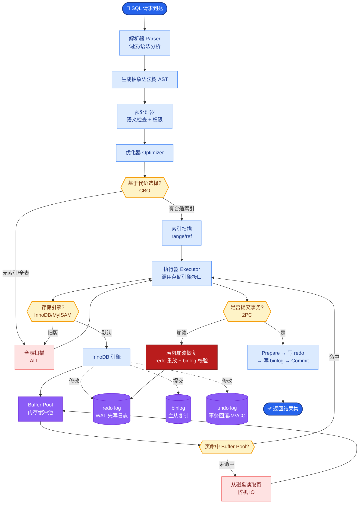

# Text2SQL 的核心流程是什么?在实际落地中有哪些关键挑战

- **Text2SQL** 是将自然语言问题自动转换为 SQL 查询的技术.

**核心流程：** 
1. **Schema Linking (模式链接)**: 将用户问题中的实体映射到数据库表/列，包括值映射（如"北京" -> `city='Beijing'`）和列映射。
2. **SQL 生成**: 基于 LLM + Schema 生成 SQL 语句。
3. **SQL 执行与验证**: 执行 SQL, 检查结果合理性（如非空检查、结果数量校验）。

**架构示意图：**
```text
用户输入 
   │
   ▼
┌─────────────────┐      Schema Linking      ┌──────────────┐
│  Natural Query  │ ────────────────────────> │ Database DB  │
└─────────────────┘                          │ (Tables/Cols)│
        │                                   └──────────────┘
        │                                          ▲
        ▼                                          │
┌─────────────────┐    Construct Prompt   ┌───────┴─────────┐
│   LLM Inference │ ─────────────────────> │ Context Builder│
└─────────────────┘                        └─────────────────┘
        │
        ▼ (Generated SQL)
┌─────────────────┐
│  SQL Executor   │ ──> 结果
└─────────────────┘
```

**关键挑战：** 
- 表名/列名歧义 (如 'name' 在多张表中存在，需基于上下文消歧)
- 复杂 JOIN 和子查询生成 (多表连接顺序、嵌套逻辑)
- 聚合函数选择 (COUNT vs SUM vs AVG)
- 数据库 Schema 过大导致 prompt 超长 (需 Schema 索引或检索)
- SQL 语法正确但语义错误 (如 `GROUP BY` 字段缺失)
- 嵌套查询与复杂逻辑 (EXISTS, CASE WHEN)

**最佳实践：** 
- **Schema 过滤**: 只检索相关的表和列，减少输入 Token 消耗
- **Few-shot**: 提供相似 query 示例 (包含 Schema 和 SQL 对)
- **Self-correction**: 让 LLM 自我检查生成的 SQL 是否符合 Schema 定义
- **执行反馈**: 执行报错信息回传给 LLM 进行修正
- **思维链**: 引导模型先分析意图再写 SQL

**实战案例：** 
曾遇到金融报表查询中，用户问"上月营收"，模型误将"营收"字段映射到"预估营收"而非"实际营收"。通过在 Schema Linking 阶段增加字段业务描述的 Embedding 相似度匹配，将准确率提升了 15%。

**代码示例：** 
```python
# Pseudo-code: 动态 Few-shot 选择
import faiss

# 1. 检索相似示例
index = faiss.IndexFlatIP(dimensions)
query_emb = get_embedding(user_query)
_, indices = index.search(query_emb, k=3) 
examples = [train_data[i] for i in indices[0]]

# 2. 构造 Prompt
prompt = f"""
Schema: {relevant_schema}
Examples:
{examples}
Question: {user_query}
SQL:
"""
```


## 核心流程图



## 记忆要点

- 流程：Schema Linking映射实体 -> SQL生成 -> 执行验证
- 挑战：复杂JOIN、表名歧义、Schema过大超长
- 优化：Schema过滤只选相关表，Few-shot提供相似示例
- 反馈：执行报错回传LLM修正，Self-correction提升准确率


## 结构化回答

**30 秒电梯演讲：** 将自然语言意图精准映射为结构化查询语言（SQL）。——打个比方，像翻译官，把人话翻译成数据库听得懂的指令。

**展开框架：**
1. **流程** — Schema Linking映射实体 -> SQL生成 -> 执行验证
2. **挑战** — 复杂JOIN、表名歧义、Schema过大超长
3. **优化** — Schema过滤只选相关表，Few-shot提供相似示例

**收尾：** 以上三点都能配合实战聊。我可以展开任一要点，比如「如何处理数据库有上百张表的 schema linking」这类追问您感兴趣吗？

## 视频脚本

> 预计时长：2 分钟 | 由浅入深

| 时间 | 画面/字幕 | 口播台词 | 讲解要点 |
|------|----------|----------|----------|
| 0:00 | 标题卡 | "Text2SQL 的核心流程是什么，30 秒讲清楚。" | 开场钩子 |
| 0:30 | 概念定义动画 | "一句话：将自然语言意图精准映射为结构化查询语言（SQL）。" | 核心定义 |
| 1:00 | 流程图解 | "Schema Linking映射实体 -> SQL生成 -> 执行验证" | 流程 |
| 1:30 | 总结卡 | "记好这几条，面试不慌。下期见。" | 收尾 |
