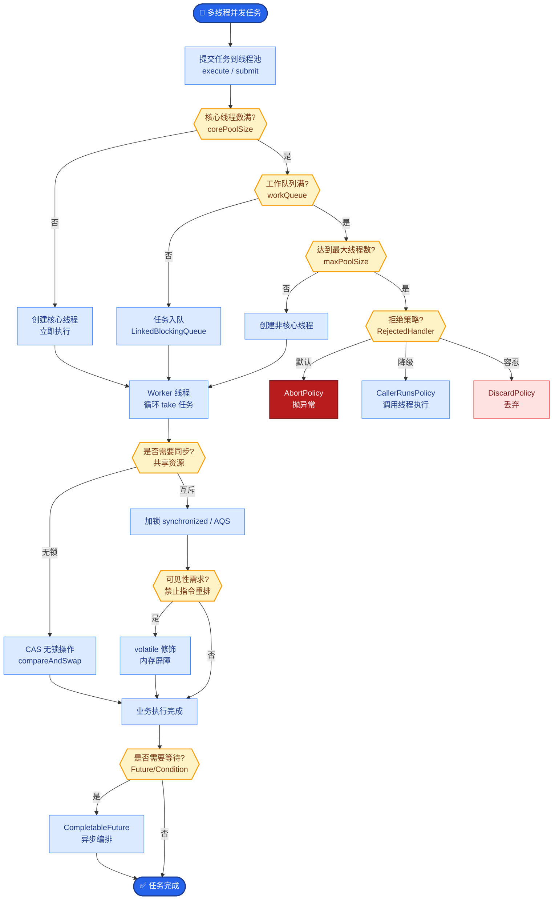

# LLM 与推荐系统结合时会遇到哪些问题?有哪些可落地的方案

- **LLM + 推荐系统** 是当前大厂热门方向,但落地有显著挑战.

**常见问题：** 
1. **延迟**: LLM 推理延迟远超传统推荐模型 (秒级 vs 毫秒级)
2. **上下文窗口限制**: 用户历史行为序列过长,超出上下文窗口
3. **优化目标差异**: LLM 对推荐指标 (CTR/CVR) 的直接优化能力有限,属于概率预测而非概率排序
4. **在线推理成本高**: 难以支撑高 QPS 场景 (召回/粗排阶段)
5. **冷启动局限**: 冷启动场景数据稀疏,但 LLM 缺乏特定领域的用户行为反馈

**LLM 与推荐系统融合架构：**
```text
┌──────────────┐    线上高并发    ┌──────────────────┐
│   召回/粗排   │ <────────────── │ 传统推荐模型 (LR)│
│ (传统 Embed)  │                 │ (DIN/DIEN)       │
└──────┬───────┘                 └──────────────────┘
       │ Top-K Candidates
       ▼
┌──────────────┐    中低 QPS     ┌──────────────────┐
│   重排序      │ <────────────── │   LLM (Pointwise)│
│   (Rerank)    │                 │   (列表打分/解释) │
└──────┬───────┘                 └──────────────────┘
       │ Re-ranked List
       ▼
    最终结果
```

**可落地方案：** 
- **特征增强**: 利用 LLM 生成用户兴趣标签、商品摘要，补充传统模型的 Sparse 特征
- **冷启动推荐**: 利用商品文本信息，通过 LLM 做 Semantic Search 匹配用户兴趣
- **重排序阶段**: 候选集缩小到几十个后，利用 LLM 做 fine-ranking 或生成推荐理由
- **对话式推荐**: 通过多轮交互主动收集用户偏好
- **生成式推荐**: LLM 直接生成推荐列表，适用于非实时的离线场景

**小红书实践：** 用 LLM 做内容理解和标签提取，传统模型 (双塔/多塔) 做排序。

**实战案例：** 
在电商冷启动场景中，新上架的商品无交互数据。我们利用 LLM 提取商品详情页中的材质、风格等结构化标签，计算与用户画像的语义相似度进行召回，使冷启动商品的曝光率提升了 20%。

**代码示例：** 
```python
# Pseudo-python: 特征增强
item_desc = "纯棉宽松，夏季透气，白色T恤"

# 利用 LLM 生成标签
tags = llm.generate(f"提取商品属性标签: {item_desc}") 
# Output: ["材质:纯棉", "季节:夏季", "版型:宽松", "颜色:白色"]

# 编码为 Sparse Features 并入传统模型
feature_vector = tfidf_vectorizer.transform([" ".join(tags)])
```

**架构选型对比：** 

| 特性 | 传统推荐模型 | LLM 生成式推荐 | 混合架构 (LLM+传统) |
| :--- | :--- | :--- | :--- |
| **核心优势** | 低延迟、高CTR、可解释性强 | 理解能力通用、可对话生成 | 结合两者优势，兼顾效果与效率 |
| **适用阶段** | 召回/粗排/精排 | 离线生成/重排/解释生成 | 传统召回 -> LLM重排/特征增强 |
| **推理成本** | 极低 (ms级, GPU/CPU) | 高 (s级, 昂贵GPU) | 中等 (仅在特定节点引入LLM) |
| **数据处理** | 依赖 ID 类数值特征 | 依赖文本/多模态语义 | 需做 ID 到 Text 的映射 |
| **典型技术** | DIN, DIEN, FM, DeepFM | GPT-4, LLaMA, Prompt Engr | TALLRec, P5, GenAIRec |


## 核心流程图



## 记忆要点

- 痛点：LLM延迟高、成本高，不适合高并发召回阶段
- 架构：传统模型做召回粗排，LLM做重排或特征增强
- 落地：冷启动用LLM提取标签，重排阶段用LLM打分
- 实践：TALLRec等混合架构，兼顾效果与推理成本


## 结构化回答

**30 秒电梯演讲：** 利用LLM的语义理解能力增强推荐系统的特征表达与交互体验。——打个比方，让推荐系统不仅看历史点击，还能“读懂”内容和“聊”出需求。

**展开框架：**
1. **痛点** — LLM延迟高、成本高，不适合高并发召回阶段
2. **架构** — 传统模型做召回粗排，LLM做重排或特征增强
3. **落地** — 冷启动用LLM提取标签，重排阶段用LLM打分

**收尾：** 以上三点都能配合实战聊。我可以展开任一要点，比如「如何降低 LLM 在推荐链路中的延迟」这类追问您感兴趣吗？

## 视频脚本

> 预计时长：2 分钟 | 由浅入深

| 时间 | 画面/字幕 | 口播台词 | 讲解要点 |
|------|----------|----------|----------|
| 0:00 | 标题卡 | "LLM 与推荐系统结合时会遇到哪些问题，30 秒讲清楚。" | 开场钩子 |
| 0:30 | 概念定义动画 | "一句话：利用LLM的语义理解能力增强推荐系统的特征表达与交互体验。" | 核心定义 |
| 1:00 | 痛点图解 | "LLM延迟高、成本高，不适合高并发召回阶段" | 痛点 |
| 1:30 | 总结卡 | "记好这几条，面试不慌。下期见。" | 收尾 |
