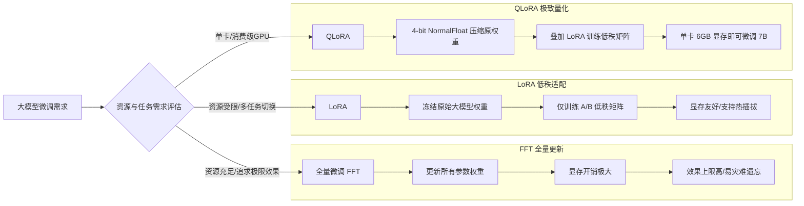

# 全量微调(Full Fine-Tuning)与参数高效微调(LoRA/QLoRA)的区别是什么?各自适用什么场景

- **全量微调 (Full Fine-Tuning, FFT)**: 更新模型所有参数.
- **优点**: 效果上限高,能充分学习新任务,能改变模型的内在知识分布.
- **缺点**: 显存极大 (需存全量梯度+优化器状态+参数), 易灾难遗忘, 存储成本高 (每个任务一套权重).
- **适用**: 有充足 GPU 资源、任务与预训练差异大 (如跨领域)、需要最优效果.

- **LoRA (Low-Rank Adaptation)**: 冻结原始权重,只训练低秩矩阵 A·B (rank 通常 8~64).
- **原理**: 假设权重更新量 ΔW 具有低秩特性, ΔW = B×A (A∈r×d, B∈d×r, r<<d).
- **优点**: 训练参数减少 99%+, 显存友好, 可切换多个 LoRA adapter (热插拔), 无灾难遗忘.
- **缺点**: 表达能力有上限 (秩 r 决定了容量), 极端任务效果可能不如 FFT.
- **适用**: 资源受限、多任务管理、快速实验.

- **QLoRA**: 在 LoRA 基础上对原始权重做 4-bit 量化 (NormalFloat4).
- **核心创新**: 引入 4-bit NormalFloat 数据类型、双重量化、分页优化器.
- **优点**: 显存极低 (7B 模型只需 ~6GB), 在保持 16bit 微调性能的同时大幅降低门槛.
- **缺点**: 量化可能引入微小精度损失, 训练速度略慢于非量化的 LoRA.
- **适用**: 消费级 GPU (如 T4, 3090/4090)、原型验证.

**参数量级对比图示：**
```text
模型权重: [============================================] 100%

FFT:     [##############################################] (全量更新)  显存: O(3d)
LoRA:    [======]                                        (仅 Adapter) 显存: O(2d + 2dr)
QLoRA:   [==] (量化) + [======] (Adapter)                 (混合精度)   显存: O(0.5d + 2dr)
```

**选择决策树：** 
- 资源充足 + 效果优先 → FFT
- 资源受限 + 多任务 → LoRA
- 极端受限 + 单卡 → QLoRA

**实战案例：** 
在处理医疗垂类模型微调时，我们在单张 A100 (40GB) 上尝试 7B 模型 FFT 时 OOM。切换至 QLoRA (4-bit + Rank 64) 后，显存占用降至 ~24GB，成功跑通 Batch Size 16，且在医疗考试集上的得分仅比全量微调低 1.5%。

**代码示例：** 
```python
from peft import LoraConfig, get_peft_model

# 配置 LoRA
lora_config = LoraConfig(
    r=16,             # Rank
    lora_alpha=32,    # Scaling
    target_modules=["q_proj", "v_proj"], # 只微调 Attention 层
    lora_dropout=0.05,
    task_type="CAUSAL_LM"
)

model = get_peft_model(base_model, lora_config)
model.print_trainable_parameters() # 打印可训练参数占比
```

**微调方式对比表：**

| 维度 | Full Fine-Tuning | LoRA | QLoRA |
| :--- | :--- | :--- | :--- |
| **显存占用** | 极高 (3x Model Size) | 中等 (Base+Adapters) | 极低 (0.5x Base + Adapters) |
| **训练参数量** | 100% | <1% (仅低秩矩阵) | <1% (仅低秩矩阵) |
| **模型存储** | 需存储完整副本 | 仅存储 Adapter (几MB) | 仅存储 Adapter (几MB) |
| **训练速度** | 快 (无量化开销) | 快 | 稍慢 (反量化计算开销) |
| **推理速度** | 原生速度 | 原生速度 (合并权重后) | 原生速度 (合并权重后) |
| **硬件要求** | 多卡高性能集群 | 单卡/多卡中端显卡 | 单卡消费级显卡 (3090/4090) |
| **灾难性遗忘** | 高风险 | 低 (基座参数冻结) | 低 (基座参数冻结) |

## 流程图



## 核心知识点图


## 记忆要点

- FFT：全量更新效果上限高，但显存极大易灾难遗忘
- LoRA：冻结权重训练低秩矩阵，显存友好可热插拔
- QLoRA：4-bit量化基座，单卡微调，显存仅需~6GB(7B)
- 选型：资源足选FFT，受限选LoRA，单卡选QLoRA


## 结构化回答

**30 秒电梯演讲：** 通过只训练少量参数或低秩分解矩阵，实现低成本的模型定制。——打个比方，不求整容(全量微调)，只做戴配饰和化妆(LoRA)。

**展开框架：**
1. **FFT** — 全量更新效果上限高，但显存极大易灾难遗忘
2. **LoRA** — 冻结权重训练低秩矩阵，显存友好可热插拔
3. **QLoRA** — 4-bit量化基座，单卡微调，显存仅需~6GB(7B)

**收尾：** 以上三点都能配合实战聊。我可以展开任一要点，比如「LoRA 的 rank 设多少合适」这类追问您感兴趣吗？

## 视频脚本

> 预计时长：2 分钟 | 由浅入深

| 时间 | 画面/字幕 | 口播台词 | 讲解要点 |
|------|----------|----------|----------|
| 0:00 | 标题卡 | "全量微调(Full Fine-Tuning)与参数高效微调(LoRA/QLoRA，30 秒讲清楚。" | 开场钩子 |
| 0:30 | 概念定义动画 | "一句话：通过只训练少量参数或低秩分解矩阵，实现低成本的模型定制。" | 核心定义 |
| 1:00 | FFT图解 | "全量更新效果上限高，但显存极大易灾难遗忘" | FFT |
| 1:30 | 总结卡 | "记好这几条，面试不慌。下期见。" | 收尾 |
