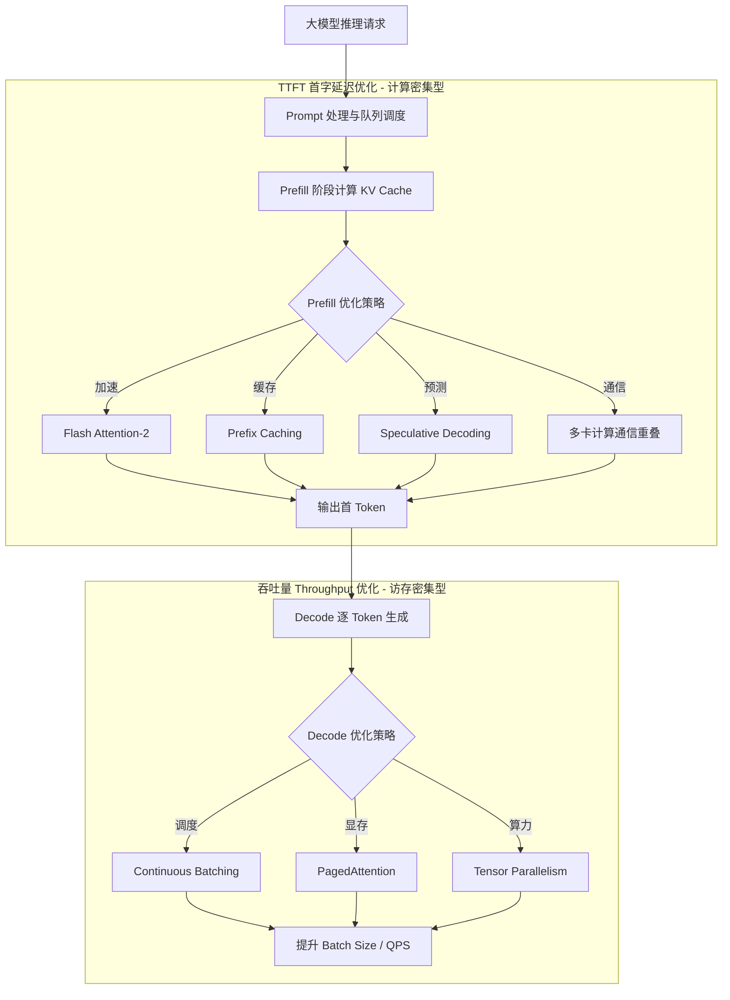

# 大模型推理的首 Token 延迟(TTFT)和整体吞吐量分别受什么因素影响?如何优化

- **首 Token 延迟 (Time To First Token, TTFT)**

**影响因素：** 
1. **Prefill 计算**: 处理整个 prompt 的 KV Cache 计算 (与 prompt 长度成正比)
2. **模型加载到 GPU**: 大模型权重传输 (通常通过模型常驻 GPU 解决)
3. **排队等待**: 请求在 batch 队列中等待 (调度器策略影响)
4. **网络延迟**: 客户端到服务端 RTT

**优化策略：** 
- **Flash Attention / Flash Attention-2**: 加速 Prefill 阶段的 Attention 计算
- **Prefix Caching**: 对共享的 System Prompt 或重复前缀缓存 KV, 避免重复计算
- **Speculative Decoding (投机解码)**: 使用小模型快速草稿 Prefill, 大模型并行验证, 显著降低 TTFT
- **计算/通信重叠**: 在多卡/多机推理时, 优化张量并行的通信开销

- **整体吞吐量 (Throughput, tokens/s)**

**影响因素：** 
1. **Decode 阶段**: 逐 token 生成, 主要是访存 受限于显存带宽, 而非计算算力
2. **Batch Size**: 越大吞吐越高但显存限制上限
3. **KV Cache 显存**: 限制最大并发数

**优化策略：** 
- **Continuous Batching (Continuous Batching / Iterative Scheduling)**: 动态组合不同长度的请求, 在一个请求结束时立即插入新请求, 避免 Padding 带来的浪费
- **PagedAttention (vLLM)**: 分页管理 KV Cache, 减少内存碎片, 类似于操作系统的虚拟内存管理
- **Tensor Parallelism / Pipeline Parallelism**: 多 GPU 并行, 将计算切分到多张卡上, 提升整体算力

**推理调度架构对比 (Static vs Continuous Batching)：**
```text
Static Batching (填满 Padding, 浪费算力):
[Req A: 10 Tok][Req B: 5 Tok ][Pad ][Pad ] -> Batch Step 1
[Req A: 11 Tok][Req B: End ][Pad ][Pad ] -> Batch Step 2 (Req B 占位但不计算)

Continuous Batching (动态进出):
[Req A: 10 Tok][Req B: 5 Tok][Req C: 2 Tok] -> Batch Step 1
[Req A: 11 Tok][Req C: 3 Tok][Req D: 1 Tok] -> Batch Step 2 (B移除, D加入)
```

- **经验公式**: 
  - TTFT ∝ prompt_length × model_size / GPU_Compute_Capability (Prefill 受限于计算)
  - Decode Throughput ∝ GPU_Memory_Bandwidth / model_size (Decode 受限于显存带宽)

**实战案例：** 
在从 vLLM 迁移到 TGI (Text Generation Inference) 时，我们发现开启 Flash Attention-2 后，针对长 prompt (4k tokens) 的场景，TTFT 从 1.2s 优化至 400ms。此外，针对高并发场景，开启 PagedAttention 使得 Batch Size 可以从 32 提升到 64 而不发生 OOM，QPS 翻倍。

**代码示例：** 
```python
# Pseudo-code: PagedAttention Block Manager 思想
import torch

class BlockAllocator:
    def __init__(self, block_size, num_blocks):
        self.block_size = block_size
        self.free_blocks = list(range(num_blocks))
    
    def allocate(self, seq_len):
        # 计算需要的物理块数量 (非连续)
        required_blocks = (seq_len + self.block_size - 1) // self.block_size
        if len(self.free_blocks) >= required_blocks:
            return [self.free_blocks.pop() for _ in range(required_blocks)]
        return None # OOM
```

**性能优化技术对比：**

| 优化技术 | 优化目标 | 核心原理 | 适用场景 | 对显存/算力影响 |
| :--- | :--- | :--- | :--- | :--- |
| **Flash Attention-2** | 加速计算/降低显存 | IO 感知的精确 Attention 算法，融合 Kernel | 长文本推理，Prefill 阶段 | 显存占用减半，计算加速 2-3x |
| **Continuous Batching** | 提升 Throughput | 动态 Batch，剔除已结束 Seq，消除 Padding | 高并发、变长请求 | 显存利用率大幅提升 |
| **Speculative Decoding** | 降低 TTFT/延迟 | 小模型快读生成，大模型并行验证 | 对延迟敏感，Decode 阶段长 | 额外需要一个小模型显存 |
| **PagedAttention** | 解决显存碎片/提升并发 | KV Cache 分块存储，类似虚拟内存 | 大 Batch，多并发 | 减少显存浪费，提升并发上限 |
| **Quantization (AWQ/GPTQ)** | 降低显存/提升带宽 | 4-bit 权重量化，反量化计算 | 显存受限，推理部署 | 显存占用减半，带宽吞吐提升 |

## 流程图



## 核心知识点图


## 记忆要点

- TTFT受限于Prefill计算(算力)，用Flash Attention/Prefix Caching优化
- 吞吐受限于Decode带宽(显存)，用Continuous Batching/PagedAttention优化
- 经验：Prefill是计算密集型，Decode是访存密集型
- 调度：Continuous Batching动态进出，消除Padding浪费


## 结构化回答

**30 秒电梯演讲：** 优化Prefill阶段算力密集型计算和Decode阶段访存密集型计算。——打个比方，首字快靠爆发力（算力），速度稳靠耐力（带宽）。

**展开框架：**
1. **TTFT受限于P** — TTFT受限于Prefill计算(算力)，用Flash Attention/Prefix Caching优化
2. **吞吐受限于Dec** — 吞吐受限于Decode带宽(显存)，用Continuous Batching/PagedAttention优化
3. **经验** — Prefill是计算密集型，Decode是访存密集型

**收尾：** 以上三点都能配合实战聊。我可以展开任一要点，比如「连续 Batching 如何处理变长请求」这类追问您感兴趣吗？

## 视频脚本

> 预计时长：2 分钟 | 由浅入深

| 时间 | 画面/字幕 | 口播台词 | 讲解要点 |
|------|----------|----------|----------|
| 0:00 | 标题卡 | "大模型推理的首 Token 延迟(TTFT)和整体吞吐量分别受什么因素影响，30 秒讲清楚。" | 开场钩子 |
| 0:30 | 概念定义动画 | "一句话：优化Prefill阶段算力密集型计算和Decode阶段访存密集型计算。" | 核心定义 |
| 1:00 | 要点图解 | "TTFT受限于Prefill计算(算力)，用Flash Attention/Prefix Caching优化" | 要点 |
| 1:30 | 总结卡 | "记好这几条，面试不慌。下期见。" | 收尾 |
