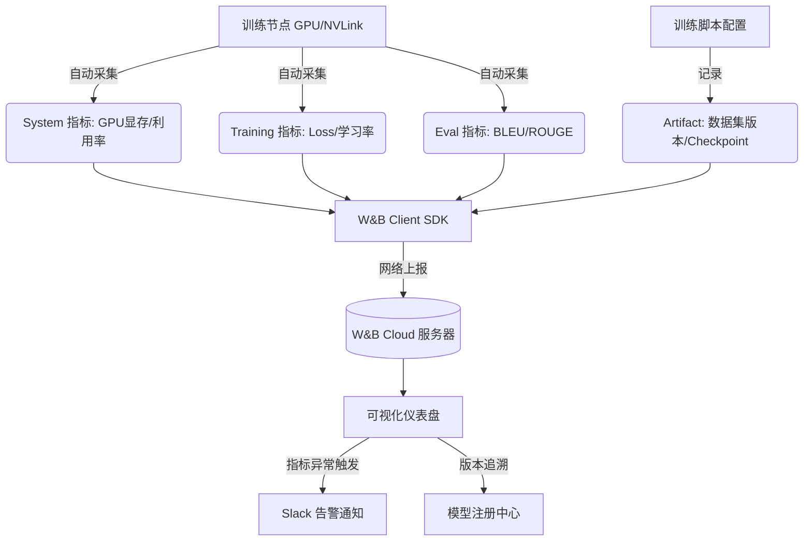

# 在 LLM 训练/微调中如何使用 W&B (Weights & Biases) 进行实验管理?核心追踪哪些指标

- **W&B (Weights & Biases)** 是最流行的 ML 实验管理平台。

- **核心功能**
  1. **实验追踪**: 记录 loss、learning rate、metrics 等
  2. **模型注册**: 版本管理训练好的 checkpoint
  3. **数据集版本**: 追踪每次实验用的数据版本
  4. **超参搜索**: 集成 Sweep 做 grid/random/bayesian search
  5. **协作与报告**: 可视化仪表盘，团队共享

- **LLM 微调关键指标代码示例**
```python
import wandb
wandb.init(project='llm-finetune', config={
    'model': 'llama-3-8b',
    'lora_rank': 16,
    'lr': 2e-4,
    'dataset': 'alpaca-zh'
})

# 训练循环中
for step, batch in enumerate(dataloader):
    loss = model(batch).loss
    wandb.log({
        'train/loss': loss.item(),
        'train/lr': scheduler.get_lr()[0],
        'train/grad_norm': grad_norm,
        'system/gpu_mem': torch.cuda.memory_allocated()/1e9,
        'system/gpu_util': get_gpu_util()
    })
```

- **必追踪指标**
  - **Training**: loss, grad_norm, lr, epoch
  - **Evaluation**: BLEU/ROUGE/accuracy, perplexity
  - **System**: GPU memory, GPU utilization, throughput
  - **LoRA specific**: trainable params ratio
  - **DPO specific**: reward margin, accuracy

- **实战案例**: 在多节点训练 Llama-3-70B 时，曾遇到某节点 Loss 震荡而其他节点正常。通过 W&B 的 `system/gpu_mem` 和 `system/gpu_util` 对比发现该节点 NVLink 带宽异常（利用率低），排查后确认为硬件松动。

- **最佳实践**: 
  1. **表格对比视图**: 使用 W&B Table 记录模型生成的文本样本，直观对比不同 Temperature 或 Prompt 版本的输出质量。
  2. **自定义 Artifact**: 将数据集的预处理脚本哈希值作为 Artifact 版本的一部分，确保数据不可变性。
  3. **告警集成**: 设置 `val_loss` 超过基线 5% 时自动发送 Slack 通知，避免无效训练浪费算力。

## 流程图




## 记忆要点

- 核心功能：实验追踪、模型注册、超参搜索、可视化仪表盘。
- 必追指标：Loss/Grad_norm/LR（训练），BLEU/ROUGE（评测），显存/吞吐（系统）。
- 实战技巧：用 Table 对比生成样本，Artifact 追踪数据版本，设置告警避免无效训练。
- 排查作用：通过 GPU 利用率和显存对比，快速定位硬件或节点异常。


## 结构化回答

**30 秒电梯演讲：** 全流程记录AI实验的“黑匣子”飞行记录仪。——打个比方，就像给健身过程配个智能手表，自动记录每组动作的重量、心率（Loss）和消耗卡路里。

**展开框架：**
1. **核心功能** — 实验追踪、模型注册、超参搜索、可视化仪表盘。
2. **必追指标** — Loss/Grad_norm/LR（训练），BLEU/ROUGE（评测），显存/吞吐（系统）。
3. **实战技巧** — 用 Table 对比生成样本，Artifact 追踪数据版本，设置告警避免无效训练。

**收尾：** 以上三点都能配合实战聊。我可以展开任一要点，比如「如何用 W&B Sweep 做 LoRA 超参搜索」这类追问您感兴趣吗？

## 视频脚本

> 预计时长：3 分钟 | 由浅入深

| 时间 | 画面/字幕 | 口播台词 | 讲解要点 |
|------|----------|----------|----------|
| 0:00 | 标题卡 | "在 LLM 训练/微调中如何使用 W&B (Weights & Biases) ，30 秒讲清楚。" | 开场钩子 |
| 0:36 | 概念定义动画 | "一句话：全流程记录AI实验的“黑匣子”飞行记录仪。" | 核心定义 |
| 1:12 | 核心功能图解 | "实验追踪、模型注册、超参搜索、可视化仪表盘。" | 核心功能 |
| 1:48 | 必追指标图解 | "Loss/Grad_norm/LR（训练），BLEU/ROUGE（评测），显存/吞吐（系统）。" | 必追指标 |
| 2:24 | 总结卡 | "记好这几条，面试不慌。下期见。" | 收尾 |
