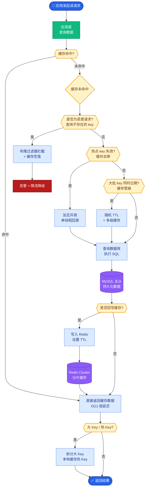
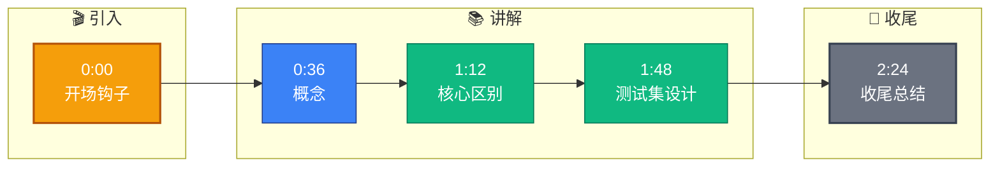

# 如何设计 Agent 的回归测试集?回归测试和普通功能测试有什么不同

- **Agent 回归测试**是确保 Agent 系统在迭代修改后不出现退化(regression)的测试方法。

- **与普通功能测试的区别**
  - 功能测试: 验证特定功能是否正常工作
  - 回归测试: 验证已有功能在修改后仍然正常工作
  - Agent 系统的非确定性使回归测试更具挑战性

**对比表格**:

| 维度 | 普通功能测试 (CRUD/API) | Agent 回归测试 |
| :--- | :--- | :--- |
| **输入确定性** | 固定 Input/Params | 自然语言 (多变、含糊) |
| **输出预期** | 精确匹配 | 语义相似 (允许措辞变化) |
| **执行路径** | 单一逻辑分支 | 规划/推理 (多步、动态) |
| **外部依赖** | Mock DB/Cache | Mock 搜索/API/LLM |
| **失败判定** | 状态码 200 != 500 | 断言失败 或 质量/安全评分低 |
| **稳定性** | 极高 | 中等 (受温度/随机性影响) |

- **Agent 回归测试集设计**

  1. **黄金数据集**
     - 人工标注的高质量 Q&A 对
     - 覆盖核心场景、边界场景、异常场景
     - 建议 100-500 条，按功能模块分类

  2. **测试维度**
     - **功能正确性**: 工具调用是否正确
     - **格式合规性**: 输出格式是否符合 schema
     - **安全性**: 是否泄露敏感信息
     - **性能**: 响应时间是否在阈值内
     - **成本**: Token 消耗是否在预算内

  3. **处理非确定性**
     - 多次运行取平均(如跑 5 次)
     - 使用语义相似度而非精确匹配
     - 关注错误率趋势而非单次结果

  4. **自动化 CI 流水线**
     ```text
     代码提交 → 运行回归测试 → 比对基线
     → 失败率 < 阈值 → 通过 → 部署
     → 失败率 ≥ 阈值 → 阻断 → 排查
     ```

  5. **线上指标与离线评估不一致**
     - 离线通过但线上差: 说明测试集覆盖不足
     - 离线差但线上好: 可能测试集过时
     - 建议: 定期从线上日志回流新 case 到回归集

  6. **评估方法补充**
     - **断言类型**: 包含断言、相似度断言 (BERTScore/Embedding cosine > 0.85)、JSON 校验断言、LLM-as-a-judge 逻辑断言。
     - **Mock 策略**: 对于外部 API (如天气、搜索)，使用 Mock Server 固定返回结果，消除环境波动。

  ```text
                ┌─────────────────────────────────────┐
                │       CI/CD Pipeline Trigger        │
                └──────────────┬──────────────────────┘
                               │
                               ▼
                ┌─────────────────────────────────────┐
                │   Regression Test Suite Execution   │
                │  ┌─────────────┐ ┌───────────────┐  │
                │  │Golden Dataset│ │  Mock APIs    │  │
                │  └──────┬──────┘ └───────┬───────┘  │
                └─────────┼────────────────┼──────────┘
                          │                │
                          ▼                ▼
                ┌─────────────────────────────────────┐
                │      Multi-Run Agent Inference      │
                │    (Run 5 times to handle Stochastic)│
                └──────────────┬──────────────────────┘
                               │
                               ▼
                ┌─────────────────────────────────────┐
                │        Evaluation & Asserts         │
                └─────────────────────────────────────┘
  ```

  **实战案例**: 某次更新 Prompt 模板后，Agent 查询天气的功能未报错但开始频繁编造数据。回归测试未拦截是因为 Mock 服务返回了固定数据，而 Agent 实际上忽略了工具输出进行幻觉。**解决**: 在回归测试中增加“工具调用轨迹断言”，强制验证 Agent 是否真的调用了 `Weather_Tool` 并使用了其返回值。

  **代码示例 (使用 LangChain 评估)**:
  ```python
from langchain.evaluation import load_evaluator, EvaluatorType
from langchain_community.llms import OpenAI

# 定义评估器：使用嵌入模型计算语义相似度
evaluator = load_evaluator(EvaluatorType.embedding_distance, llm=OpenAI())

# 运行测试
prediction = agent.invoke("帮我查下北京的天气")
reference = "根据查询，北京今天晴，温度 25 度。"

# 相似度断言：分数应小于 0.2 (越低越相似)
score = evaluator.evaluate_strings(
    prediction=prediction['output'], 
    reference=reference
)['score']

assert score < 0.2, f"语义偏差过大，得分: {score}"
  ```


## 核心流程图



## 记忆要点

- 核心区别：功能测验证特定功能，回归测验证已有功能不退化，Agent 测需处理非确定性。
- 测试集设计：黄金数据集（覆盖核心/边界），维度含功能、格式、安全、性能。
- 处理非确定性：多次运行取平均，使用语义相似度断言，关注错误率趋势。
- 自动化流：提交代码 -> 运行回归 -> 比对基线 -> 失败率超阈值则阻断。


## 结构化回答

**30 秒电梯演讲：** 验证系统更新后不会“好心办坏事”破坏原有功能的机制。——打个比方，就像修好汽车引擎后，必须路测确认空调、音响等旧功能没被顺便弄坏。

**展开框架：**
1. **核心区别** — 功能测验证特定功能，回归测验证已有功能不退化，Agent 测需处理非确定性。
2. **测试集设计** — 黄金数据集（覆盖核心/边界），维度含功能、格式、安全、性能。
3. **处理非确定性** — 多次运行取平均，使用语义相似度断言，关注错误率趋势。

**收尾：** 以上三点都能配合实战聊。我可以展开任一要点，比如「如何降低 Agent 回归测试的运行成本」这类追问您感兴趣吗？

## 视频脚本

> 预计时长：3 分钟 | 由浅入深

| 时间 | 画面/字幕 | 口播台词 | 讲解要点 |
|------|----------|----------|----------|
| 0:00 | 标题卡 | "设计 Agent 的回归测试集，30 秒讲清楚。" | 开场钩子 |
| 0:36 | 概念定义动画 | "一句话：验证系统更新后不会“好心办坏事”破坏原有功能的机制。" | 核心定义 |
| 1:12 | 核心区别图解 | "功能测验证特定功能，回归测验证已有功能不退化，Agent 测需处理非确定性。" | 核心区别 |
| 1:48 | 测试集设计图解 | "黄金数据集（覆盖核心/边界），维度含功能、格式、安全、性能。" | 测试集设计 |
| 2:24 | 总结卡 | "记好这几条，面试不慌。下期见。" | 收尾 |

### 视频流程图


