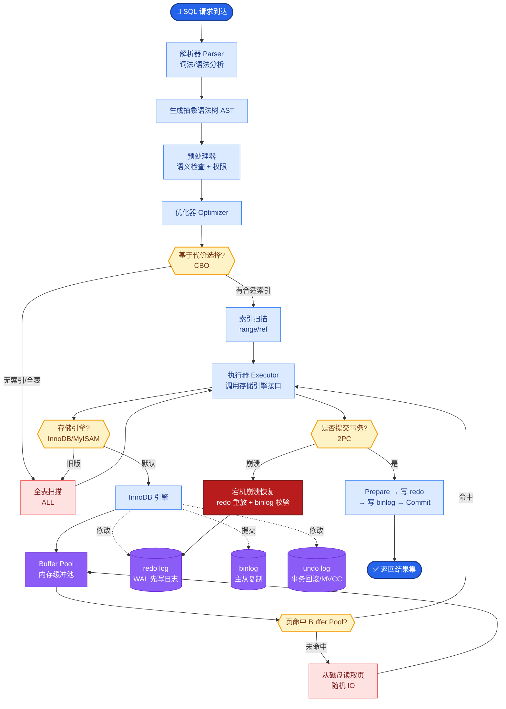

# 如果让你从零搭建一个支持百万文档的 RAG 系统,你会怎么设计

- **百万级文档 RAG 系统设计**

  - **数据层**
    - **文档解析**: Unstructured/DeepDoc(PDF表格/图片/OCR)
    - **分块策略**: RecursiveCharacterTextSplitter(chunk=512, overlap=64)
    - **父子块**: 子块用于检索，父块用于生成上下文
    - **Embedding**: BGE-M3(多语言/多功能)
    - **向量库**: Milvus 集群(分片 + HNSW 索引)

  - **检索层(多路混合检索)**
    - **向量检索**: 语义相似(Milvus, top-k=20)
    - **BM25 检索**: 关键词匹配(Elasticsearch, top-k=20)
    - **RRF 融合**: reciprocal_rank_fusion 合并两路结果
    - **Rerank**: Cross-Encoder 精排(top-k=5)

  - **生成层**
    - **Query 改写**: HyDE / 子问题分解
    - **上下文组装**: 父子块 + 上下文窗口管理
    - **生成**: LLM + System Prompt + 检索结果
    - **引用标注**: 标注每个事实的来源

  - **优化层**
    - **Query 路由**: 简单问题 → 直接向量检索，复杂问题 → 子问题分解
    - **Adaptive RAG**: 如果检索置信度低 → 触发 Web 搜索
    - **Self-RAG**: 生成后自检是否需要重新检索

  - **评估**
    - **RAGAS**: faithfulness(忠实度) + answer_relevancy(相关性)
    - **召回率**: 检索结果是否包含正确答案
    - **人工评测**: 每月 200 条 bad case 分析

  - **扩展性**
    - 增量更新: 文档变更 → 重新 Embed → upsert
    - 冷热分离: 热数据 HNSW，冷数据 IVF

  > **💡 实战案例**：在金融财报项目中，曾遇到表格解析错行导致数值检索错误。引入**Markdown格式清洗**和**表格HTML结构化解析**后，表格类问题的准确率提升了 40%。

  > **🧱 代码示例（Python - RRF 融合逻辑）**
  > ```python
  > def reciprocal_rank_fusion(results_dict, k=60):
  >     fused_scores = {}
  >     for system, docs in results_dict.items():
  >         for rank, doc in enumerate(docs):
  >             doc_id = doc['id']
  >             fused_scores[doc_id] = fused_scores.get(doc_id, 0) + 1 / (k + rank + 1)
  >     reranked_results = sorted(fused_scores.items(), key=lambda x: x[1], reverse=True)
  >     return [doc_id for doc_id, score in reranked_results]
  > ```

  - **架构数据流图**

  ```text
  ┌──────────────┐     ┌──────────────┐     ┌──────────────┐
  │  Raw Docs    │────▶│   Ingestion  │────▶│   Vector DB  │
  │ (PDF/Doc/Txt)│     │ (Parse/Split)│     │  (Milvus)    │
  └──────────────┘     └──────┬───────┘     └───────┬──────┘
                              │                     │
                              ▼                     │
                      ┌──────────────┐             │
                      │ Elasticsearch │             │
                      │  (BM25 Index)│             │
                      └──────┬───────┘             │
                             │                     │
                             └──────────┬──────────┘
                                        │
  ┌──────────────┐                      ▼
  │   User Query │───────▶    ┌──────────────────┐
  └──────────────┘          │   Query Router   │
                            └────────┬─────────┘
                                     │
                    ┌────────────────┼────────────────┐


## 核心流程图



## 记忆要点

- 数据层：解析（Unstructured）-> 分块（父子块）-> 向量化（BGE-M3）-> Milvus 集群。
- 检索层：混合检索（向量+BM25）-> RRF 融合 -> Cross-Encoder 重排。
- 生成层：Query 改写 -> 上下文组装 -> LLM 生成 -> 引用标注。
- 优化策略：冷热数据分离，增量更新，RAGAS 评估（忠实度/相关性）。


## 结构化回答

**30 秒电梯演讲：** 通过检索增强生成技术，构建海量知识的精准问答系统。——打个比方，像超级图书管理员，先通过关键词和语义在百万书中找到相关章节，再基于此撰写答案。

**展开框架：**
1. **数据层** — 解析（Unstructured）-> 分块（父子块）-> 向量化（BGE-M3）-> Milvus 集群。
2. **检索层** — 混合检索（向量+BM25）-> RRF 融合 -> Cross-Encoder 重排。
3. **生成层** — Query 改写 -> 上下文组装 -> LLM 生成 -> 引用标注。

**收尾：** 以上三点都能配合实战聊。我可以展开任一要点，比如「HNSW 和 IVF 如何取舍」这类追问您感兴趣吗？

## 视频脚本

> 预计时长：3 分钟 | 由浅入深

| 时间 | 画面/字幕 | 口播台词 | 讲解要点 |
|------|----------|----------|----------|
| 0:00 | 标题卡 | "如果让你从零搭建一个支持百万文档的 RAG 系统,你会怎么设计，30 秒讲清楚。" | 开场钩子 |
| 0:36 | 概念定义动画 | "一句话：通过检索增强生成技术，构建海量知识的精准问答系统。" | 核心定义 |
| 1:12 | 数据层图解 | "解析（Unstructured）-> 分块（父子块）-> 向量化（BGE-M3）-> Milvus 集群。" | 数据层 |
| 1:48 | 检索层图解 | "混合检索（向量+BM25）-> RRF 融合 -> Cross-Encoder 重排。" | 检索层 |
| 2:24 | 总结卡 | "记好这几条，面试不慌。下期见。" | 收尾 |

### 视频流程图


