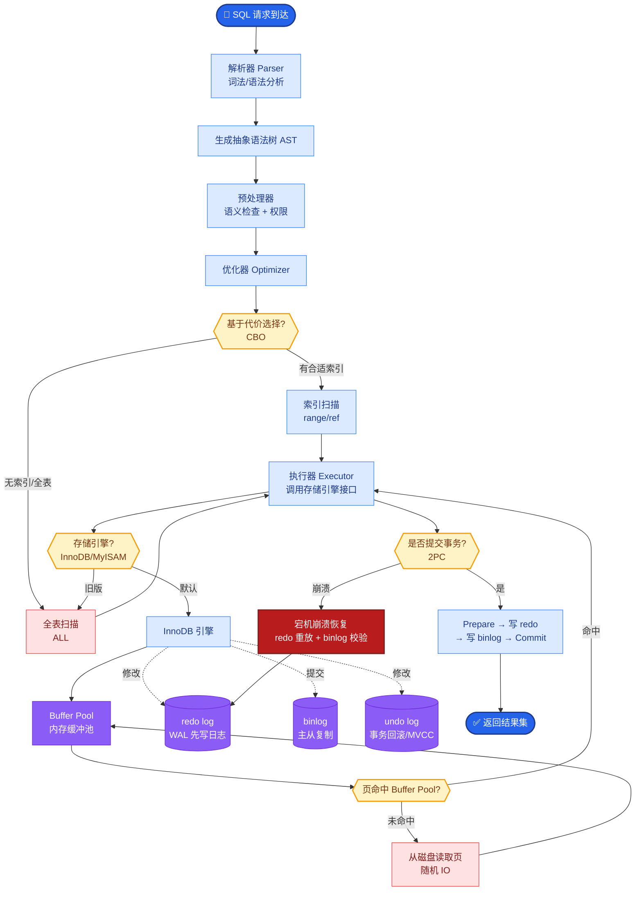

# 线上 RAG 系统突然幻觉率升高,从 3% 升到 15%,你会怎么排查

- **幻觉率飙升排查 SOP**

  - **Step 1: 确认范围**
    - 是全量用户还是特定用户群?
    - 是所有问题类型还是特定类型?
    - 什么时候开始的?(关联部署时间)

  - **Step 2: 检查最近变更**
    - Prompt 是否修改?(最常见原因)
    - 模型是否升级?(不同模型幻觉率不同)
    - 知识库是否更新?(新文档可能引入冲突信息)
    - 分块策略是否调整?

  - **Step 3: 检查检索质量分析**
    - 抽取 50 条幻觉样本
    - 检查检索结果是否包含正确答案
    - 检索到但生成错误 → 生成层问题
    - 根本没检索到 → 检索层问题
    - 检查 rerank 模型是否正常

  - **Step 4: 常见根因**

    | 根因 | 占比 | 解决方案 |
    |------|------|---------|
    | Prompt 修改不当 | 30% | 回滚 Prompt 版本 |
    | 检索结果质量差 | 25% | 调整分块/Embedding |
    | 知识库冲突 | 20% | 清理旧版本数据 |
    | 模型升级 | 15% | 对比评测后决定 |
    | 用户 query 漂移 | 10% | 增加 query 改写 |

  - **Step 5: 快速止血**
    1. 回滚到上一版本(Prompt/模型/配置)
    2. 增加回答约束: '如果上下文中没有相关信息，请回答我不知道'
    3. 临时增加 rerank 步骤

  - **预防措施**
    - 幻觉率告警(阈值 5%)
    - 每日自动抽样检测
    - Prompt 变更必须 A/B 测试

  > **💡 实战案例**：某次更新后，客服Bot突然开始编造不存在的退费政策。排查发现是知识库入库脚本Bug导致重复索引，使得旧版（已废弃）的文档权重在Rerank时高于新版。修复去重逻辑后恢复。

  > **🧱 代码示例（Python - 诊断性日志打印）**
  > ```python
  > def log_rag_diagnostic(query, retrieved_docs, answer):
  >     # 快速排查关键：检查检索分数和上下文重叠度
  >     print(f"Query: {query}")
  >     for doc in retrieved_docs:
  >         print(f"Doc Score: {doc['score']}, Content Preview: {doc['text'][:50]}...")
  >     # 计算上下文覆盖率（简单词频统计）
  >     answer_words = set(answer.split())
  >     context_words = set(" ".join([d['text'] for d in retrieved_docs]).split())
  >     overlap = len(answer_words & context_words) / len(answer_words)
  >     print(f"Context Overlap Ratio: {overlap:.2%}")
  > ```

  - **详细排查决策树**

  ```text
               [发现幻觉率升高]
                     │
         ┌───────────┴───────────┐
         ▼                       ▼
    [检查监控系统]          [检查发布记录]
         │                       │
         ▼                       ▼
  [是特定租户/类型?]      [是否有模型/Prompt变更?]
   /         \             /           \
  是          否           是            否
  │           │           │             │
  ▼           ▼           ▼             ▼
[检查该租户   [检查全局   [回滚变更/   [进入深度排查]
 配置/数据]   模型状态]  A/B测试]      │
                                   │     │
                                   │     ▼
                                   │  [样本分析：检索 vs 生成]
                                   │     │
                                   │     ├─ 检索命中正确答案? ──No──▶ [检索层故障: Embed/DB/Rerank]
                                   │     │     (是)
                                   │     │
                                   │     └─ Yes ──▶ [生成层故障: Prompt/Temp]
  ```

  ## 常见考点
  1.  **如何快速判断是检索问题还是生成问题？**
      - 看日志中的 `Context` 字段。如果检索到的文档片段不包含答案，是检索问题；如果文档里有正确答案但 LLM 没答出来，是生成问题。
  2.  **Prompt 修改导致幻觉的典型错误有哪些？**
      - 删除了“严格基于上下文回答”的约束指令；System Prompt 中增加了鼓励“创造性”或“扩展性”的描述，导致模型过度发挥；Temperature 参数意外调高。
  3.


## 核心流程图



## 记忆要点

- 排查 SOP：确认范围 -> 检查变更（Prompt/模型/数据）-> 分析检索质量 -> 定位根因。
- 快速止血：回滚版本，增加负面约束（不知道），临时增加 Rerank。
- 判断逻辑：检索到正确答案但生成错是生成层问题，没检索到是检索层问题。
- 预防措施：幻觉率告警，每日自动检测，Prompt 变更必须 A/B 测试。


## 结构化回答

**30 秒电梯演讲：** 快速定位并解决模型“一本正经胡说八道”的故障排查流程。——打个比方，像医生诊断急症，先确认发病范围，再查最近接触了什么（变更），最后对症下药。

**展开框架：**
1. **排查 SOP** — 确认范围 -> 检查变更（Prompt/模型/数据）-> 分析检索质量 -> 定位根因。
2. **快速止血** — 回滚版本，增加负面约束（不知道），临时增加 Rerank。
3. **判断逻辑** — 检索到正确答案但生成错是生成层问题，没检索到是检索层问题。

**收尾：** 以上三点都能配合实战聊。我可以展开任一要点，比如「如何自动化检测幻觉」这类追问您感兴趣吗？

## 视频脚本

> 预计时长：2 分钟 | 由浅入深

| 时间 | 画面/字幕 | 口播台词 | 讲解要点 |
|------|----------|----------|----------|
| 0:00 | 标题卡 | "线上 RAG 系统突然幻觉率升高,从 3% 升到 15%,你会怎么排查，30 秒讲清楚。" | 开场钩子 |
| 0:30 | 概念定义动画 | "一句话：快速定位并解决模型“一本正经胡说八道”的故障排查流程。" | 核心定义 |
| 1:00 | 排查 SOP图解 | "确认范围 -> 检查变更（Prompt/模型/数据）-> 分析检索质量 -> 定位根因。" | 排查 SOP |
| 1:30 | 总结卡 | "记好这几条，面试不慌。下期见。" | 收尾 |
