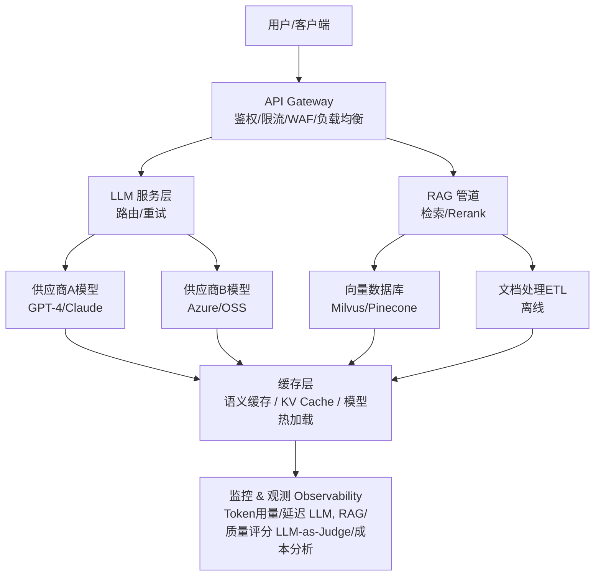
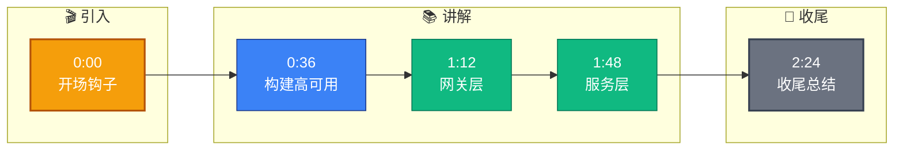

# 如何设计一个LLM应用的生产架构？

生产级 LLM 应用架构需要考虑高可用、低延迟、可观测性和安全性。以下是关键组件及数据流向。

### 核心架构设计



### 组件详解

#### 1. API Gateway
作为流量的统一入口，负责处理非业务逻辑的横切关注点。
- **鉴权与安全**：集成 OAuth2/API Key，防止 Key 泄露和滥用。
- **限流熔断**：防止突发流量击穿后端 LLM 供应商配额或预算。

#### 2. LLM 服务层
这一层是架构的大脑，负责与模型供应商交互。
- **多模型管理**：抽象统一的接口，支持热切换模型（如从 OpenAI 切换至 Azure）。
- **请求编排**：处理 Prompt 模板渲染、上下文拼接。

#### 3. RAG 管道
- **流式/非流式处理**：离线 ETL 负责文档切片、向量化入库；在线管道负责 Query 向量化、检索和 Rerank。

#### 4. 监控与观测
- **可观测性**：不仅监控 HTTP 状态码，还要追踪 Token 消耗、首字延迟（TTFT）和端到端延迟。

### 💡 实战案例
在某金融风控问答系统上线首日，我们发现 OpenAI API 偶发 5xx 超时，导致前端直接报错，用户体验极差。**实战优化**：我们在 API Gateway 层增加了**多供应商熔断降级策略**，当监测到 GPT-4 超时率超过 5% 时，自动将流量切换至备用模型（如 Claude 3 或自部署 Llama），保证了 99.9% 的可用性。

### 💻 代码示例 (Python - 熔断器装饰器)
```python
from circuitbreaker import circuit

@circuit(failure_threshold=5, recovery_timeout=30)
def call_llm_with_fallback(prompt):
    try:
        return primary_llm_client.generate(prompt)
    except Exception as e:
        print(f"Primary failed: {e}, switching to fallback")
        return fallback_llm_client.generate(prompt)
```

### 📊 架构选型对比
| 关键组件 | 云托管方案 | 自建/开源方案 |
| :--- | :--- | :--- |
| **LLM 服务** | OpenAI/Azure (零运维，高单价) | vLLM/TGI (需 GPU 维护，低边际成本) |
| **向量库** | Pinecone/Zilliz (全托管，自动扩展) | Milvus/Weaviate (需运维，数据私有化) |
| **编排层** | LangChain Cloud (功能丰富，较重) | LlamaIndex (轻量，Pythonic) |
| **可观测性** | LangSmith (集成度高，厂商绑定) | Prometheus + Grafana (通用，需自埋点) |

#### 5. 数据流与安全性
- **数据隐私**：敏感数据（PII）在进入 LLM 前需通过脱敏模块处理。
- **Prompt 注入防御**：在 Gateway 层增加输入清洗策略。


## 记忆要点

- 网关层：统一鉴权限流，防API Key泄露，熔断防突发流量。
- 服务层：多模型管理，支持热切换，统一接口处理Prompt编排。
- RAG管道：离线ETL向量化入库，在线检索Rerank，流式非流式分离。
- 观测性：监控Token用量、首字延迟(TTFT)及端到端延迟。
- 高可用：多供应商熔断降级，避免单点故障导致服务不可用。


## 结构化回答

**30 秒电梯演讲：** 构建高可用、低延迟且安全的AI服务基础设施。——打个比方，像装修队：门口有接待，中间有施工队，旁边有材料库，还有监工。

**展开框架：**
1. **网关层** — 统一鉴权限流，防API Key泄露，熔断防突发流量。
2. **服务层** — 多模型管理，支持热切换，统一接口处理Prompt编排。
3. **RAG管道** — 离线ETL向量化入库，在线检索Rerank，流式非流式分离。

**收尾：** 以上三点都能配合实战聊。您想深入聊哪一块？

## 视频脚本

> 预计时长：3 分钟 | 由浅入深

| 时间 | 画面/字幕 | 口播台词 | 讲解要点 |
|------|----------|----------|----------|
| 0:00 | 标题卡 | "设计一个LLM应用的生产架构，30 秒讲清楚。" | 开场钩子 |
| 0:36 | 概念定义动画 | "一句话：构建高可用、低延迟且安全的AI服务基础设施。" | 核心定义 |
| 1:12 | 网关层图解 | "统一鉴权限流，防API Key泄露，熔断防突发流量。" | 网关层 |
| 1:48 | 服务层图解 | "多模型管理，支持热切换，统一接口处理Prompt编排。" | 服务层 |
| 2:24 | 总结卡 | "记好这几条，面试不慌。下期见。" | 收尾 |

### 视频流程图


