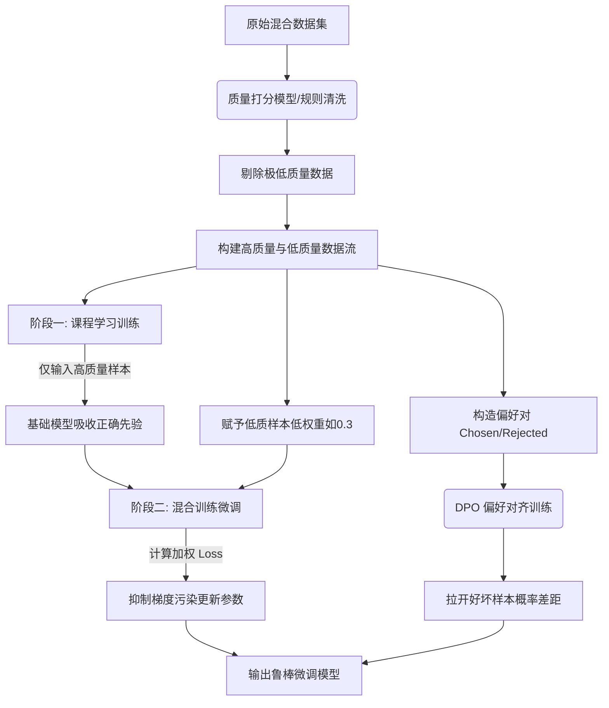

# 在 SFT（监督微调）阶段，如果训练数据中存在大量高质量数据与少量低质量数据混合，应采取什么策略防止模型被低质量数据“带偏”？

为了防止低质量数据恶化模型性能，通常采取以下策略：1) **数据加权**：在计算 Loss 时，根据数据质量得分对不同样本赋予不同权重，降低低质量数据的梯度贡献；2) **课程学习**：先让模型学习高质量、相对简单的样本，待收敛后再引入低质量或困难样本，逐步适应；3) **数据过滤与清洗**：在训练前利用启发式规则或小模型打分剔除极低质量数据；4) **混合比例控制**：严格控制低质量数据的比例（如不超过 5%-10%）。此外，还可以使用 DPO（直接偏好优化）方法，将高质量数据视为正样本、低质量视为负样本进行偏好训练，显式拉开两者在模型输出概率上的差距。

### 💡 实战案例
在训练垂直领域的代码助手时，我们使用了 GitHub 高星项目数据（高质量）和 StackOverflow 问答（含噪声）。初期直接混训导致模型学会了 StackOverflow 中的俚语和错误的代码片段。**实战优化**：我们采用了课程学习策略，前 80% 的 Step 仅用高星仓库代码预训练，最后 20% Step 引入过滤后的 SO 数据，并赋予 0.3 的权重，最终模型既掌握了规范写法，又能理解问答场景。

### 💻 代码示例 (PyTorch - 数据加权 Loss)
```python
import torch
import torch.nn as nn

# 假设 samples_weight 是根据数据质量评分生成的归一化权重张量
# scores: [0.9, 0.2, 0.8, ...] -> weights: [1.2, 0.5, 1.0, ...]
weights_tensor = torch.tensor(samples_weight) 

def weighted_loss criterion(logits, targets, sample_indices):
    base_loss = nn.CrossEntropyLoss(reduction='none')(logits, targets)
    # 根据样本索引获取对应权重，调整 Loss
    weighted_loss = base_loss * weights_tensor[sample_indices]
    return weighted_loss.mean()
```

### 📊 数据质量处理策略对比
| 策略 | 核心机制 | 优点 | 缺点 | 适用场景 |
| :--- | :--- | :--- | :--- | :--- |
| **数据过滤** | 训练前剔除 | 彻底隔离污染，模型收敛稳 | 可能损失边缘案例数据 | 数据量充足，有明显特征的低质数据 |
| **数据加权** | 训练时降权 | 保留数据分布，灵活控制梯度 | 需要设计可靠的评分函数 | 数据量少，需利用噪声数据丰富分布 |
| **课程学习** | 分阶段训练 | 符合认知规律，模型稳健 | 训练流程复杂，需设计调度器 | 混合了简单与极难样本的数据集 |
| **DPO/PPO** | 偏好对齐 | 显式惩罚差回答，对齐效果好 | 需要成对偏好数据，构建成本高 | 具备偏好标注（如点赞/点踩）的场景 |

## 技术原理

低质量数据"带偏"模型的本质是**梯度污染**——模型训练是沿损失函数的梯度方向更新参数，低质量样本（错误标签、噪声文本）产生的梯度方向是错的，会拉偏整个模型的优化轨迹。四种策略从不同环节抑制这种污染：

- **数据加权的原理**：标准训练中每个样本对 loss 的贡献权重相同（都是 1）。加权训练在计算 batch loss 时，给低质样本乘一个小于 1 的权重 $w_i$（如 0.3），让其产生的梯度幅值缩小，从而减少对参数更新的影响。公式从 $\frac{1}{N}\sum L_i$ 变为 $\frac{1}{\sum w_i}\sum w_i L_i$。关键是权重函数要可靠——用质量打分模型（如训练一个二分类器判别样本质量）或启发式规则（代码长度、是否通过编译）生成权重。
- **课程学习（Curriculum Learning）的原理**：模拟人类学习——先学简单再学难。训练分阶段：前 80% step 只喂高质量、简单的样本，让模型先建立稳固的正确表示；后 20% step 再引入低质/困难样本。此时模型已有较强的正确先验，少量噪声样本的梯度不足以带偏它。这比一开始就混训更稳健。
- **数据清洗的原理**：训练前用规则（正则、长度阈值）或小模型（质量分类器）给样本打分，剔除低于阈值的极低质数据。最彻底但可能误删边缘案例（长尾的正常但罕见样本）。
- **DPO 的原理**：把"高质量 vs 低质量"构造成偏好对（chosen 是高质量回答，rejected 是低质量回答），用 DPO 直接优化模型让高质量回答的概率显著高于低质量。这比单纯降权更直接——它显式拉开好坏回答的概率差距。

## 代码示例

```python
import torch
import torch.nn as nn
from torch.utils.data import WeightedRandomSampler

# 1. 数据加权：给低质样本降权
class WeightedTrainer:
    def __init__(self, model, quality_scores):
        self.model = model
        # 根据 quality_score (0~1) 生成权重：高质量权重高
        self.weights = torch.tensor(quality_scores)  # 如 [0.9, 0.2, 0.8, ...]

    def compute_loss(self, logits, labels, sample_indices):
        """加权 loss：低质样本权重低，梯度贡献小"""
        base_loss = nn.CrossEntropyLoss(reduction='none')(logits, labels)
        sample_weights = self.weights[sample_indices]   # 取出本 batch 的权重
        weighted = base_loss * sample_weights
        return weighted.sum() / sample_weights.sum()    # 加权平均

# 配套：WeightedRandomSampler 让高质量样本更可能被采样
sampler = WeightedRandomSampler(
    weights=quality_scores,
    num_samples=len(dataset),
    replacement=True,
)

# 2. 课程学习：分阶段调度数据混合比例
class CurriculumScheduler:
    def __init__(self, high_quality_data, low_quality_data):
        self.high = high_quality_data
        self.low = low_quality_data

    def get_mix_ratio(self, current_step, total_steps):
        """前 80% 只用高质量，后 20% 引入低质量"""
        if current_step < total_steps * 0.8:
            return 1.0, 0.0    # 全高质量
        else:
            return 0.8, 0.2    # 混合，低质权重 0.2

# 3. DPO：把高低质量构造成偏好对
def build_preference_pairs(high_qa, low_qa, same_prompt):
    """同一 prompt 的好回答 vs 坏回答构成偏好对"""
    pairs = []
    for prompt in same_prompt:
        good = high_qa[prompt]
        bad = low_qa[prompt]
        pairs.append({"prompt": prompt, "chosen": good, "rejected": bad})
    return pairs
# 用 DPOTrainer 训练：拉近 chosen 概率，推远 rejected 概率
```

```python
# 数据清洗：用质量分类器剔除极低质样本
def clean_dataset(samples, quality_threshold=0.3):
    """用质量分类器打分，剔除低分样本"""
    quality_model = load_quality_classifier()   # 预训练的质量判别器
    cleaned = []
    for s in samples:
        score = quality_model.score(s["text"])
        if score >= quality_threshold:
            s["quality_score"] = score
            cleaned.append(s)
    return cleaned
```

## 注意事项

- **加权函数要可靠**：权重不准（给低质样本高权重）反而加剧污染。先用人工标注的小集训练质量分类器，验证其准确率后再用于全量打分。
- **课程学习的阶段切换要平滑**：硬切换（80% step 突然引入低质）可能造成 loss 跳变。用线性插值逐步增加低质比例（如从 0% 到 20% 用 10% step 过渡），更稳定。
- **清洗别误删长尾**：极严格的清洗会删掉罕见但正常的样本（如小众语言的代码、边缘业务场景），导致模型在这些场景表现差。阈值要留余量，被删样本可人工抽检。
- **低质数据比例控制在 5~10%**：经验上低质数据超过 10% 就会显著带偏模型。宁可少用也不要让噪声主导。
- **DPO 需要成对数据**：构造偏好对的前提是有"同一 prompt 的好/坏回答"，这需要点赞/点踩数据或人工标注，构建成本高。没有成对数据时退而用加权。

## 流程图



## 核心知识点图


## 记忆要点

- 数据加权：低质样本降低Loss权重，减少其对梯度的贡献。
- 课程学习：先学高质量简单样本，收敛后再引入低质困难样本。
- 数据清洗：训练前利用规则或模型打分，剔除极低质量数据。
- 比例控制：严格限制低质数据比例，通常不超过5%到10%。
- 偏好对齐：用DPO方法，显式拉开高低质量数据在输出概率的差距。


## 结构化回答

**30 秒电梯演讲：** 通过数据加权、课程学习或清洗手段，抑制低质数据的梯度贡献。——打个比方，就像做汤时，如果混入了少量杂质，要么提前挑出去（过滤），要么在调味时少放一点（加权），或者先熬好主料最后再放（课程学习），防止坏了整锅汤的味道。

**展开框架：**
1. **数据加权** — 低质样本降低Loss权重，减少其对梯度的贡献。
2. **课程学习** — 先学高质量简单样本，收敛后再引入低质困难样本。
3. **数据清洗** — 训练前利用规则或模型打分，剔除极低质量数据。

**收尾：** 以上三点都能配合实战聊。您想深入聊哪一块？

## 视频脚本

> 预计时长：2 分钟 | 由浅入深

| 时间 | 画面/字幕 | 口播台词 | 讲解要点 |
|------|----------|----------|----------|
| 0:00 | 标题卡 | "在 SFT（监督微调）阶段，如果训练数据中存在大量高质量数据与少量低质量数据混合，30 秒讲清楚。" | 开场钩子 |
| 0:30 | 概念定义动画 | "一句话：通过数据加权、课程学习或清洗手段，抑制低质数据的梯度贡献。" | 核心定义 |
| 1:00 | 数据加权图解 | "低质样本降低Loss权重，减少其对梯度的贡献。" | 数据加权 |
| 1:30 | 总结卡 | "记好这几条，面试不慌。下期见。" | 收尾 |
