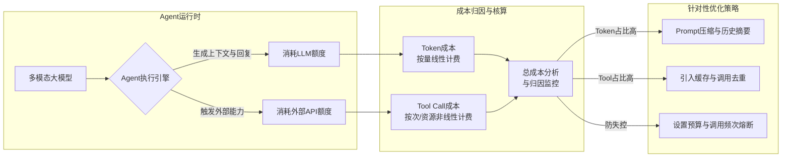

# 在多模态Agent的成本归因分析中，为什么要区分Token成本和Tool Call成本？

因为LLM Agent的经济模型不仅仅由语言模型本身决定。Token成本主要取决于Prompt长度和生成的回复长度，受Prompt工程影响大。而Tool Call成本涉及调用外部API（如搜索、数据库查询、CV模型）的费用和网络延迟，这在长链路任务中可能在商业上不可行。区分两者可以帮助开发者精准优化：如果Token成本高，优化Prompt压缩和Context策略；如果Tool成本高，优化工具选择的准确性和调用频率。忽略Tool Call成本可能导致Agent虽然回答准确，但因频繁调用昂贵的地图或搜索API而在商业上不可行。

**实战案例**：
在开发“订餐助手”Agent时，初期未做限制，Agent每轮对话平均调用地图API 3次（查位置、查距离、查导航），单日API费用达数百美元。通过引入成本归因，发现Tool Call成本占比超80%，随后增加了工具调用的去重逻辑和缓存层，将费用降低至原来的1/5。

**代码示例**（Python）：
```python
# 计算单次Agent请求的综合成本
def calculate_total_cost(usage, tools_cost, model_price_per_1k):
    # Token成本 (输入+输出)
    token_cost = (usage.prompt_tokens + usage.completion_tokens) * model_price_per_1k / 1000
    # Tool Call成本 (外部API如搜索/OCR等)
    tool_cost = sum(t.price for t in tools_cost)
    return {
        "token_cost": round(token_cost, 6),
        "tool_cost": round(tool_cost, 6),
        "total_cost": round(token_cost + tool_cost, 6)
    }
```

**对比表格**：

| 维度 | Token 成本 | Tool Call 成本 |
| :--- | :--- | :--- |
| **成本来源** | LLM 输入/输出计费 | 第三方 API 调用费、云资源费、网络流量费 |
| **优化手段** | Prompt 压缩、Context 裁剪、量化、小模型微调 | 结果缓存、多路归并、选用平替服务、限制调用频次 |
| **瓶颈特征** | 上下文越长越贵，呈线性增长 | 单次调用可能极贵（如OCR/大图搜索），受网络延迟影响 |
| **计费粒度** | 通常按 1k Tokens 精度计费 | 通常按“次”或按资源量计费，不可预测性较强 |

## 技术原理

Agent 的总成本 = Token 成本 + Tool Call 成本，两者性质完全不同，必须分开核算才能针对性优化：

- **Token 成本的线性特征**：LLM 按 token 计费（输入 + 输出），成本与上下文长度和生成长度严格线性相关。公式：`token_cost = (prompt_tokens + completion_tokens) × price_per_1k`。这意味着：上下文越长越贵（每次调用都要重新传入完整历史），且这是**每轮都付的固定成本**——多轮对话会累积放大。
- **Tool Call 成本的非线性特征**：外部 API（搜索、OCR、地图、数据库）按"次"或"资源量"计费，单次可能极贵（如 OCR 一张大图 0.01 美元，向量搜索 0.001 美元/次）。成本与调用次数和单次资源消耗相关，**非线性且可预测性差**——Agent 可能因为 prompt 设计不当，在一轮对话里反复调用同一工具，成本爆炸。
- **为什么要区分**：
  - **优化手段不同**：Token 高 → 压缩 prompt、裁剪历史、用小模型；Tool 高 → 加缓存、去重、限制调用频次。
  - **商业可行性判断不同**：Token 成本是可预测的线性增长，容易定价；Tool 成本可能因用户行为（如反复查询）而爆炸，让"看起来准确"的方案在商业上不可行。
  - **归因定位**：不区分就无法知道"钱花在哪了"。某 Agent 总成本高，可能是 Token（需压缩 prompt）也可能是 Tool（需加缓存），优化方向完全相反。

## 代码示例

```python
from dataclasses import dataclass, field
from functools import lru_cache

@dataclass
class ToolCallRecord:
    name: str
    cost: float          # 单次成本
    cached: bool = False

@dataclass
class CostTracker:
    """追踪单次 Agent 请求的 Token + Tool 成本"""
    token_input: int = 0
    token_output: int = 0
    tool_calls: list = field(default_factory=list)

    def add_tokens(self, prompt_tokens, completion_tokens):
        self.token_input += prompt_tokens
        self.token_output += completion_tokens

    def add_tool_call(self, name, cost, cached=False):
        self.tool_calls.append(ToolCallRecord(name, cost, cached))

    def summary(self, model_price_per_1k):
        token_cost = (self.token_input + self.token_output) * model_price_per_1k / 1000
        tool_cost = sum(t.cost for t in self.tool_calls if not t.cached)
        total = token_cost + tool_cost
        return {
            "token_cost": round(token_cost, 4),
            "tool_cost": round(tool_cost, 4),
            "total": round(total, 4),
            "tool_cost_ratio": round(tool_cost / total, 2) if total else 0,
            "tool_calls": len(self.tool_calls),
            "cached_calls": sum(1 for t in self.tool_calls if t.cached),
        }

# Tool 调用加缓存（降低重复调用的成本）
@lru_cache(maxsize=1000)
def cached_search(query: str) -> str:
    """带 LRU 缓存的搜索：相同 query 只调一次 API"""
    return search_api(query)   # 单次成本 0.005 美元

# 调用去重（同一轮内相同参数的调用合并）
class ToolCallDeduplicator:
    def __init__(self):
        self.called = {}
    def call_once_per_session(self, tool, key, *args):
        if key in self.called:
            return self.called[key]   # 命中去重，不重复计费
        result = tool(*args)
        self.called[key] = result
        return result
```

```python
# 成本归因分析（找出占比最高的成本项）
def cost_attribution(tracker: CostTracker, model_price):
    s = tracker.summary(model_price)
    if s["tool_cost_ratio"] > 0.5:
        recommendation = "Tool 成本占比高，优先优化：加缓存、去重、限制调用频次"
    else:
        recommendation = "Token 成本占比高，优先优化：压缩 prompt、裁剪历史、用小模型"
    return {**s, "recommendation": recommendation}
```

## 注意事项

- **Tool Call 成本最易被忽视**：开发者常只盯 Token 成本（看得见、可预测），忽略 Tool Call 可能占总成本 80%+。某订餐 Agent 每轮调 3 次地图 API，单日费用数百美元——这是典型的 Tool 成本失控。
- **缓存是降 Tool 成本的第一手段**：相同 query 的搜索结果、相同图片的 OCR 结果都可缓存（LRU + TTL）。命中率高的场景能降 80% 成本。
- **限制 Agent 的调用频次**：Agent 可能因为 prompt 设计不当反复调同一工具。设置 `max_tool_calls_per_turn`（如 5 次）和会话级去重，防止失控。
- **Token 成本靠压缩 prompt**：历史对话摘要、system prompt 精简、用 few-shot 代替长指令。多轮对话累积的 Token 是大头，定期摘要压缩历史。
- **建立成本预算和熔断**：单次请求设置成本上限（如 0.1 美元），超限熔断返回降级回答。防止恶意用户构造超长对话或触发大量工具调用拖垮成本。

## 流程图



## 核心知识点图


## 记忆要点

- 成本构成：Token成本取决于上下文长度，Tool成本取决于外部API调用。
- 优化侧重：Token高则压缩Prompt，Tool高则优化工具选择和缓存。
- 商业风险：忽略Tool Call成本可能导致准确但不可行的商业方案。
- 计费差异：Token按量线性计费，Tool按次或资源计费且波动大。
- 实战策略：引入成本归因分析，针对性优化占比最高的成本项。


## 结构化回答

**30 秒电梯演讲：** 区分AI思维成本与执行成本，以实现商业可行性。——打个比方，就像算水电费，不能只看电表（Token），还要单独算水费、燃气费（Tool Call），否则可能因为水龙头没关（滥用API）导致总费用爆炸。

**展开框架：**
1. **成本构成** — Token成本取决于上下文长度，Tool成本取决于外部API调用。
2. **优化侧重** — Token高则压缩Prompt，Tool高则优化工具选择和缓存。
3. **商业风险** — 忽略Tool Call成本可能导致准确但不可行的商业方案。

**收尾：** 以上三点都能配合实战聊。您想深入聊哪一块？

## 视频脚本

> 预计时长：2 分钟 | 由浅入深

| 时间 | 画面/字幕 | 口播台词 | 讲解要点 |
|------|----------|----------|----------|
| 0:00 | 标题卡 | "在多模态Agent的成本归因分析中，为什么要区分Token成本和Tool Cal，30 秒讲清楚。" | 开场钩子 |
| 0:30 | 概念定义动画 | "一句话：区分AI思维成本与执行成本，以实现商业可行性。" | 核心定义 |
| 1:00 | 成本构成图解 | "Token成本取决于上下文长度，Tool成本取决于外部API调用。" | 成本构成 |
| 1:30 | 总结卡 | "记好这几条，面试不慌。下期见。" | 收尾 |
