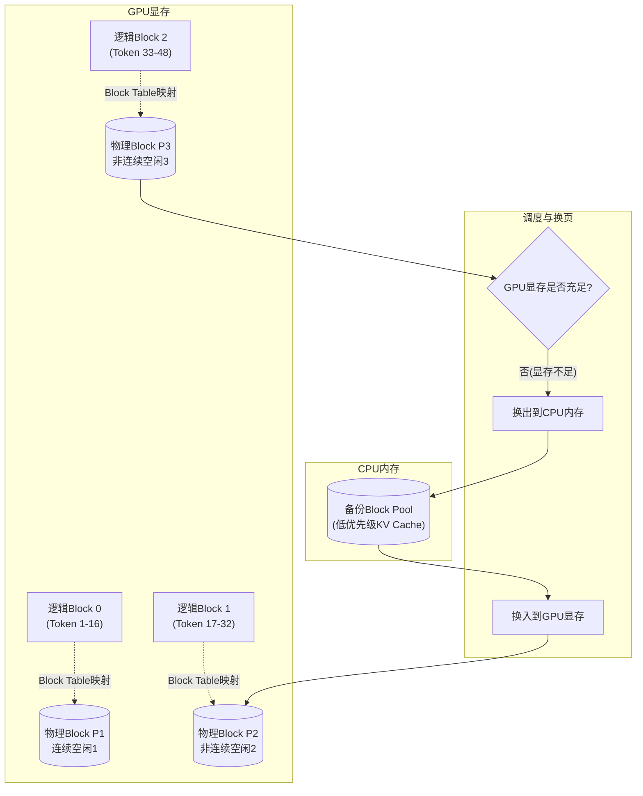
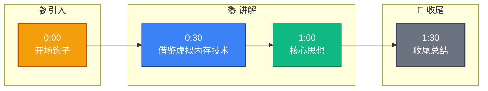

# vLLM 的 PagedAttention 技术核心是什么？它是如何解决显存碎片化问题的？

vLLM 的核心创新 PagedAttention 借鉴了操作系统的分页内存管理思想。在传统的 LLM 推理中，KV Cache 需要连续的显存空间，随着序列长度变化和 Batch 处理，极易产生严重的**内存碎片**，导致显存利用率低且难以扩展。PagedAttention 将每个序列的 KV Cache 切分成固定大小的**块**，存储在非连续的显存页中。通过 Block Manager 管理这些页面，类似于 CPU 管理虚拟内存。当需要生成新 Token 时，如果物理内存不足，系统可以将暂时不用的 Block 页面换出到 CPU 内存，待需要时再换入。这种机制极大地提高了显存利用率，消除了预留显存的需要，从而支持了更大的 Batch Size 和更长的上下文，是 vLLM 吞吐量远高于 HuggingFace 的关键。

## 技术原理

- **借鉴操作系统虚拟内存的分页机制**：操作系统把进程的虚拟地址空间切成固定大小的页（通常 4KB），通过页表映射到非连续的物理页帧。PagedAttention 完全照搬这一思想——把每个序列的 KV Cache 切成固定大小的 Block（如 16 个 token 的 K/V），通过 Block Table 把逻辑 Block 映射到物理 Block（非连续显存页）。
- **将 KV Cache 切分为固定大小的 Block，非连续存储**：传统推理要为每个序列预分配一块连续显存（按 max_length 预留），实际生成长度未知导致 60%-80% 显存被浪费在"预留但未用"上。PagedAttention 按需分配 Block——生成第 1-16 个 token 时分配 1 个 Block，第 17 个再分配下一个，且这些 Block 在物理上可以任意分散，通过 Block Table 串起来。
- **支持显存与 CPU 内存间的换入换出，提高利用率**：类似 OS 的 swap 机制，当 GPU 显存不足时，可以把某些序列（如被抢占的低优先级请求）的 Block 换出到 CPU 内存，腾出显存给高优先级或新请求；等需要恢复时再换入。这让 vLLM 能超量接纳请求，吞吐量显著提升。

## 对比/选型

| 方案 | KV Cache 存储 | 显存利用率 | 支持换出 | 典型吞吐 |
|------|---------------|------------|----------|----------|
| 传统 HF Transformers | 连续预分配 | 20%-40% | 否 | 基线 1x |
| PagedAttention（vLLM） | 非连续分页 Block | 90%+ | 是 | 2-4x |
| FlashAttention | 连续但融合计算 | 中 | 否 | 主要省计算 |

## 代码示例

vLLM 启动时显式配置 PagedAttention 的 Block 大小（默认 16）：

```python
from vllm import LLM, EngineArgs

llm = LLM(
    model="meta-llama/Llama-3-8B",
    block_size=16,                  # 每个 Block 容纳 16 个 token 的 KV（默认）
    swap_space=4,                   # CPU 换出空间 4GB
    gpu_memory_utilization=0.9,     # 显存占用上限 90%
    max_num_seqs=256,               # 最大并发序列数
    enable_prefix_caching=True,     # 复用相同前缀的 Block
)
outputs = llm.generate(prompts)
```

PagedAttention 的 Block Table 概念（伪代码）：

```
逻辑视图（序列 A，已生成 5 个 token）：
  [Block 0: t0..t15]  [Block 1: t16..t31]

物理显存（非连续）：
  GPU 页 #7:  t0 t1 t2 t3 t4 _ _ _ ... _   （Block 0 → 物理 #7）
  GPU 页 #23: t16 t17 ... _ _ _             （Block 1 → 物理 #23）

Block Table[A] = [7, 23]   # 逻辑 Block → 物理页的映射
```

## 常见坑/注意事项

- **Block Size 的权衡**：Block 太小（如 4）Block Table 膨胀增加查表开销；太大（如 64）尾部 Block 浪费多。默认 16 是经验最优，一般不调。
- **换出换入的代价**：swap 到 CPU 虽然提升并发，但 PCIe 带宽有限，频繁换页会拖慢 P99 延迟。生产环境通常把 swap_space 设小，靠抢占式调度而非大量 swap。
- **PagedAttention 主要优化吞吐而非单次延迟**：单请求延迟可能与传统方案接近甚至略高（多了查表），它的价值在于同时服务更多请求，所以适合批处理/高并发场景，不适合单请求低延迟优先的场景。
- **与 Prefix Caching 配合**：相同 system prompt 的多请求可共享前缀 Block，PagedAttention 让这种共享成为可能（引用计数），是 RAG 场景吞吐提升的关键。

## 流程图




## 记忆要点

- 核心思想：借鉴操作系统分页管理，将KV Cache切分为固定大小的块。
- 解决碎片：Block存储在非连续显存，无需预留大块连续内存。
- 内存管理：Block Manager管理页面，支持CPU与GPU内存换入换出。
- 性能提升：极大提高显存利用率，支持更大Batch Size和长上下文。
- 对比优势：消除显存碎片，吞吐量远高于传统HuggingFace推理。


## 结构化回答

**30 秒电梯演讲：** 借鉴虚拟内存技术，将KV Cache分块管理，消除显存碎片。——打个比方，就像读写字典，传统方式必须撕下连续的几页（容易撕坏或没地方放），而PagedAttention可以随便找散落在书桌上的空白卡片写，写满再整理，桌面利用率极高。

**展开框架：**
1. **核心思想** — 借鉴操作系统分页管理，将KV Cache切分为固定大小的块。
2. **解决碎片** — Block存储在非连续显存，无需预留大块连续内存。
3. **内存管理** — Block Manager管理页面，支持CPU与GPU内存换入换出。

**收尾：** 以上三点都能配合实战聊。您想深入聊哪一块？

## 视频脚本

> 预计时长：2 分钟 | 由浅入深

| 时间 | 画面/字幕 | 口播台词 | 讲解要点 |
|------|----------|----------|----------|
| 0:00 | 标题卡 | "vLLM 的 PagedAttention 技术核心是什么，30 秒讲清楚。" | 开场钩子 |
| 0:30 | 概念定义动画 | "一句话：借鉴虚拟内存技术，将KV Cache分块管理，消除显存碎片。" | 核心定义 |
| 1:00 | 核心思想图解 | "借鉴操作系统分页管理，将KV Cache切分为固定大小的块。" | 核心思想 |
| 1:30 | 总结卡 | "记好这几条，面试不慌。下期见。" | 收尾 |

### 视频流程图


