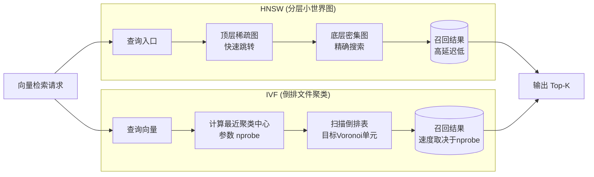

# 在构建向量数据库索引时，HNSW（分层可导航小世界图）和 IVF（倒排文件）有哪些性能和资源上的权衡？

HNSW 是基于图的索引，通过构建多层图结构实现快速近似最近邻搜索。其**优势**在于查询速度极快（对数级复杂度）和召回率高，尤其适合高维向量。**劣势**是构建索引时间长，内存占用较大（需要存储完整的图结构），且插入新数据成本相对较高。IVF（倒排文件）基于聚类，首先将数据划分到若干个 Voronoi 单元（聚类中心），查询时只需搜索最近的几个聚类。其**优势**在于构建速度快，内存占用相对可控，且支持增量更新。**劣势**是查询速度通常慢于 HNSW，且高度依赖聚类参数（如 nprobe）的调优，召回率在极端情况下可能不如 HNSW 稳定。**选型建议**：对查询延迟极度敏感且资源充足选 HNSW；对写入性能敏感或成本受限选 IVF（或其量化版 IVF-PQ）。

## 技术原理

- **HNSW：读快写慢，吃内存，高维强**：HNSW（分层小世界图）构建多层图——顶层稀疏快速跳转、底层密集精确搜索。查询从顶层入口逐层贪心向下，复杂度近似 O(log N)，召回率高（95%+）。代价是图结构占内存（每个向量要存 m 条连接边），且插入新点要在多层图上做搜索更新邻居，写成本高。
- **IVF：建库快，省资源，适合增量**：IVF（倒排文件）先用 k-means 把向量聚成 nlist 个簇，查询时只扫描离查询最近的 nprobe 个簇。构建只需一次聚类，速度快、内存可控（只存聚类中心 + 倒排表）。新增数据归入最近簇即可，增量友好。代价是查询要遍历 nprobe 个簇的所有点，比 HNSW 慢，且 nprobe 太小召回低、太大又退化成全扫描。
- **HNSW 查得准，IVF 需调参平衡召回率**：HNSW 在合理参数下召回率天然高且稳定；IVF 强依赖 nprobe 调参，参数不对要么召回暴跌要么延迟爆炸。生产中常把 IVF 与 PQ（乘积量化）结合成 IVF-PQ，用有损压缩换内存和成本，是十亿级大规模检索的主流方案。

## 对比/选型

| 维度 | HNSW | IVF | IVF-PQ |
|------|------|-----|--------|
| 数据结构 | 分层图 | 倒排聚类 | 倒排 + 量化压缩 |
| 查询速度 | 极快（O(logN)） | 中（依赖 nprobe） | 中 |
| 召回率 | 高（95%+） | 中（需调 nprobe） | 中低（有损） |
| 内存占用 | 大（存图结构） | 中 | 极小（压缩） |
| 构建速度 | 慢 | 快 | 快 |
| 增量更新 | 贵（改图） | 便宜 | 便宜 |
| 适合场景 | 百万级、低延迟 | 千万级、读多写多 | 十亿级、成本敏感 |

## 命令演示

Faiss 构建两种索引对比：

```python
import faiss
import numpy as np

data = np.random.rand(1_000_000, 768).astype('float32')
query = np.random.rand(1, 768).astype('float32')

# HNSW：高召回、低延迟、吃内存
hnsw = faiss.IndexHNSWFlat(768, M=32)            # M=每节点连接数
hnsw.add(data)
D_h, I_h = hnsw.search(query, 10)                # 几乎瞬时

# IVF：省内存、需调 nprobe
nlist = 4096
quantizer = faiss.IndexFlatL2(768)
ivf = faiss.IndexIVFFlat(quantizer, 768, nlist)
ivf.train(data); ivf.add(data)
ivf.nprobe = 16                                   # 调大→召回高但慢
D_i, I_i = ivf.search(query, 10)

# IVF-PQ：十亿级、有损压缩、最省内存
pq = faiss.IndexIVFPQ(quantizer, 768, nlist, 96, 8)   # 96 个子量化器，每个 8 bit
pq.train(data); pq.add(data)
pq.nprobe = 16
D_p, I_p = pq.search(query, 10)
```

## 常见坑/注意事项

- **HNSW 的 m 和 ef_construction 决定上限**：m（连接数）太小图断连召回暴跌，太大内存爆炸；构建时 ef_construction 越高图质量越好但构建越慢。改参数要重建索引。
- **IVF 的 nprobe 是查询时参数**：可热调，高峰调小保延迟、闲时调大保召回，但天花板由 nlist 和数据分布决定，地基差调不出高召回。
- **IVF 必须先 train 再 add**：聚类中心要先训练出来才能分类，忘了 train 直接 add 会报错或召回为 0。
- **PQ 的有损会掉精度**：压缩比越高召回越低，需配合 rerank（先用 PQ 粗排取 top-1000，再用 Flat 精排 top-10）补回精度。
- **HNSW 不支持高效删除**：图索引删除节点要复杂重连，多数实现只能标记删除不真正回收，长期增删后需重建。

## 流程图



## 记忆要点

- HNSW特点：基于图结构，查询极快且召回率高，但构建慢、内存大。
- IVF特点：基于聚类，构建快且内存可控，但查询慢且依赖参数调优。
- 查询性能：HNSW是对数级复杂度，IVF需搜索最近聚类中心。
- 写入性能：HNSW插入成本高，IVF支持增量更新更灵活。
- 选型建议：读多写少选HNSW，写多读少或成本受限选IVF。


## 结构化回答

**30 秒电梯演讲：** HNSW换空间换速度，IVF换精度换成本。——打个比方，HNSW像复杂的地铁导航网，建路贵但跑得快；IVF像把城市划分成几个大区，找东西先去最近的区里翻，省地儿但查得慢。

**展开框架：**
1. **HNSW特点** — 基于图结构，查询极快且召回率高，但构建慢、内存大。
2. **IVF特点** — 基于聚类，构建快且内存可控，但查询慢且依赖参数调优。
3. **查询性能** — HNSW是对数级复杂度，IVF需搜索最近聚类中心。

**收尾：** 以上三点都能配合实战聊。您想深入聊哪一块？

## 视频脚本

> 预计时长：2 分钟 | 由浅入深

| 时间 | 画面/字幕 | 口播台词 | 讲解要点 |
|------|----------|----------|----------|
| 0:00 | 标题卡 | "在构建向量数据库索引时，HNSW（分层可导航小世界图）和 IVF（倒排文件）有哪，30 秒讲清楚。" | 开场钩子 |
| 0:30 | 概念定义动画 | "一句话：HNSW换空间换速度，IVF换精度换成本。" | 核心定义 |
| 1:00 | HNSW特点图解 | "基于图结构，查询极快且召回率高，但构建慢、内存大。" | HNSW特点 |
| 1:30 | 总结卡 | "记好这几条，面试不慌。下期见。" | 收尾 |
