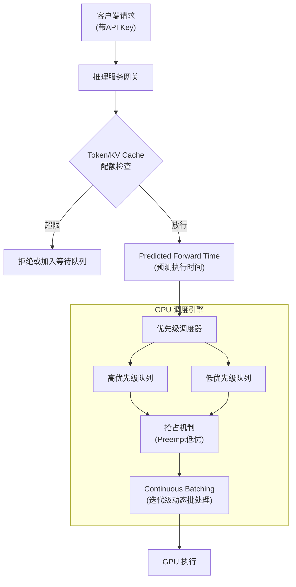

# 在推理服务网关设计中，如何实现基于 Token 的限流与请求优先级调度？

在 LLM 推理服务中，传统的 QPS 限流不够精细，因为每个请求的长度和生成 Token 数差异巨大。更合理的策略是基于**计算量（总 Token 数）**或**KV Cache 占用量**进行限流。实现上，网关维护每连接的资源计数。对于优先级调度，通常采用**两级队列**：高优先级请求可抢占低优先级资源或进入“快车道”。常用算法包括**Maximal Batching**和**Continuous Batching**。此外，需通过**Predicted Forward Time**预测完成时间，以便更公平地分配 GPU 时间片。

## 技术原理

- **基于 Token 或 KV Cache 的精细化限流**：传统 QPS 限流假设每个请求消耗相当，但 LLM 请求差异巨大——生成 10 token 和 2000 token 的计算量差 200 倍。按 QPS 限流时，少量长请求能撑爆 GPU；按 Token 限流（每分钟总生成 token 上限）或按 KV Cache 占用（每请求预约的 block 数总和上限）才匹配真实资源消耗。网关维护每个 API Key/用户的 Token 计数和当前占用 Block 数，超限则排队或拒绝。
- **两级队列与抢占式优先级调度**：维护高/低优先级两个请求队列，高优先级（付费用户、关键业务）可抢占低优先级的 GPU 资源。vLLM 的 `PREEMPT` 机制把低优先级请求的 KV Cache 换出到 CPU 或直接丢弃，腾出 Block 给高优先级请求，被抢占的请求稍后重新调度。这比 FIFO 队列能更好保障 SLA。
- **Maximal/Continuous Batching 批处理策略**：传统静态 batching 要等满 batch 或超时才执行，请求长度不一时短请求会被长请求拖累。Continuous Batching（迭代级调度）每个 token 生成步都重新组 batch——完成的请求立即退出让位给新请求，让 GPU 始终满载，吞吐提升 2-8 倍。
- **预测完成时间以公平分配时间片**：用 Predicted Forward Time（基于 prompt 长度和历史生成长度预测）估算每个请求的剩余耗时，调度器据此决定下一个 token 步放谁进 batch，避免一个长请求饿死后续短请求。

## 对比/选型

| 限流维度 | 衡量什么 | 优点 | 缺点 |
|----------|----------|------|------|
| QPS | 请求数/秒 | 简单 | 忽略请求大小，长请求撑爆 |
| Token/min | 总生成 token | 匹配计算成本 | 难以预估生成长度 |
| KV Cache | 占用 Block 数 | 匹配显存占用 | 实现复杂 |
| 并发数 | 同时在跑的请求 | 直观 | 不区分资源消耗 |

## 代码示例

Token bucket + 优先级队列（伪代码）：

```python
class LLMGateway:
    def __init__(self):
        self.token_bucket = {}        # user -> 剩余 token 配额
        self.high_prio_queue = PriorityQueue()
        self.low_prio_queue  = PriorityQueue()

    def admit(self, request):
        # 1. Token 限流：按预测生成长度预扣
        est_tokens = estimate_output_length(request.prompt)
        if self.token_bucket.get(request.user, 0) < est_tokens:
            return reject_or_queue(request)
        self.token_bucket[request.user] -= est_tokens

        # 2. 优先级路由
        q = self.high_prio_queue if request.premium else self.low_prio_queue
        q.put((request.predicted_time, request))

    def schedule_batch(self, engine):
        # Continuous Batching：每个 step 重新组 batch
        batch = []
        for q in [self.high_prio_queue, self.low_prio_queue]:
            while not q.empty() and len(batch) < MAX_BATCH:
                batch.append(q.get()[1])
        # 高优先级可触发抢占：换出低优先级的 KV Cache
        engine.step(batch, allow_preempt=True)
```

## 常见坑/注意事项

- **预测生成长度不准**：Token 限流依赖预估，实际生成长可能远超预测导致超额。可设硬上限 `max_tokens` 强制截断，或事后按实际 token 结算补扣。
- **抢占有代价**：被抢占的请求 KV Cache 换出/重算有开销，频繁抢占反而降低吞吐；应设最小执行步数（如至少跑 64 token 才可被抢占）。
- **饥饿问题**：纯优先级调度会让低优先级长期等待，需配合 aging（等待越久优先级渐增）或预留最低保障配额。
- **Continuous Batching 对长尾不友好**：长请求在每个 step 都占用一个 batch 位，可能拖慢整体 P99，需对单请求设最大生成长度。
- **不要忽略 prefill 阶段的突发**：长 prompt 的 prefill（首 token 前向）是计算密集的，瞬时压力大，限流要同时覆盖 prefill 而非只看 decode。

## 流程图



## 核心知识点图


## 记忆要点

- 稠密检索：用Embedding捕捉语义相似性，解决词汇不匹配，但计算贵。
- 稀疏检索：如BM25关键词匹配，精确匹配强效率高，但不懂语义。
- 混合检索：结合两者优势，通常用RRF或分数加权融合结果。
- 互补效应：稠密懂语义，稀疏懂实体，混合能提升RAG召回率。
- 实践结论：混合检索在大多数场景下效果优于单一检索方式。


## 结构化回答

**30 秒电梯演讲：** 用Token粒度限流，通过抢占式调度与批处理优化GPU利用率。——打个比方，就像机场安检，传统QPS是限制进站人数，Token限流是限制行李总重；优先级调度则是让VIP旅客插队，或者将普通旅客打包成一车过安检，以提高传送带（GPU）的使…

**展开框架：**
1. **稠密检索** — 用Embedding捕捉语义相似性，解决词汇不匹配，但计算贵。
2. **稀疏检索** — 如BM25关键词匹配，精确匹配强效率高，但不懂语义。
3. **混合检索** — 结合两者优势，通常用RRF或分数加权融合结果。

**收尾：** 以上三点都能配合实战聊。您想深入聊哪一块？

## 视频脚本

> 预计时长：2 分钟 | 由浅入深

| 时间 | 画面/字幕 | 口播台词 | 讲解要点 |
|------|----------|----------|----------|
| 0:00 | 标题卡 | "在推理服务网关设计中，如何实现基于 Token 的限流与请求优先级调度，30 秒讲清楚。" | 开场钩子 |
| 0:30 | 概念定义动画 | "一句话：用Token粒度限流，通过抢占式调度与批处理优化GPU利用率。" | 核心定义 |
| 1:00 | 稠密检索图解 | "用Embedding捕捉语义相似性，解决词汇不匹配，但计算贵。" | 稠密检索 |
| 1:30 | 总结卡 | "记好这几条，面试不慌。下期见。" | 收尾 |
