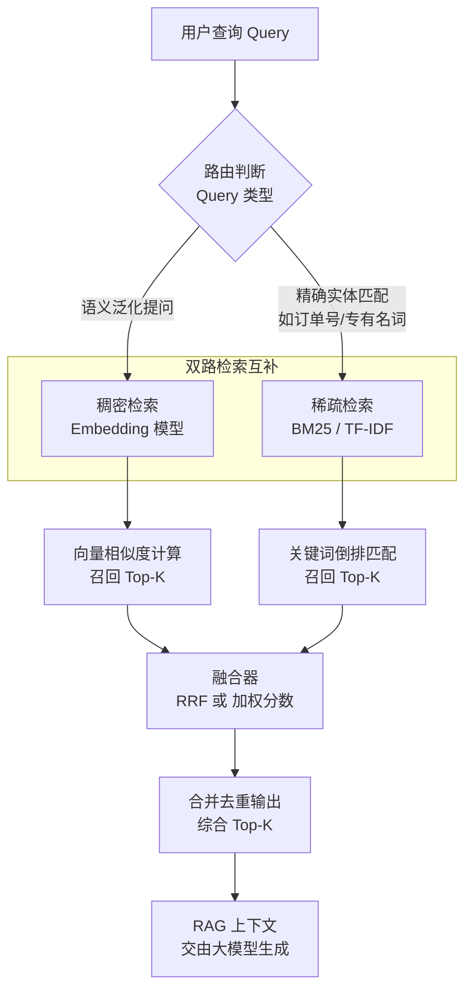

# 在向量检索中，稠密检索和稀疏检索有何优缺点？混合检索是如何结合两者的？

**稠密检索**使用 Embedding 模型将文本转化为高维向量，擅长捕捉语义相似性，能解决词汇不匹配问题，但对实体名称等精确匹配较弱，且计算成本高。**稀疏检索**（如 BM25、TF-IDF）基于关键词匹配，擅长精确匹配和稀有词查找，效率高，但无法理解语义。**混合检索**通过结合两者的优势，通常采用“加权倒数排名融合（RRF）”或分数加权融合。例如，对于一个查询，分别计算其向量相似度和 BM25 分数，然后按比例融合。实践证明，混合检索在大多数 RAG 场景下比单一检索方式的召回率更高，因为它兼顾了语义理解和关键词精确匹配。

## 技术原理

- **稠密：语义强、精度弱、成本高**：稠密检索用 Embedding 模型把 query 和文档编码成高维向量，通过余弦/内积相似度匹配。它能抓住语义——"如何省钱"能召回讲"理财规划"的文档（无字面重叠）。但向量相似对专有名词、ID、代码等精确匹配弱（"订单号 ABC123"可能匹配到无关文档），且 Embedding 编码和向量检索的计算成本远高于关键词倒排。
- **稀疏：关键词强、无语义、效率高**：稀疏检索（BM25/TF-IDF）基于词频统计做关键词倒排匹配，对稀有词和精确实体（产品名、人名）召回精准，倒排索引查询是毫秒级。但它不理解语义——"如何省钱"不会召回只讲"理财"的文档，对 query 改写、近义词、错别字无能为力。
- **混合：RRF 或分数融合，兼顾语义与精确匹配**：同时跑稠密（向量召回 top-K）和稀疏（BM25 召回 top-K），再用 RRF（倒数排名融合 `1/(k+rank)`）或加权分数融合合并结果。两路互补——稠密补语义、稀疏补实体，融合后召回率显著高于任一单路。RAG 场景下混合检索几乎是标配。

## 对比/选型

| 维度 | 稠密检索 | 稀疏检索 | 混合检索 |
|------|----------|----------|----------|
| 匹配方式 | 语义向量相似 | 关键词倒排 | 双路融合 |
| 语义理解 | 强 | 无 | 强 |
| 精确匹配 | 弱 | 强 | 强 |
| 计算成本 | 高（Embedding+ANN） | 低（倒排） | 中高 |
| 召回率 | 中 | 中 | 高 |
| 适合场景 | 模糊语义、问答 | 实体/关键词精确 | 通用 RAG |

## 代码示例

Elasticsearch 混合检索（BM25 + kNN 向量，用 RRF 融合）：

```json
GET /kb_docs/_search
{
  "size": 10,
  "retriever": {
    "rrf": {
      "rank_window_size": 50,
      "rank_constant": 60,
      "retrievers": [
        { "standard": { "query": { "match": { "content": "如何省钱买基金" } } } },
        { "knn": { "field": "embedding", "query_vector": [0.12, -0.05, "..."], "num_candidates": 100 } }
      ]
    }
  }
}
```

LangChain 混合 retriever（EnsembleRetriever 自动加权融合）：

```python
from langchain.retrievers import EnsembleRetriever

bm25 = BM25Retriever.from_documents(docs)           # 稀疏
bm25.k = 20
vector = FAISS.from_documents(docs, embeddings).as_retriever(search_kwargs={"k": 20})

ensemble = EnsembleRetriever(
    retrievers=[bm25, vector],
    weights=[0.4, 0.6],                              # BM25 0.4 / 向量 0.6
)
results = ensemble.invoke("如何理财")               # 自动融合两路
```

## 常见坑/注意事项

- **两路 top-K 要足够大**：BM25 和向量各召回 top-20 以上再融合，否则候选集太小，融合效果体现不出来。
- **权重不是拍脑袋**：加权融合的权重（0.4/0.6）对不同业务差异大，要用标注集离线调；或直接用 RRF 免去调权。
- **Embedding 模型要和语料匹配**：通用 Embedding 在垂直领域（医疗/法律/代码）召回差，需用领域微调的 Embedding 模型。
- **稀疏检索的中文分词**：BM25 在中文上效果强依赖分词器，默认分词对专业术语切分差，需配 IK/PKU 等中文分词插件。
- **混合检索≠一定更好**：极短查询（1-2 词）或纯实体查询（订单号）时，纯 BM25 可能更准，融合反而引入噪声，要按 query 类型路由。

## 流程图



## 记忆要点

- 稠密重语义而稀疏重字面：前者靠Embedding解决词汇不匹配，后者靠BM25擅长精确匹配和稀有词
- 因为稠密计算成本高且弱实体，稀疏无法理解语义，所以需要混合检索兼顾两者优势
- 混合检索的核心机制是融合双路召回结果，常采用RRF（倒数排名融合）或分数加权法
- 实战记忆：RAG场景首选混合检索，因为它能同时保障语义泛化能力与关键词精确召回率


## 结构化回答

**30 秒电梯演讲：** 稠密懂意不懂词，稀疏懂词不懂意，混合兼优。——打个比方，稠密检索像读后感理解大意，稀疏检索像查字典精准找词，混合检索是“理解大意”加“查找关键词”双管齐下。

**展开框架：**
1. **稠密重语义而稀疏** — 稠密重语义而稀疏重字面：前者靠Embedding解决词汇不匹配，后者靠BM25擅长精确匹配和稀有词
2. **因为稠密计算成本** — 因为稠密计算成本高且弱实体，稀疏无法理解语义，所以需要混合检索兼顾两者优势
3. **混合检索的核心机** — 混合检索的核心机制是融合双路召回结果，常采用RRF（倒数排名融合）或分数加权法

**收尾：** 以上三点都能配合实战聊。您想深入聊哪一块？

## 视频脚本

> 预计时长：2 分钟 | 由浅入深

| 时间 | 画面/字幕 | 口播台词 | 讲解要点 |
|------|----------|----------|----------|
| 0:00 | 标题卡 | "在向量检索中，稠密检索和稀疏检索有何优缺点，30 秒讲清楚。" | 开场钩子 |
| 0:30 | 概念定义动画 | "一句话：稠密懂意不懂词，稀疏懂词不懂意，混合兼优。" | 核心定义 |
| 1:00 | 稠密重语义而稀疏重字面图解 | "前者靠Embedding解决词汇不匹配，后者靠BM25擅长精确匹配和稀有词" | 稠密重语义而稀疏重字面 |
| 1:30 | 总结卡 | "记好这几条，面试不慌。下期见。" | 收尾 |
