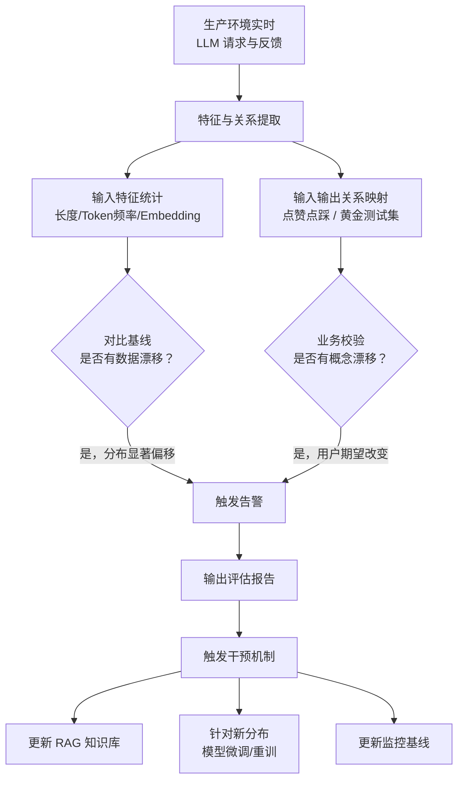
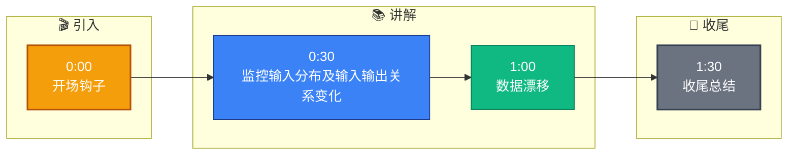

# 在MLOps实践中，如何检测生产环境中LLM的“数据漂移”和“概念漂移”？这对模型监控有何意义？

在生产环境中，数据漂移指输入数据分布随时间变化（如Prompt句式变长或出现新术语），而概念漂移指输入与输出关系改变（如用户对同一问题的期望标准变了）。检测数据漂移通常通过统计输入长度、Token频率或嵌入向量距离（如KL散度）与基线对比。检测概念漂移更难，需依赖人工反馈（RLHF）或定期用黄金测试集评估输出质量。这至关重要，因为LLM基于预训练分布生成结果，严重漂移会导致性能退化、幻觉或安全失效，从而触发模型重训或微调。

## 技术原理

- **数据漂移：输入分布变化，监控长度、频率或向量距离**：LLM 的输入是 prompt，数据漂移指线上 prompt 的统计分布偏离训练/基线分布——如平均 prompt 长度从 200 token 涨到 800 token、新术语出现、领域从闲聊转向技术问答。检测手段：统计 prompt 长度分布、token 频率变化、用 Embedding 计算输入向量与基线的 KL 散度/ Wasserstein 距离。
- **概念漂移：输入输出关系变化，需人工反馈或黄金测试集**：同样输入下用户期望的"正确输出"随时间变了——如政策更新后某问题答案需改变、用户对风格的偏好变了、外部事实更新（公司被收购）。这种漂移无法只看输入检测，必须靠用户反馈（点赞/点踩、RLHF 数据）、客服工单或定期用黄金测试集（标注好的固定用例）回归评估输出质量。
- **意义：防止性能退化、幻觉上升，触发模型重训或微调**：LLM 基于预训练时的分布生成内容，分布漂移会让模型在新场景下性能悄悄退化、幻觉率上升或安全策略失效。监控漂移能在事故发生前触发重训/微调/RAG 知识更新，是 LLM 持续可靠上线的护栏。

## 检测方法对比

| 漂移类型 | 监控对象 | 检测方法 | 触发动作 |
|----------|----------|----------|----------|
| 数据漂移 | 输入分布 | 长度/token 频率/向量 KL 散度 | 自动告警 |
| 概念漂移 | 输入输出关系 | 黄金测试集回归、用户反馈率 | 人工介入评估 |
| 预测漂移 | 输出分布 | 输出长度/风格/拒答率 | 告警 + 抽样 |

## 代码示例

数据漂移检测（prompt 向量与基线 KL 散度）：

```python
import numpy as np
from scipy.stats import entropy

baseline_vecs = np.load("baseline_prompts.npy")    # 上线初期的 prompt 向量
baseline_hist, bins = np.histogramd(baseline_vecs.mean(axis=1), bins=50, density=True)

def check_drift(new_prompts):
    new_vecs = embed(new_prompts)
    new_hist, _ = np.histogram(new_vecs.mean(axis=1), bins=bins, density=True)
    kl = entropy(new_hist + 1e-9, baseline_hist + 1e-9)   # KL 散度
    if kl > 0.5:                                          # 阈值需根据业务校准
        alert(f"数据漂移告警 KL={kl:.3f}")

# 简化的统计特征监控（长度/词频）
def monitor_length(new_prompts):
    avg_len = np.mean([len(p.split()) for p in new_prompts])
    if abs(avg_len - baseline_avg_len) / baseline_avg_len > 0.3:
        alert(f"prompt 长度漂移 {avg_len} vs baseline {baseline_avg_len}")
```

概念漂移检测（黄金测试集回归）：

```python
GOLDEN_SET = load_jsonl("golden_test_500.jsonl")    # 500 条人工标注用例

def daily_regression():
    failures = 0
    for case in GOLDEN_SET:
        output = llm.generate(case["prompt"])
        score = judge(output, case["expected"])     # LLM-as-judge 或规则
        if score < THRESHOLD:
            failures += 1
    if failures / len(GOLDEN_SET) > 0.05:           # 失败率 >5% 告警
        alert(f"概念漂移告警，黄金集失败率 {failures/len(GOLDEN_SET):.1%}")
```

## 常见坑/注意事项

- **概念漂移比数据漂移更隐蔽**：数据漂移有量化指标可自动告警，概念漂移往往只体现在业务反馈里（用户不再满意、转化率下降），必须建立反馈闭环（埋点、客服工单分析），否则发现时已造成损失。
- **基线要可更新**：基线本身会随业务演进过时，需要定期重新校准基线（如每月用最近一周数据更新），否则误报频发。
- **Embedding 模型漂移**：如果 Embedding 模型自身升级了，向量分布会变，要和真正的数据漂移区分开（升级前后做一次基准对齐）。
- **黄金测试集要保持代表性**：测试集要随业务覆盖范围更新（加入新场景用例），否则会漏检新场景的退化。
- **不要只看整体指标**：整体准确率可能不变但某细分人群退化严重，需按用户分群/场景分桶监控。

## 流程图




## 记忆要点

- 数据漂移：输入分布变化，如句式变长或新词，通过统计特征检测。
- 概念漂移：输入输出关系改变，需靠人工反馈或黄金测试集评估。
- 检测方法：对比输入长度、Token频率或向量距离(KL散度)与基线。
- 监控意义：漂移会导致性能退化或幻觉，触发模型重训或微调。
- 核心挑战：概念漂移比数据漂移更隐蔽，需依赖业务反馈闭环。


## 结构化回答

**30 秒电梯演讲：** 监控输入分布及输入输出关系变化，保障LLM生产稳定性。——打个比方，就像餐厅监控食材变化（数据漂移）和顾客口味变化（概念漂移），以确保菜品持续受欢迎。

**展开框架：**
1. **数据漂移** — 输入分布变化，如句式变长或新词，通过统计特征检测。
2. **概念漂移** — 输入输出关系改变，需靠人工反馈或黄金测试集评估。
3. **检测方法** — 对比输入长度、Token频率或向量距离(KL散度)与基线。

**收尾：** 以上三点都能配合实战聊。您想深入聊哪一块？

## 视频脚本

> 预计时长：2 分钟 | 由浅入深

| 时间 | 画面/字幕 | 口播台词 | 讲解要点 |
|------|----------|----------|----------|
| 0:00 | 标题卡 | "在MLOps实践中，如何检测生产环境中LLM的“数据漂移”和“概念漂移”，30 秒讲清楚。" | 开场钩子 |
| 0:30 | 概念定义动画 | "一句话：监控输入分布及输入输出关系变化，保障LLM生产稳定性。" | 核心定义 |
| 1:00 | 数据漂移图解 | "输入分布变化，如句式变长或新词，通过统计特征检测。" | 数据漂移 |
| 1:30 | 总结卡 | "记好这几条，面试不慌。下期见。" | 收尾 |

### 视频流程图


