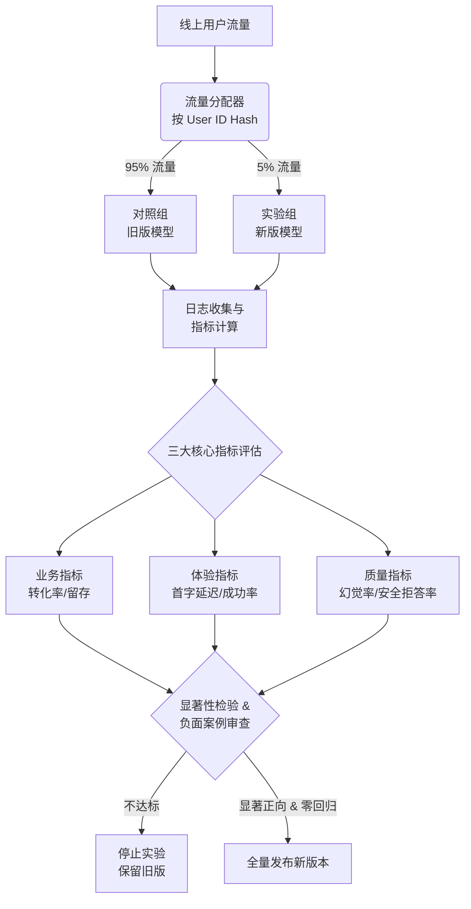
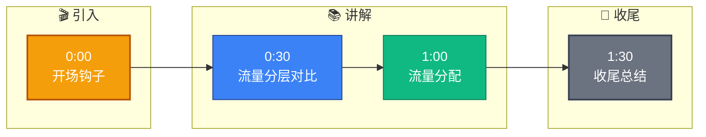

# 在MLOps的灰度发布中，如何设计A/B测试来验证新版本大模型的效果？需要关注哪些核心指标？

在 MLOps 中对新版本大模型进行 A/B 测试，通常将用户流量按比例随机切分，一组使用旧模型，一组使用新模型。设计时需确保流量分配的统计显著性，并排除用户特征偏差。核心指标通常分为三类：1. 业务指标：如点击率（CTR）、转化率、用户留存时间或代码生成任务的采纳率，直接反映模型对业务价值的贡献。2. 体验指标：如首字生成延迟（TTFT）、端到端响应时间、请求成功率，影响用户满意度。3. 质量指标：如回答的准确性、幻觉率、安全拒答率（误拒和漏拒），通常需要通过人工抽样或自动化判别模型（如用 GPT-4 打分）进行离线或在线评估。由于 LLM 输出的不确定性，A/B 测试通常需要较大的样本量才能得出统计学显著的结论，同时也需密切关注“负面案例”的分布。

## 技术原理

- **流量分配：随机分流确保统计显著，排除偏差**：按用户 ID 哈希均匀切分流量（如 5% 新模型 vs 95% 旧模型，或 50/50 对比）。关键是用稳定的分流 key（用户 ID 而非请求 ID）让同一用户始终落在同一组，避免体验不一致；同时做分层正交（hashing with salt）避免多个实验互相干扰。样本量要通过功效分析（power analysis）预先计算——LLM 输出方差大，需要的样本量往往是传统 A/B 的数倍。
- **三大指标：业务价值（转化率）、体验（延迟）、质量（准确/安全）**：①业务指标——CTR、转化率、留存、代码采纳率，直接反映模型对业务的价值；②体验指标——TTFT（首字延迟）、端到端延迟、请求成功率、流式稳定性，影响用户满意度；③质量指标——准确性、幻觉率、安全拒答率（误拒/漏拒），通常靠人工抽样或 LLM-as-judge（用 GPT-4 打分）离线/在线评估。
- **大模型特性：需大样本量验证，关注负面案例**：LLM 输出是非确定性的（同 prompt 多次结果不同），单次对比无意义，必须大样本统计；同时平均值可能掩盖尾部问题——平均值提升但 worst case 变差（如安全拒答率从 99% 降到 95%），所以要重点监控负面案例的分布而非只看均值。

## 指标体系

| 类别 | 具体指标 | 衡量方式 |
|------|----------|----------|
| 业务 | CTR、转化率、留存率、采纳率 | 行为埋点自动统计 |
| 体验 | TTFT、端到端延迟、成功率 | 网关日志 |
| 质量 | 准确性、幻觉率、安全拒答率 | 人工抽样 + LLM-as-judge |
| 风险 | worst-case 延迟、负面案例数 | 尾部分桶监控 |

## 代码示例

流量分流 + 指标采集（伪代码）：

```python
import hashlib

def assign_group(user_id, experiment="model_v2"):
    # 用 user_id + experiment 哈希做稳定分流
    h = int(hashlib.md5(f"{user_id}:{experiment}".encode()).hexdigest(), 16) % 100
    if h < 5:                                     # 5% 流量进新模型
        return "treatment"
    return "control"

def serve(user_id, prompt):
    group = assign_group(user_id)
    model = "v2" if group == "treatment" else "v1"
    t0 = time.time()
    output = llm.generate(prompt, model=model)
    metrics.emit("ab", {
        "experiment": "model_v2",
        "group": group,
        "ttft_ms": (time.time() - t0) * 1000,
        "tokens": len(output),
        "user_id": hash(user_id),                 # 脱敏
    })
    return output
```

样本量计算（功效分析）：

```python
from statsmodels.stats.power import tt_ind_solve_power

# 假设旧模型转化率 5%，希望检出 0.5% 的绝对提升（5%→5.5%），显著性 0.05，功效 0.8
n = tt_ind_solve_power(
    effect_size=0.005 / 0.05,                     # 标准化效应量
    alpha=0.05, power=0.8,
    ratio=1.0, alternative='two-sided'
)
print(f"每组需 {int(n)+1} 样本")                  # LLM 场景可能需要百万级请求
```

## 常见坑/注意事项

- **样本量不足得出错误结论**：LLM 输出方差大，几百样本的差异可能是噪声。必须先做功效分析算最小样本量，没达标前不下结论。
- **分群干扰（辛普森悖论）**：整体看新模型更好，但分人群看可能对某些用户更差。要按用户分群（新老用户、地区、场景）分别看指标。
- **新颖效应**：新模型上线初用户因新鲜感指标飙升，2 周后回落。A/B 至少跑满一个业务周期（7-14 天）。
- **负面案例比均值重要**：均值提升但安全拒答率从 1% 升到 3% 是不可接受的回归，要设负面指标的硬门槛（一票否决）。
- **LLM-as-judge 有偏差**：用大模型给小模型打分会有偏好（偏向同家族模型、长答案），需配合人工抽样校准。
- **流量切分要保持稳定**：用户今天在 A 组明天在 B 组会污染数据，分流 key 必须稳定（用户 ID + 实验 ID 哈希）。

## 流程图




## 记忆要点

- 流量分配：用户随机切分，确保统计显著性，排除特征偏差。
- 业务指标：关注CTR、转化率、留存率，直接反映业务价值。
- 体验指标：关注首字延迟(TTFT)、端到端延迟、请求成功率。
- 质量指标：关注准确性、幻觉率、安全拒答率，需人工或模型打分。
- 样本需求：因LLM输出不确定，需大样本量才能得出显著结论。


## 结构化回答

**30 秒电梯演讲：** 流量分层对比，多维验证模型实效与风险。——打个比方，像餐厅推出新菜谱，给A桌客上旧菜，给B桌客上新菜，对比哪桌吃得香、上菜快且没人投诉，以此决定是否全面更换菜单。

**展开框架：**
1. **流量分配** — 用户随机切分，确保统计显著性，排除特征偏差。
2. **业务指标** — 关注CTR、转化率、留存率，直接反映业务价值。
3. **体验指标** — 关注首字延迟(TTFT)、端到端延迟、请求成功率。

**收尾：** 以上三点都能配合实战聊。您想深入聊哪一块？

## 视频脚本

> 预计时长：2 分钟 | 由浅入深

| 时间 | 画面/字幕 | 口播台词 | 讲解要点 |
|------|----------|----------|----------|
| 0:00 | 标题卡 | "在MLOps的灰度发布中，如何设计A/B测试来验证新版本大模型的效果，30 秒讲清楚。" | 开场钩子 |
| 0:30 | 概念定义动画 | "一句话：流量分层对比，多维验证模型实效与风险。" | 核心定义 |
| 1:00 | 流量分配图解 | "用户随机切分，确保统计显著性，排除特征偏差。" | 流量分配 |
| 1:30 | 总结卡 | "记好这几条，面试不慌。下期见。" | 收尾 |

### 视频流程图


