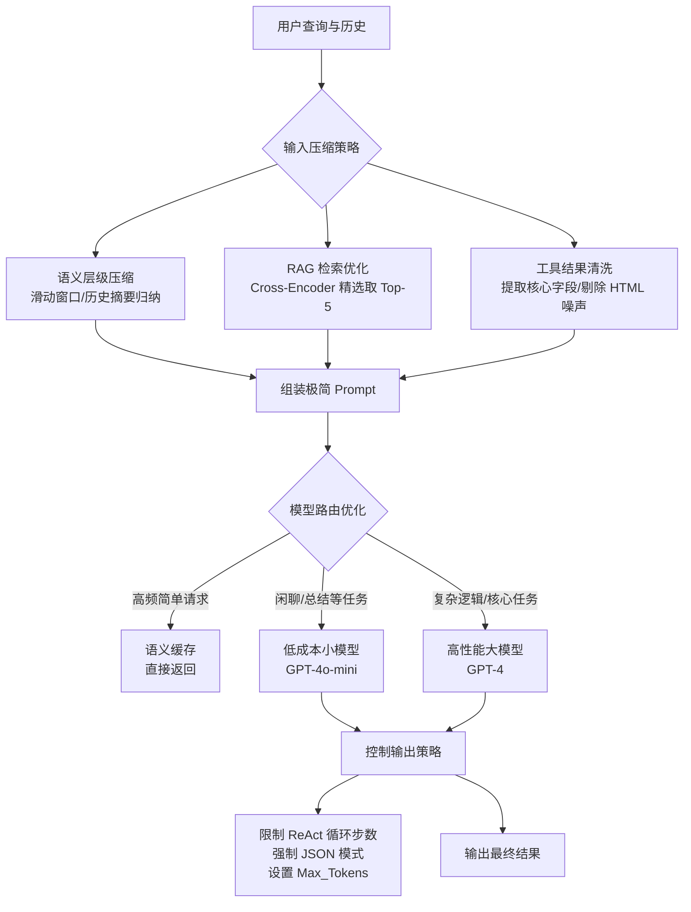

# 在 AI Agent 工程化中，如何优化 Token 成本？有哪些具体的压缩策略？

在 AI Agent 工程化中，Token 成本直接决定了系统的商业可行性。优化策略主要分为“压缩输入”、“控制输出”及“模型层优化”三个维度。

### 一、压缩输入策略
1. **语义层级压缩**：
   - **滑动窗口**：仅保留最近 $K$ 轮对话，丢弃老旧信息。需结合 Token 计数逻辑，避免切断不完整句子。
   - **摘要归纳**：对于长期记忆，利用低成本模型（如 GPT-3.5/4o-mini）将多轮历史 Tool 执行结果和对话总结为一段高密度的摘要，替换原始上下文。注意设置 Prompt 模板以“保留关键实体和决策路径”。

2. **RAG 检索优化**：
   - **重排序**：先用向量检索召回 100 个文档块，再用 Cross-Encoder 进行精排，只取 Top-5 注入上下文，大幅减少无效 Token。
   - **元数据过滤**：在检索前增加时间、类别等过滤条件，缩小检索范围。

3. **工具结果清洗**：
   - 对搜索引擎返回的 HTML，去除广告、CSS、JS 代码，提取纯文本。
   - 对 API 返回的 JSON 大对象，若只用到部分字段，使用 JQ 等工具进行预处理提取。

4. **Prompt 工程极简**：
   - 使用像 `System: You are a helpful assistant.` 这样短小的角色定义。
   - 移除例子中的冗余描述，仅保留核心 Few-shot 样本。

### 二、控制输出策略
1. **ReAct 循环限制**：
   - 设置 `max_iterations`（如 10 步）。超过步数强制结束，并返回兜底回复（如“任务过重，请简化需求”），防止死循环。

2. **输出结构化与截断**：
   - 强制使用 JSON 模式输出，减少自然语言废话。
   - 严格设置 `max_tokens` 参数，根据预期答案长度动态调整（如查询类 200 tokens，生成类 1024 tokens）。

### 三、模型层替换（降低单价）
- **大小模型协同**：主流程使用大模型（GPT-4），但将“工具结果摘要”、“闲聊分流”等子任务交给小模型（Llama 3-8B/GPT-4o-mini）处理。
- **语义缓存**：对用户的相似 Query，使用向量化检索，直接返回缓存的 Answer，跳过 LLM 调用。

### 💡 实战案例
开发一个支持查询知识库并自动生成日报的 Agent 时，我们发现每次循环都将所有历史 Tool 输出原样带入了上下文，导致在第 5 轮对话后 Token 暴涨。**实战优化**：我们在每次 Tool 执行后，增加了一个异步轻量级任务，专门提取本次执行的 `observation` 中的关键信息（如文件名、状态码），仅将结构化后的 Key-Value 注入下一轮 Prompt，单轮成本降低了 40%。

### 💻 代码示例 (Python - 动态上下文截断)
```python
# 根据模型上下文窗口限制，动态计算保留多少历史对话
def trim_context(messages, max_tokens=8000, model_name="gpt-4"):
    encoding = tiktoken.encoding_for_model(model_name)
    total_tokens = 0
    trimmed_msgs = []
    
    # 倒序遍历，优先保留最近的对话
    for msg in reversed(messages):
        msg_tokens = len(encoding.encode(msg['content']))
        if total_tokens + msg_tokens > max_tokens:
            break
        trimmed_msgs.insert(0, msg)
        total_tokens += msg_tokens
    return trimmed_msgs
```

### 📊 Agent Token 优化效果对比
| 优化手段 | 针对 Token 类型 | 技术复杂度 | 效果预估 |
| :--- | :--- | :--- | :--- |
| **Prompt 压缩** | System/User | 低 | 10%-20% |
| **RAG 重排** | Context | 中 | 30%-50% (Top-N 变动大) |
| **Observation 清洗** | Tool Output | 低 | 20%-40% (工具调用多时显著) |
| **历史摘要** | History | 高 | 50%+ (多轮对话场景) |
| **缓存机制** | 全局 | 中 | ~100% (命中缓存) |

## 流程图




## 记忆要点

- 压缩输入：滑动窗口截断历史，RAG重排取Top5，清洗工具结果去噪。
- 控制输出：限制React循环步数，强制JSON模式，严格设置max_tokens。
- 模型层：大小模型协同，闲聊用小模型，核心用大模型，利用语义缓存。
- 核心口诀：输入截断清洗，输出结构限制，模型分层降本。


## 结构化回答

**30 秒电梯演讲：** 通过精简上下文、控制输出量及高低搭配模型来降低 Token 消耗。——打个比方，像省话费一样：只打必要的电话（摘要缓存），长话短说（限制输出），非正式场合用便宜套餐（小模型）。

**展开框架：**
1. **压缩输入** — 滑动窗口截断历史，RAG重排取Top5，清洗工具结果去噪。
2. **控制输出** — 限制React循环步数，强制JSON模式，严格设置max_tokens。
3. **模型层** — 大小模型协同，闲聊用小模型，核心用大模型，利用语义缓存。

**收尾：** 以上三点都能配合实战聊。您想深入聊哪一块？

## 视频脚本

> 预计时长：2 分钟 | 由浅入深

| 时间 | 画面/字幕 | 口播台词 | 讲解要点 |
|------|----------|----------|----------|
| 0:00 | 标题卡 | "在 AI Agent 工程化中，如何优化 Token 成本，30 秒讲清楚。" | 开场钩子 |
| 0:30 | 概念定义动画 | "一句话：通过精简上下文、控制输出量及高低搭配模型来降低 Token 消耗。" | 核心定义 |
| 1:00 | 压缩输入图解 | "滑动窗口截断历史，RAG重排取Top5，清洗工具结果去噪。" | 压缩输入 |
| 1:30 | 总结卡 | "记好这几条，面试不慌。下期见。" | 收尾 |
