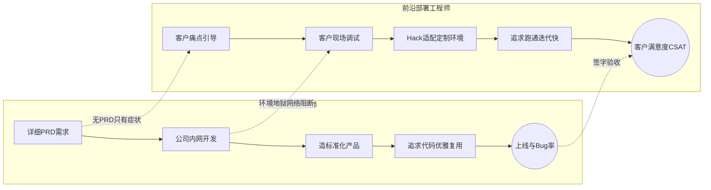

# FDE 和传统软件工程师(SWE)有什么核心区别

- **核心区别**

| 维度 | SWE (软件工程师) | FDE (前沿部署工程师) |
|------|-------------------|----------------------|
| 工作地点 | 公司办公室/远程 | **客户现场** (On-site) |
| 需求来源 | 产品经理的详细 PRD | 客户口头描述 + 痛点，需**提炼/翻译**成技术需求 |
| 代码质量 | 追求优雅、可维护性、复用性 | **先跑通再说**，强调快速迭代，Hack 代码较多 |
| 技术栈 | 专精某一端 (前/后端/算法) | **全栈 + AI (LLM/RAG) + DevOps + 领域知识** |
| 成功标准 | 代码上线、Bug 率低、性能好 | **客户满意 (CSAT)、验收签字、续费/扩容** |
| 反馈周期 | 季度/月度 (版本迭代) | **天/小时级别** (客户就在旁边) |

- **实战案例**：在某银行部署 AI 助手时，客户内网无法访问 PyPI，且防火墙策略变动导致无法拉取 Docker 镜像。SWE 可能会提工单等待网络组处理，但 FDE 必须现场手动打包所有依赖，甚至搭建私有 PyPI 源，在 2 小时内恢复环境，否则无法完成当天的演示。

- **FDE 的独特挑战**
  - **需求挖掘**: 没有详细 PRD，需要学会通过对话引导客户发现真实痛点（客户往往只知道症状，不知道病因）。
  - **环境地狱**: 客户环境千差万别（内网隔离、老旧硬件、安全合规），需要极强的快速适配和排错能力。
  - **多面手**: 既要写核心代码，又要做方案汇报，还要甚至要做客户培训。
  - **并行压力**: 多客户并行，且每个客户的问题都是阻塞级（P0），时间管理和预期管理能力要求极高。

- **代码示例（快速环境适配脚本）**：
```python
# 针对 PyPI 源不通的紧急应急脚本
import os
import subprocess

def install_local_packages(libs_path):
    """本地离线安装依赖"""
    for whl in os.listdir(libs_path):
        if whl.endswith('.whl'):
            subprocess.run(['pip', 'install', '--no-index', '--find-links', libs_path, whl])

# 实战中常用于在内网环境快速拉起服务
```

- **工作流对比**
```text
[SWE]: PRD -> 设计 -> 开发 -> 测试 -> 上线 -> 反馈 (Loop long)
[FDE]: 客户痛点 -> 快速原型 -> 现场演示 -> 迭代 -> 验收 (Loop short, High Chaos)
```

- **一句话理解**: SWE 是在工厂里造标准化产品的，FDE 是拿着半成品到客户现场改装、调试直到客户能用的。

## 常见考点
1. **FDE 写的代码通常比较乱，如何回归维护？**：考察是否意识到这个问题，以及是否有将定制化代码抽象回通用产品的意识。
2. **面对客户不合理的需求，FDE 如何处理？**：考察沟通能力和预期管理（Say No 的艺术，提供替代方案）。
3. **FDE 的工作节奏极快且压力大，如何避免 Burnout？**：考察自我调节能力和边界设定。

## 流程图




## 记忆要点

- 工作地点：SWE在公司造标准品，FDE在客户现场做改装调试。
- 需求来源：SWE接详细PRD，FDE需从客户痛点中提炼翻译需求。
- 代码标准：SWE追求优雅复用，FDE强调先跑通，Hack代码多，迭代快。
- 成功标准：SWE看上线和Bug率，FDE看客户满意(CSAT)和验收签字。


## 结构化回答

**30 秒电梯演讲：** 从标准化产品制造转向定制化现场交付。——打个比方，SWE是造汽车的，FDE是教客户开车并修路的。

**展开框架：**
1. **工作地点** — SWE在公司造标准品，FDE在客户现场做改装调试。
2. **需求来源** — SWE接详细PRD，FDE需从客户痛点中提炼翻译需求。
3. **代码标准** — SWE追求优雅复用，FDE强调先跑通，Hack代码多，迭代快。

**收尾：** 以上三点都能配合实战聊。我可以展开任一要点，比如「FDE 需要什么样的技术栈」这类追问您感兴趣吗？

## 视频脚本

> 预计时长：2 分钟 | 由浅入深

| 时间 | 画面/字幕 | 口播台词 | 讲解要点 |
|------|----------|----------|----------|
| 0:00 | 标题卡 | "FDE 和传统软件工程师(SWE)有什么核心区别，30 秒讲清楚。" | 开场钩子 |
| 0:30 | 概念定义动画 | "一句话：从标准化产品制造转向定制化现场交付。" | 核心定义 |
| 1:00 | 工作地点图解 | "SWE在公司造标准品，FDE在客户现场做改装调试。" | 工作地点 |
| 1:30 | 总结卡 | "记好这几条，面试不慌。下期见。" | 收尾 |
