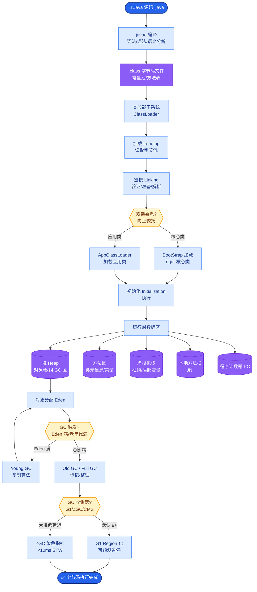
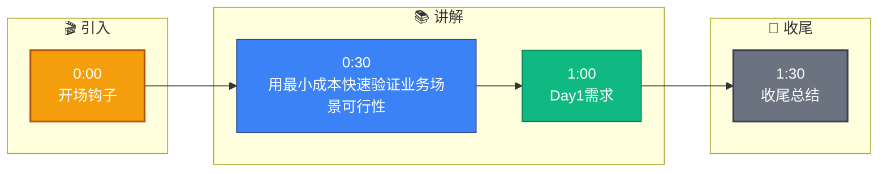

# 客户要做一个企业知识库问答系统,你会怎么快速搭建 PoC(概念验证)

- **企业知识库 PoC 的 FDE 标准打法(3-5天交付)**

- **Day 1: 需求澄清 + 数据收集**
- 搞清楚客户有多少文档(PDF/Word/网页)
- 文档量级 < 1000 篇 → 直接本地处理
- 文档量级 > 10000 篇 → 需要向量数据库

- **Day 2-3: 搭建 RAG Pipeline**
```
文档 → 分块(512 token) → Embedding(BGE-M3) → 向量库(Milvus/Chroma)
↓
用户提问 → Embedding → 向量检索 → Top-K → LLM 生成答案
```

- **Day 4: 接入 LLM**
- 国内:GLM-4 / Qwen
- 国际:GPT-4 / Claude
- 本地部署:Llama 3 + vLLM

- **Day 5: 前端 Demo**
- Streamlit / Gradio 快速搭 UI
- 部署到客户服务器
- 做一次现场演示

- **实战案例**：某车企客户提供的 PDF 包含大量复杂的维修电路图和表格，直接按字符分块导致上下文错乱，LLM 回答准确率极低。FDE 现场紧急调整策略，引入 LlamaParse 解析表格，并针对图片部分调用多模态模型（Qwen-VL）提取文字描述，将准确率从 30% 提升至 85%，当场赢得客户信任。

- **关键 Tips**
- PoC 不追求完美,追求'让客户看到效果'
- 准备 5-10 个客户真实问题的测试集
- 演示时用客户真实数据,不要用通用 demo 数据

- **代码示例（RAG 核心检索逻辑）**：
```python
from langchain_community.vectorstores import Chroma
from langchain_openai import OpenAIEmbeddings

# 初始化向量库
vectorstore = Chroma(
    collection_name="docs",
    embedding_function=OpenAIEmbeddings()
)

# 检索并生成
retriever = vectorstore.as_retriever(search_kwargs={"k": 5})
docs = retriever.get_relevant_documents("发动机故障灯亮怎么处理?")
```

- **技术细节补充**
- **分块策略**：推荐使用 `RecursiveCharacterTextSplitter`，参数设为 `chunk_size=512`, `chunk_overlap=64`，保证语义连贯性。
- **向量检索参数**：初始推荐 `Top-K=5`，相似度阈值设为 `0.7`，低于此阈值直接回答“知识库中未找到相关信息”，减少幻觉。
- **数据库选择**：小规模 PoC 可用 ChromaDB（内存模式，零配置）；大规模或生产预演必须上 Milvus/Weaviate。

- **架构图**
```text
   ┌─────────────┐
   │ 源文档数据   │ (PDF/Docx/Markdown)
   └──────┬──────┘
          │ ETL (解析/清洗)
          ▼
   ┌─────────────┐
   │ 文本分块     │ (Chunking 512 tokens)
   └──────┬──────┘
          │ Embedding (BGE-M3/OpenAI)
          ▼
   ┌─────────────┐
   │ 向量数据库   │ (Milvus/Chroma)
   └──────┬──────┘
          │
   ┌──────┴──────┐         ┌──────────┐
   │   检索阶段   │         │   LLM    │
   ├─────────────┤         │  (推理)   │
   │1. Query向量化├────────▶│          │
   │2. 向量相似度  │  Context└──────────┘
   │   检索(Top-K)│         │
   └──────┬──────┘         │
          │               ▼
   ┌──────┴──────┐    ┌──────────┐
   │ 用户提问 UI  │◀───│ 最终答案  │
   └─────────────┘    └──────────┘
```

- **## 常见考点**
1. **PoC 不做模型微调**：面试官常问“为什么 PoC 阶段不微调模型？”，答案：微调周期长、成本高且容易过拟合，PoC 旨在验证数据流和 Prompt 效果，RAG 是首选。
2. **Embedding 模型选择**：中文场景首选 BGE-M3 或 M3E，英文可用 OpenAI text-embedding-3，关键是要和向量库维度匹配（如 1024 维）。
3. **混合检索**：面试官可能会追问“如果用户问的是具体数字或关键词怎么办？”，应回答：在 PoC 后期引入 BM25 关键词检索与向量检索做融合（Reciprocal Rank Fusion）。


## 核心流程图



## 记忆要点

- Day1需求：确认文档量级，<1000本地处理，>10000上向量库。
- Day2-3搭建：文档分块(512 token)，Embedding(BGE-M3)，入库。
- Day4接入：选LLM(国内GLM/Qwen，国际GPT)，配置检索参数。
- Day5演示：Streamlit搭UI，用客户真实数据演示，不追求完美只求效果。
- 关键Tips：PoC不做微调，重点验证RAG数据流，准备Top10测试集。


## 结构化回答

**30 秒电梯演讲：** 用最小成本快速验证业务场景可行性的敏捷开发。——打个比方，像装修样板间，不用盖整栋楼，先造个客厅给客户看。

**展开框架：**
1. **Day1需求** — 确认文档量级，<1000本地处理，>10000上向量库。
2. **Day2-3搭建** — 文档分块(512 token)，Embedding(BGE-M3)，入库。
3. **Day4接入** — 选LLM(国内GLM/Qwen，国际GPT)，配置检索参数。

**收尾：** 以上三点都能配合实战聊。我可以展开任一要点，比如「PoC 验证通过后怎么上生产」这类追问您感兴趣吗？

## 视频脚本

> 预计时长：2 分钟 | 由浅入深

| 时间 | 画面/字幕 | 口播台词 | 讲解要点 |
|------|----------|----------|----------|
| 0:00 | 标题卡 | "客户要做一个企业知识库问答系统,你会怎么快速搭建 PoC(概念验证)，30 秒讲清楚。" | 开场钩子 |
| 0:30 | 概念定义动画 | "一句话：用最小成本快速验证业务场景可行性的敏捷开发。" | 核心定义 |
| 1:00 | Day1需求图解 | "确认文档量级，<1000本地处理，>10000上向量库。" | Day1需求 |
| 1:30 | 总结卡 | "记好这几条，面试不慌。下期见。" | 收尾 |

### 视频流程图


