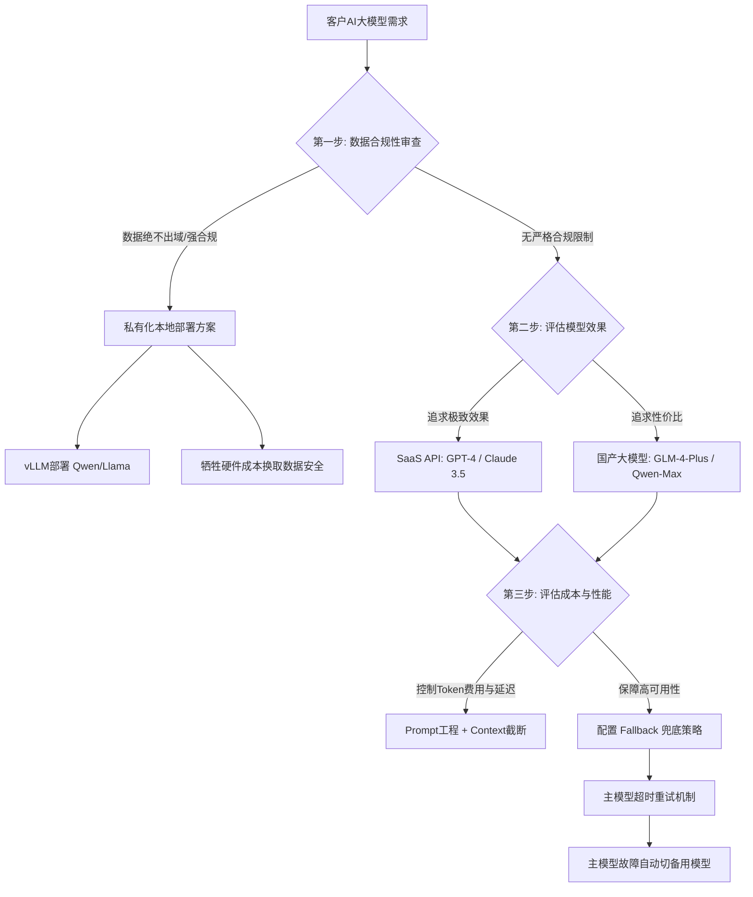

# 如何为客户选择合适的 LLM API?应该考虑哪些因素

- **LLM API 选型决策矩阵**

| 维度 | 考量点 |
|------|--------|
| **效果** | 中文理解、推理能力、代码生成 |
| **成本** | 每 1K token 价格、有无免费额度 |
| **延迟** | 首 token 延迟(TTFT)、生成速度 |
| **合规** | 数据出境合规、私有化部署需求 |
| **稳定性** | SLA 保障、限流策略 |
| **生态** | 工具链支持、社区活跃度 |

- **实战案例**：某金融机构需要大模型辅助审批，合规规定“数据绝不出域”，且对成本极度敏感。FDE 放弃了 GPT-4，使用 vLLM 在客户本地 GPU 服务器上部署了 Qwen-72B-Int4，并通过 Prompt 优化将推理速度从 15 tokens/s 提升到 45 tokens/s，在完全合规的前提下满足了业务实时性要求。

- **国内场景推荐**
- 追求效果:GPT-4(需合规通道)/ Claude 3.5
- 性价比:GLM-4-Plus / Qwen-Max
- 数据敏感:GLM-4 自部署 / Llama 3 本地化
- 高 QPS:GLM-4-Flash(速度快、便宜)

- **选型流程**
```
1. 确认合规要求(数据能否出境?)
2. 确认预算(月度 API 成本上限)
3. 用客户真实数据做 3-5 个模型的 A/B 测试
4. 选择效果 Top 2 中成本更低的
5. 准备 fallback 方案(主模型挂了切备用)
```

- **代码示例（带 Fallback 的模型调用）**：
```python
from openai import OpenAI

client_a = OpenAI(api_key="...", base_url="https://api.model-a.com")
client_b = OpenAI(api_key="...", base_url="https://api.model-b.com")

def chat_with_fallback(prompt):
    try:
        return client_a.chat.completions.create(model="model-a", messages=prompt)
    except Exception:
        # 实战中：主模型超时或报错，自动降级到备用模型
        return client_b.chat.completions.create(model="model-b", messages=prompt)
```

- **一句话理解**:先合规,再效果,最后成本--这个顺序不能反.

- **## 常见考点**
1. **Token 计费陷阱**：面试官常问如何控制成本。答案：提示词工程控制输入长度（如 Context 截断），长文本生成流式传输，以及对于简单任务使用小模型（如 GPT-3.5-turbo 或 Llama-7B）。
2. **Fallback 策略**：追问如果主 API 挂了怎么办？答案：在应用层实现超时重试机制，并配置备用模型（如主用 GLM-4，备用 Qwen），确保服务可用性。
3. **私有化部署 vs SaaS**：重点在于数据不出域。需提及使用 vLLM 或 TGI 推理框架在本地部署开源模型（如 Llama 3, Qwen-72B），虽然硬件成本高，但满足金融/政务合规要求。

## 流程图




## 记忆要点

- 选型维度：效果、成本、延迟、合规(数据不出域)、稳定性。
- 决策顺序：先合规，再效果，最后成本，顺序不能反。
- 实战策略：数据敏感选本地部署(Qwen/Llama)，追求效果选GPT-4。
- 兜底方案：代码层实现Fallback，主模型挂了自动切备用模型。
- 性能优化：本地部署用vLLM加速，Prompt优化提升推理速度。


## 结构化回答

**30 秒电梯演讲：** 基于合规红线、效果与成本三角权衡的技术选型。——打个比方，像选外卖，先看能不能送（合规），再看好不好吃（效果），最后看贵不贵。

**展开框架：**
1. **选型维度** — 效果、成本、延迟、合规(数据不出域)、稳定性。
2. **决策顺序** — 先合规，再效果，最后成本，顺序不能反。
3. **实战策略** — 数据敏感选本地部署(Qwen/Llama)，追求效果选GPT-4。

**收尾：** 以上三点都能配合实战聊。我可以展开任一要点，比如「如何做 LLM A/B 测试」这类追问您感兴趣吗？

## 视频脚本

> 预计时长：2 分钟 | 由浅入深

| 时间 | 画面/字幕 | 口播台词 | 讲解要点 |
|------|----------|----------|----------|
| 0:00 | 标题卡 | "为客户选择合适的 LLM API，30 秒讲清楚。" | 开场钩子 |
| 0:30 | 概念定义动画 | "一句话：基于合规红线、效果与成本三角权衡的技术选型。" | 核心定义 |
| 1:00 | 选型维度图解 | "效果、成本、延迟、合规(数据不出域)、稳定性。" | 选型维度 |
| 1:30 | 总结卡 | "记好这几条，面试不慌。下期见。" | 收尾 |
