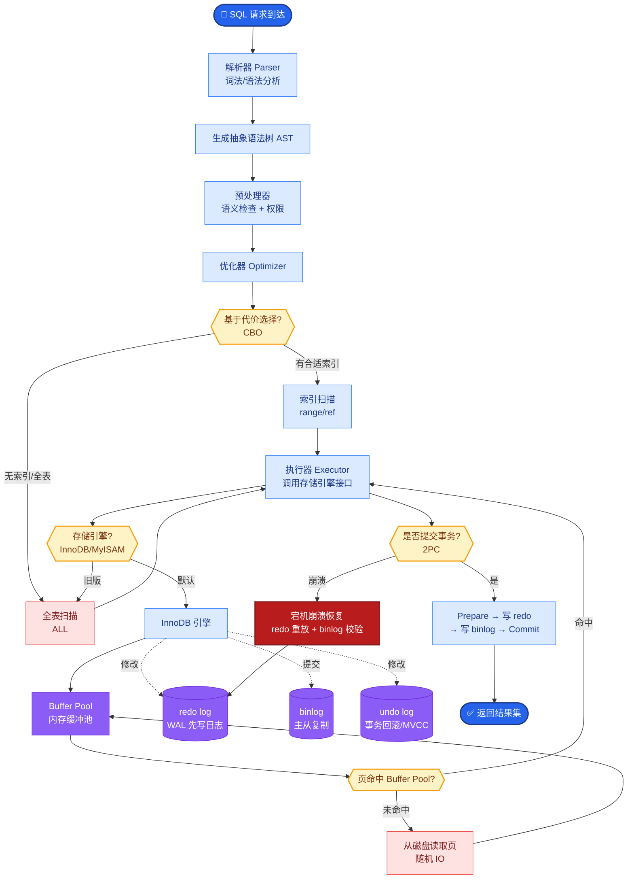

# 客户说'我要一个 AI 客服',你怎么帮他澄清真实需求

- **'我要一个 AI 客服' → FDE 需求澄清 SOP**

- **第 1 层:业务现状**
- 现在的客服有多少人?
- 每天处理多少工单?平均处理时间?
- 客户最常问的 Top 20 问题是什么?
- 现有的客服系统是什么?(Zendesk/自建/飞书)

- **第 2 层:目标量化**
- 'AI 客服' 是要完全替代人工,还是辅助人工?
- 期望的自动解决率是多少?(30%? 50%? 80%?)
- 容忍的错误率是多少?(5%? 10%?)
- 响应时间要求?(秒级?分钟级?)

- **第 3 层:技术约束**
- 有没有历史对话数据可以训练/测试?
- 知识库在哪里?(文档/数据库/员工脑子)
- 数据安全要求?(能否用云 API?)
- 预算范围?

- **第 4 层:场景收敛**
- 是全渠道客服(电话+在线+邮件)还是仅在线?
- 需要多语言支持吗?
- 需要和 CRM/ERP 对接吗?

- **经验法则**:客户说'我要 AI 客服',90% 的真实需求是 'FAQ 自动回答 + 人工兜底',而不是全自动机器人.

- **对话状态流转图**
```text
┌───────────┐
│ 用户发起提问 │
└─────┬─────┘
      ▼
 ┌─────────────┐
 │  意图识别    │ ───(闲聊/问候)──▶ 预设话术回复
 └─────┬───────┘
       │ (业务咨询)
       ▼
 ┌─────────────┐
 │  知识库检索  │ ───(置信度 < 阈值)──▶ 转人工客服
 └─────┬───────┘       (如:Score < 0.6)
       │ (置信度高)
       ▼
 ┌─────────────┐
 │  LLM 生成    │
 │  回复+引用   │
 └─────────────┘
```

- **## 常见考点**
1. **置信度阈值设定**：面试官会问如何判断转人工。答案：计算检索相似度或模型输出的 LogProbs，设定动态阈值（如简单问题 0.7，复杂问题 0.5），并允许用户手动触发“转人工”。
2. **多轮对话处理**：追问 AI 如何记住上下文？答案：维护 Session History，将最近 N 轮的对话摘要拼接进 System Prompt 或利用具备长窗口的模型。
3. **冷启动问题**：如果没有历史数据怎么做？答案：利用现有产品手册、FAQ 文档构建知识库，或者让客服人员整理近期高频问题作为种子数据。

---

- **实战案例**：某客户一开始要求 100% 自动化，但上线首周发现敏感投诉（如退款失败）全被 AI 机械回复激化矛盾。我们在 Prompt 中增加了“情感识别逻辑”，一旦检测到愤怒情绪，强制转接高级人工，投诉率下降了 40%。

- **代码示例**：
```python
# 动态阈值转人工逻辑 (Python)
def check_handover(query, retrieval_score, user_intent):
    # 场景1：检索置信度过低
    if retrieval_score < 0.65:
        return True, "未找到相关信息"
    # 场景2：敏感意图强制转人工
    if user_intent in ["complaint", "refund", "legal"]:
        return True, "转接人工专家"
    return False, "AI 处理"
```

- **对比表格**：纯关键词匹配 vs 语义向量匹配
| 特性 | 关键词匹配 | 语义向量匹配 |
| :--- | :--- | :--- |
| **原理** | 倒排索引，精确匹配 Token | Embedding 向量余弦相似度 |
| **优点** | 速度快，对专有名词（如型号 Q3）准 | 理解同义词（如“电脑”与“笔记本”） |
| **缺点** | 无法处理同义词、口语化 | 计算资源消耗大，可能“幻觉”匹配 |
| **适用** | 表单查询、关键词搜索 | 智能问答、客服对话 |


## 核心流程图



## 记忆要点

- 业务现状：摸清现有客服量、Top20问题、现有系统。
- 目标量化：明确自动解决率、容忍错误率、响应时间。
- 场景收敛：是全渠道还是仅在线？是否需对接CRM？
- 真实需求：90%需求是FAQ自动回答+人工兜底，非全自动。
- 关键逻辑：设置置信度阈值，低于阈值或检测到愤怒情绪强制转人工。


## 结构化回答

**30 秒电梯演讲：** 通过分层提问将模糊业务诉求转化为可量化技术指标。——打个比方，像医生问诊，不能病人说头疼就开药，得查清楚病因、病史和过敏源。

**展开框架：**
1. **业务现状** — 摸清现有客服量、Top20问题、现有系统。
2. **目标量化** — 明确自动解决率、容忍错误率、响应时间。
3. **场景收敛** — 是全渠道还是仅在线？是否需对接CRM？

**收尾：** 以上三点都能配合实战聊。我可以展开任一要点，比如「如何向客户展示 PoC 的价值」这类追问您感兴趣吗？

## 视频脚本

> 预计时长：2 分钟 | 由浅入深

| 时间 | 画面/字幕 | 口播台词 | 讲解要点 |
|------|----------|----------|----------|
| 0:00 | 标题卡 | "客户说'我要一个 AI 客服',你怎么帮他澄清真实需求，30 秒讲清楚。" | 开场钩子 |
| 0:30 | 概念定义动画 | "一句话：通过分层提问将模糊业务诉求转化为可量化技术指标。" | 核心定义 |
| 1:00 | 业务现状图解 | "摸清现有客服量、Top20问题、现有系统。" | 业务现状 |
| 1:30 | 总结卡 | "记好这几条，面试不慌。下期见。" | 收尾 |
