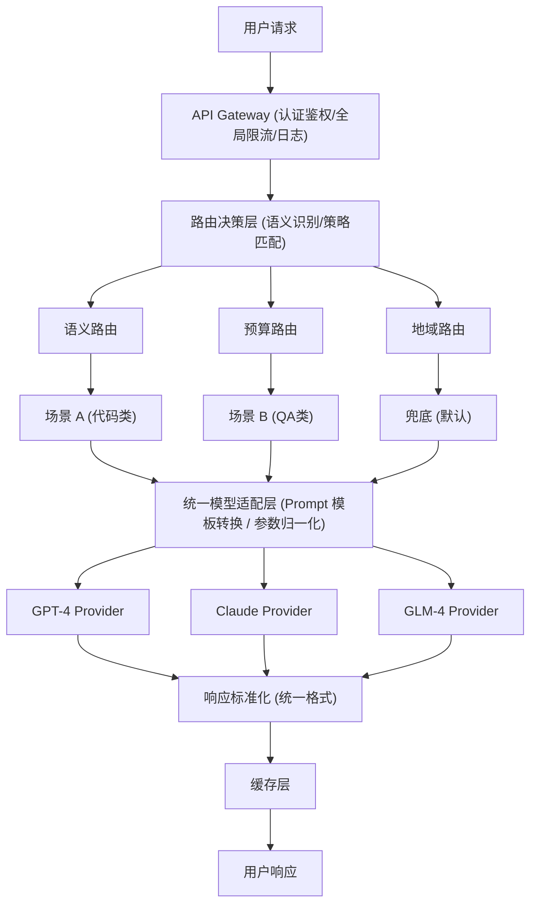
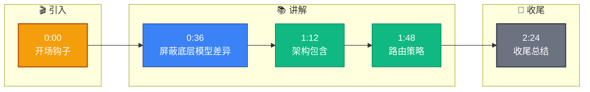

# 如何设计一个支持多模型的 AI 网关?让客户可以根据场景切换不同的 LLM

- **多模型 AI 网关架构**

**请求流架构图：**


- **核心组件详解**

1.  **模型路由器**: 基于 Prompt Context 的动态决策
    *   **简单 FAQ (低 Token/高 QPS)**: GLM-4-Flash (便宜快速，甚至可以仅做 RAG 检索)
    *   **代码/逻辑推理 (高准确度)**: GPT-4 / Claude 3.5 Sonnet (代码能力强)
    *   **长文档阅读 (长上下文)**: Claude 3 (200k+ Context Window)
    *   **默认/通用**: GLM-4-Plus (性价比均衡)
    *   *实现细节*: 可通过 Prompt 预分类打标，或者基于 LlamaGuard 等轻量级模型进行意图识别。
    *   **实战案例**：在某电商智能客服场景中，我们将“查订单”等意图通过正则/小模型分流给便宜的小模型，而将“产品售后维权”等复杂敏感对话分流给 GPT-4，实现了成本降低 60% 且投诉率未升反降。

2.  **统一适配层**: 屏蔽底层差异
    *   **字段映射**: 将 OpenAI 格式的 `messages` 映射到不同厂商的 `prompt`/`history` 结构。
    *   **流式转换**: 处理不同厂商 SSE (Server-Sent Events) 的数据分块格式差异。
    *   **参数归一化**: 统一 `temperature`, `top_p` 等参数范围。
    *   **代码示例**：
    ```go
    // 适配器模式统一不同模型的流式响应格式
    type StreamAdapter interface {
        ParseChunk(chunk []byte) (string, error) // 解析为标准文本片段
        IsDone(chunk []byte) bool               // 判断是否结束
    }

    // OpenAI 适配器实现
    type OpenAIAdapter struct{}
    func (o *OpenAIAdapter) ParseChunk(chunk []byte) (string, error) {
        // 解析 "data: {"choices":[{"delta":{"content":"..."}}]}" 格式
        var resp struct { Choices []struct { Delta struct { Content string } } }
        if err := json.Unmarshal(bytes.TrimPrefix(chunk, []byte("data: ")), &resp); err != nil {
            return "", err
        }
        return resp.Choices[0].Delta.Content, nil
    }
    ```

3.  **智能降级链**:
    *   主模型 (GPT-4) [超时/限流/错误] -> 备用 -> 兜底 (GLM-4)
    *   *关键细节*: 必须确保降级时用户的上下文不丢失，需在网关层维护统一会话快照。
    *   **模型选型对比**：
    | 维度 | GPT-4 / Claude 3.5 | GLM-4 / Qwen-Turbo | 本地部署 (Llama 3) |
    | :--- | :--- | :--- | :--- |
    | **核心优势** | 逻辑推理最强，代码能力出色 | 响应速度快，价格极具优势 | 数据隐私，无并发计费，稳定可控 |
    | **适用场景** | 复杂Agent、代码生成、核心决策 | 高并发客服、简单问答、摘要生成 | 私有知识库RAG、敏感数据处理 |
    | **成本考量** | 极高 (按Token计费昂贵) | 低 (适合大规模放量) | 硬件一次性投入高，边际成本低 |
    | **延迟表现** | 较高 (2s+ 首字延迟) | 低 (<500ms 首字延迟) | 取决于显卡算力 (通常中等) |
    | **维护难度** | 低 (无需运维模型) | 低 | 高 (需监控显存、GPU负载)


## 记忆要点

- 架构包含：路由决策层、统一适配层、模型Provider层、响应标准化层
- 路由策略：简单FAQ用小模型，复杂推理用GPT-4，长文档用Claude
- 统一适配层屏蔽底层差异，处理字段映射和流式转换


## 结构化回答

**30 秒电梯演讲：** 屏蔽底层模型差异，根据场景自动路由，实现统一调用与成本最优。——打个比方，像打车软件，自动给你派最快、最便宜或最舒适的车，你只需输入目的地。

**展开框架：**
1. **架构包含** — 路由决策层、统一适配层、模型Provider层、响应标准化层
2. **路由策略** — 简单FAQ用小模型，复杂推理用GPT-4，长文档用Claude
3. **统一适配层屏蔽底** — 统一适配层屏蔽底层差异，处理字段映射和流式转换

**收尾：** 以上三点都能配合实战聊。我可以展开任一要点，比如「如何做模型 A/B 测试」这类追问您感兴趣吗？

## 视频脚本

> 预计时长：3 分钟 | 由浅入深

| 时间 | 画面/字幕 | 口播台词 | 讲解要点 |
|------|----------|----------|----------|
| 0:00 | 标题卡 | "设计一个支持多模型的 AI 网关，30 秒讲清楚。" | 开场钩子 |
| 0:36 | 概念定义动画 | "一句话：屏蔽底层模型差异，根据场景自动路由，实现统一调用与成本最优。" | 核心定义 |
| 1:12 | 架构包含图解 | "路由决策层、统一适配层、模型Provider层、响应标准化层" | 架构包含 |
| 1:48 | 路由策略图解 | "简单FAQ用小模型，复杂推理用GPT-4，长文档用Claude" | 路由策略 |
| 2:24 | 总结卡 | "记好这几条，面试不慌。下期见。" | 收尾 |

### 视频流程图


