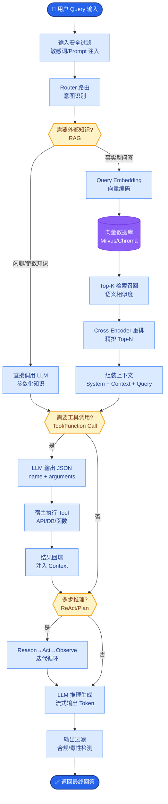

# 如何帮客户计算 AI 项目的 ROI(投资回报率)

- **AI 项目 ROI 计算 FDE 模板**

- **成本侧**
1. **FDE 实施 (一次性)**: 需求分析、数据清洗、POC 开发，通常耗时 2-4 周。可按人天计算。
2. **推理 API 费用 (持续性)**: 按 Token 计算月度成本。需估算日均调用量、平均上下文长度。公式：`Cost = (Input Tokens * Price_in + Output Tokens * Price_out) * RPM * 60 * 24 * 30`。
3. **GPU 服务器 (持续性)**: 若私有化部署，需考虑硬件折旧或租赁。含算力卡（5000-20000元/月，视显卡型号而定）。
4. **存储与数据库 (持续性)**: 向量数据库（1000-5000元/月）、对象存储（S3/OSS）费用。
5. **运维人力 (持续性)**: 系统监控、Prompt 迭代优化、版本更新（建议预留 5000+元/月或 0.5 FTE）。

- **收益侧**
1. **AI 客服**: 
   - 收益 = `(替代的客服人数 * 月薪) + (提升转化率带来的增收)`。
   - 注意：通常 AI 客服作为 "Level 1" 支持，能拦截 60%-80% 常见问题。
2. **文档处理 (OCR/抽取)**: 
   - 收益 = `原人工处理工时 * 人数 * 时薪 - (AI 处理成本 + 人工复核成本)`。
   - 关键点：需计算 "人工抽检/纠错" 的残留成本。
3. **代码助手**: 
   - 收益 = `开发者人数 * (效率提升百分比 20-30%) * (时薪 + 机会成本)`。
   - 量化指标：代码生成速度、减少 Context Switch 时间。
4. **销售/知识辅助**: 
   - 收益 = `增量订单数 * 平均利润率`。
   - 或减少销售培训周期的时间成本。

- **实战案例**
  在某跨国企业的合同审查项目中，我们不仅计算了“AI 节省的律师审阅时间”（直接收益），还通过 AI 帮助业务部门提前识别出合同中的 3 个潜在巨额赔偿风险条款（隐性收益）。这单风险规避价值约 500 万，远超项目本身的 RAG 部署成本，极大地帮助客户通过了立项审批。

- **代码示例**
```python
# Python: 简单的 ROI 计算模拟器
def calculate_roi(annual_revenue, annual_cost, initial_investment):
    """
    annual_revenue: 年化总收益 (人民币)
    annual_cost: 年化运营成本 (人民币)
    initial_investment: 初始一次性投入 (人民币)
    """
    net_profit = annual_revenue - annual_cost
    roi_percentage = (net_profit / annual_cost) * 100
    payback_months = (initial_investment / (net_profit / 12)) if net_profit > 0 else float('inf')
    
    return {
        "ROI": f"{roi_percentage:.2f}%",
        "Payback_Period": f"{payback_months:.1f} months",
        "Net_Annual_Profit": net_profit
    }

print(calculate_roi(annual_revenue=500000, annual_cost=150000, initial_investment=80000))
```

```text
              [ ROI 计算公式矩阵 ]
┌─────────────────────────────────────────────────────┐
│                                                     │
│  ROI = (年化总收益 - 年化总成本) / 年化总成本 * 100%│
│                                                     │
│  回本周期 = 初始一次性投入 / (月度收益 - 月度OPEX)  │
│                                                     │
└─────────────────────────────────────────────────────┘

        [ 成本结构 ]              [ 收益结构 ]
┌──────────────┐          ┌──────────────┐
│ 一次性成本   │          │ 直接降本     │
│ - 开发实施   │          │ - 减少人力   │
└──────┬───────┘          └──────┬───────┘
       │                         │
┌──────▼───────┐          ┌──────▼───────┐
│ 持续性成本   │          │ 效率提升     │
│ - Token费    │          │ - 单产增加   │
│ - GPU/云资源 │          │ - 周期缩短   │
│ - 运维人力   │          └──────┬───────┘
└──────────────┘                 │
                         ┌──────▼───────┐
                         │ 战略/隐性收益│
                         │ - 体验提升   │
                         │ - 数据沉淀   │
                         └──────────────┘
```

- **ROI 示例**
- **场景**: 50 人客服团队，引入 AI 客服拦截 60% 咨询。
- **成本**: 
  - API+服务器+运维: 15000 元/月。
  - 实施一次性投入: 50000 元。
- **收益**:
  - 优化前团队月人力成本：50人 * 8000元 = 400,000元。
  - 预计释放人力30%（人效提升而非裁员）：400,000 * 30% = 120,000元。
  - 转化率提升增收：预估 20,000元/月。
  - 总月收益：140,000元。
- **结果**:
  - 月净利：140,000 - 15,000 = 125,000元。
  - 回本周期：50,000 / 125,000 ≈ 0.4 个月（约12天）。


## 核心流程图



## 记忆要点

- 成本侧：实施费、推理Token费、GPU折旧、运维人力
- 收益侧：替代人力成本、效率提升带来的增收、风险规避价值
- ROI=(年化总收益-年化总成本)/年化总成本，关注回本周期


## 结构化回答


**30 秒电梯演讲：** 买扫地机器人算算每年省了多少小时保洁费，再减去电费和机器折旧。

**展开框架：**
1. **API** — 成本算API、算力与运维
2. **收益算省下的** — 收益算省下的人力工时
3. **用客户真实数** — 用客户真实数据量化

**收尾：** 如何说服管理层投入 AI 项目？


## 视频脚本

> 预计时长：2 分钟 | 由浅入深

| 时间 | 画面/字幕 | 口播台词 | 讲解要点 |
|------|----------|----------|----------|
| 0:00 | 标题卡 | "帮客户计算 AI 项目的 ROI(投资回报率)，30 秒讲清楚。" | 开场钩子 |
| 0:30 | 概念定义动画 | "一句话：量化人力替代与效率提升带来的收益，对比显性成本计算回本周期。" | 核心定义 |
| 1:00 | 成本侧图解 | "实施费、推理Token费、GPU折旧、运维人力" | 成本侧 |
| 1:30 | 总结卡 | "记好这几条，面试不慌。下期见。" | 收尾 |
