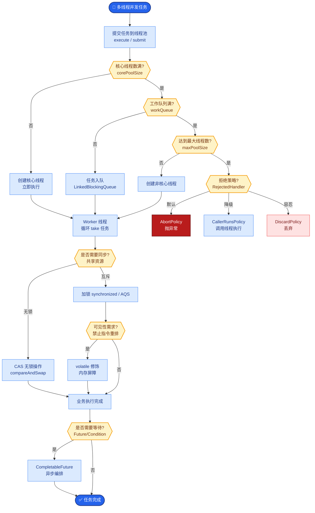

# AI 应用上线后,需要监控哪些关键指标

- **AI 应用监控四层模型**

- **Layer 1: 基础设施监控**
- CPU/内存/GPU 利用率（显存占用、SM 利用率、温度）
- 服务存活/健康检查（Liveness/Readiness Probe）
- 工具:Prometheus + Grafana

- **Layer 2: 应用性能监控 (APM)**
- QPS / P95延迟 / 错误率（HTTP 4xx/5xx）
- Token 消耗量（输入/输出 Token 比、成本追踪）
- 工具:Langfuse / LangSmith

- **Layer 3: AI 质量监控**
- 幻觉率（输出与检索结果的一致性 / Faithfulness）
- 用户点赞/点踩率
- 引用准确率
- 工具调用成功率

- **Layer 4: 业务指标监控**
- 自动解决率（无需人工的比例）
- 用户满意度 (CSAT)
- 平均处理时间
- API 成本/请求

- **告警阈值建议**
- P95 延迟 > 5s -> 告警
- 错误率 > 5% -> 告警
- 幻觉率 > 10% -> 告警
- 日 API 成本 > 预算 80% -> 告警

- **监控数据流架构**
``` 
┌─────────┐     ┌──────────────┐     ┌─────────────┐
│ 用户请求 │ ──> │ 应用服务层   │ ──> │ LLM/向量库  │
└─────────┘     └──────┬───────┘     └──────┬──────┘
                      │                     │
                      v                     v
               ┌──────┴───────┐     ┌──────┴──────┐
               │  Tracing     │     │  Logs/Metrics│
               │  (OTEL)      │     │  (Prometheus)│
               └──────┬───────┘     └──────┬──────┘
                      └──────────┬──────────┘
                                 v
                         ┌───────────────┐
                         │  观测性平台   │
                         │  (Grafana/Langfuse) │
                         └───────┬───────┘
                                 │
                         ┌───────┴───────┐
                         │  告警/看板    │
                         └───────────────┘
```

- **## 常见考点**
1. **Token 计费监控**：如何精确计算不同模型（如 GPT-4 与 3.5）混合使用的成本？需按模型维度分别打标。
2. **幻觉率计算**：线上如何自动化评估？通常使用 LLM-as-a-Judge（如 GPT-4 评估回复与引用的一致性）或基于规则的引用覆盖率。
3. **GPU 监控细节**：除了显存（VRAM），为什么还要监控 PCIe 带宽和温度？在高并发下，显存带宽往往是瓶颈而非计算单元。

- **实战案例**：某客服机器人上线后，监控显示错误率正常，但“用户点踩率”激增。经排查发现是 LLM 虽然回答了问题，但语气过于生硬。通过新增“语气友好度”作为自定义指标进行 A/B 测试后解决了问题。

- **关键代码 (Python - Langfuse 集成示例)**
```python
from langfuse import Langfuse
langfuse = Langfuse()

# 创建追踪记录
trace = langfuse.trace(
    name="customer-support-rag",
    user_id="user_123",
    metadata={"model": "gpt-4", "tenant": "acme"}
)

# 记录 LLM 生成与评分
generation = trace.generation(
    model="gpt-4",
    input="用户问题...",
    output="AI回答...",
    usage={"input": 150, "output": 300, "unit": "TOKENS"}
)

# 记录用户反馈 (用于监控质量)
trace.score(
    name="user_feedback",
    value=1, # 1为点赞，-1为点踩
    comment="回答准确但太啰嗦"
)
```


## 核心流程图



## 记忆要点

- 四层监控：基础设施、应用性能(APM)、AI质量、业务指标
- 关键指标：P95延迟、Token消耗、幻觉率、用户满意度
- 幻觉率通过LLM-as-a-Judge或引用覆盖率自动化评估


## 结构化回答

**30 秒电梯演讲：** 从底层资源到上层业务效果建立全链路监控，确保服务稳定与质量可控。——打个比方，像体检，不仅检查心跳体温（设施），还要检查反应速度（性能）和智商（质量）。

**展开框架：**
1. **四层监控** — 基础设施、应用性能(APM)、AI质量、业务指标
2. **关键指标** — P95延迟、Token消耗、幻觉率、用户满意度
3. **幻觉率通过LLM** — 幻觉率通过LLM-as-a-Judge或引用覆盖率自动化评估

**收尾：** 以上三点都能配合实战聊。我可以展开任一要点，比如「如何自动化检测幻觉」这类追问您感兴趣吗？

## 视频脚本

> 预计时长：2 分钟 | 由浅入深

| 时间 | 画面/字幕 | 口播台词 | 讲解要点 |
|------|----------|----------|----------|
| 0:00 | 标题卡 | "AI 应用上线后,需要监控哪些关键指标，30 秒讲清楚。" | 开场钩子 |
| 0:30 | 概念定义动画 | "一句话：从底层资源到上层业务效果建立全链路监控，确保服务稳定与质量可控。" | 核心定义 |
| 1:00 | 四层监控图解 | "基础设施、应用性能(APM)、AI质量、业务指标" | 四层监控 |
| 1:30 | 总结卡 | "记好这几条，面试不慌。下期见。" | 收尾 |
