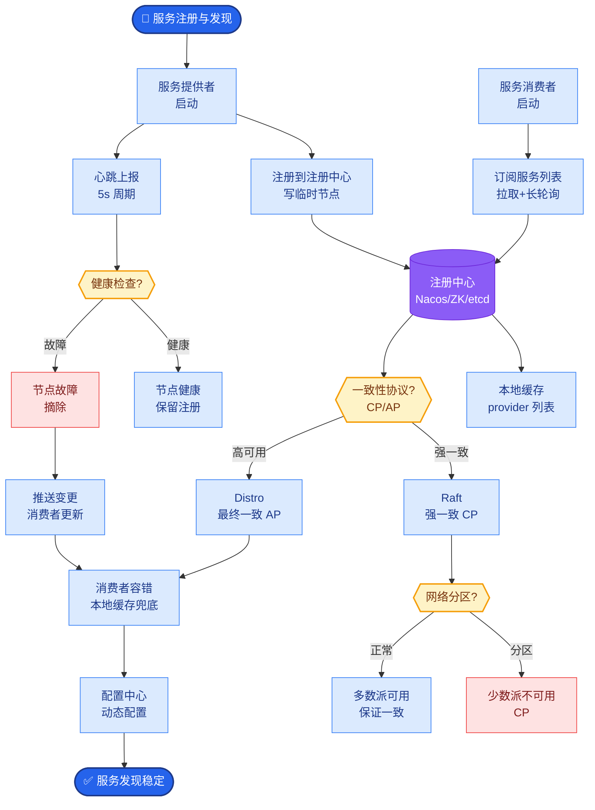

# 设计一个支持多租户的企业 AI 平台,不同租户之间数据隔离、模型可定制.

- **多租户 AI 平台架构设计**

- **数据隔离方案**
- 租户 A 的知识库和租户 B 完全隔离
- 向量库层面:每个租户独立 Collection(Milvus partition)
- 应用层面:每条请求带 tenant_id,中间件强制隔离
- 数据库层面:行级安全(RLS)或独立 schema

- **模型可定制**
- 每个租户可配置自己的 System Prompt
- 每个租户可选择不同模型(GLM-4 / GPT-4 / 自部署)
- 每个租户可上传自己的知识库
- 支持租户级别的 Fine-tune(LoRA adapter)

- **资源管理**
- 租户级别 QPS 限流
- Token 预算管理(月度上限 + 告警)
- 存储配额(向量库大小限制)

- **架构分层**
- 接入层:API Gateway + 认证(每租户 API Key)
- 路由层:tenant_id -> 对应配置(模型/知识库/Prompt)
- 服务层:RAG引擎 + Agent引擎 + 模型适配
- 存储层:向量库分区 + 关系DB + 对象存储

- **安全要点**
- 跨租户数据泄露测试(必须做)
- 租户数据删除时的级联清理
- 审计日志:哪个租户、什么时候、做了什么

- **多租户请求处理流程**
```
┌────────┐  ┌─────────────┐  ┌──────────────┐  ┌──────────┐
│ 租户请求│─>│ API Gateway │─>│ 路由/配置中心 │─>│ RAG/LLM  │
│(tenant │  │(身份认证)   │  │(获取Prompt/  │  │ 引擎     │
│ _id)   │  └──────┬──────┘  │ 知识库配置)   │  └────┬─────┘
└────────┘         │         └──────┬───────┘       │
                   v                v               v
            ┌──────────┐   ┌──────────────┐  ┌──────────┐
            │ 限流/配额│   │   元数据DB   │  │ 向量库   │
            │ 检查     │   │ (TenantConf) │  │(Partition)│
            └──────────┘   └──────────────┘  └──────────┘
```

- **## 常见考点**
1. **向量库隔离策略**：为什么推荐 Partition 而不是 Collection？创建 Collection 有开销，而 Partition 开销极小且查询性能基本一致，适合大规模租户。
2. **LoRA 动态加载**：多租户场景下如何管理成百上千个 LoRA Adapter？推荐使用 LoRA Server（如 vLLM 的 LoRA 支持）实现按需加载/卸载，避免显存溢出。
3. **行级安全 (RLS)**：在 Postgres 中实现 RLS 的关键是什么？需要开启 RLS 策略并使用 `current_setting('app.current_tenant')` 传递上下文，确保 SQL 层面拦截跨租户查询。

- **实战案例**：某医疗 SaaS 客户曾出现“幽灵数据”问题，即租户 A 删除了文档，但租户 B 偶尔能检索到该文档的切片。原因在于向量库的 Soft Delete 机制与 Partition 过滤逻辑冲突。修复方案是强制在 Filter 表达式中同时加入 `partition_key` 和 `is_deleted=false`。

- **隔离策略对比**

| 维度 | 独立数据库 | 独立 Schema | 行级隔离 (RLS) | 应用层逻辑隔离 |
| :--- | :--- | :--- | :--- | :--- |
| **隔离性** | ⭐⭐⭐⭐⭐ (物理) | ⭐⭐⭐⭐ (逻辑) | ⭐⭐⭐ | ⭐⭐ (易出错) |
| **成本** | 高 (维护重) | 中 | 低 | 低 |
| **扩展性** | 差 | 中 | 好 | 好 |
| **故障恢复** | 简单 | 中等 | 复杂 | 复杂 |
| **推荐场景** | 金融核心数据 | 中大型企业 | 通用SaaS (推荐) | 早期MVP |

- **关键代码 (Python - 上下文注入)**
```python
from fastapi import Request, HTTPException

# 依赖注入：确保每个请求都携带 tenant_id
async def get_tenant_id(request: Request):
    api_key = request.headers.get("X-API-Key")
    # 模拟解析：实际应查询 DB 或 JWT
    tenant = verify_api_key(api_key)
    if not tenant:
        raise HTTPException(status_code=401, detail="Invalid Tenant")
    
    # 将 tenant_id 存入 state，供下游服务使用
    request.state.tenant_id = tenant.id
    return tenant.id

# 使用示例
def search_docs(query: str, tenant_id: str = Depends(get_tenant_id)):
    # 强制带上 filter，防止越权
    return vector_store.search(
        query, 
        filter={"tenant_id": tenant_id} # 核心安全逻辑
    )
```


## 核心流程图



## 记忆要点

- 数据隔离：向量库Partition隔离，应用层强制tenant_id过滤
- 模型定制：租户级System Prompt、模型选择、LoRA Adapter
- 资源管理：租户级QPS限流、Token预算告警、存储配额限制


## 结构化回答

**30 秒电梯演讲：** 通过租户ID上下文隔离数据与资源，支持个性化配置与独立配额管理。——打个比方，像写字楼办公，每家公司独立门锁（隔离），自选装修（配置），独立水电表（资源）。

**展开框架：**
1. **数据隔离** — 向量库Partition隔离，应用层强制tenant_id过滤
2. **模型定制** — 租户级System Prompt、模型选择、LoRA Adapter
3. **资源管理** — 租户级QPS限流、Token预算告警、存储配额限制

**收尾：** 以上三点都能配合实战聊。我可以展开任一要点，比如「如何做租户级别的模型路由」这类追问您感兴趣吗？

## 视频脚本

> 预计时长：4 分钟 | 由浅入深

| 时间 | 画面/字幕 | 口播台词 | 讲解要点 |
|------|----------|----------|----------|
| 0:00 | 标题卡 | "设计一个支持多租户的企业 AI 平台,不同租户之间数据隔离、模型可定制.，30 秒讲清楚。" | 开场钩子 |
| 0:40 | 概念定义动画 | "一句话：通过租户ID上下文隔离数据与资源，支持个性化配置与独立配额管理。" | 核心定义 |
| 1:20 | 数据隔离图解 | "向量库Partition隔离，应用层强制tenant_id过滤" | 数据隔离 |
| 2:00 | 模型定制图解 | "租户级System Prompt、模型选择、LoRA Adapter" | 模型定制 |
| 2:40 | 资源管理图解 | "租户级QPS限流、Token预算告警、存储配额限制" | 资源管理 |
| 3:20 | 总结卡 | "记好这几条，面试不慌。下期见。" | 收尾 |
