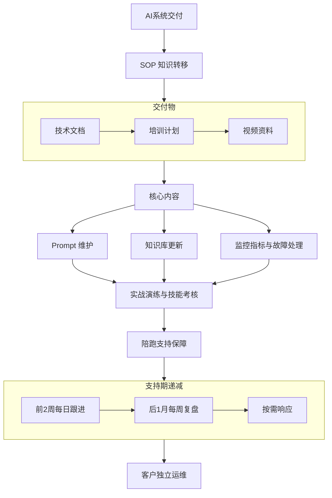
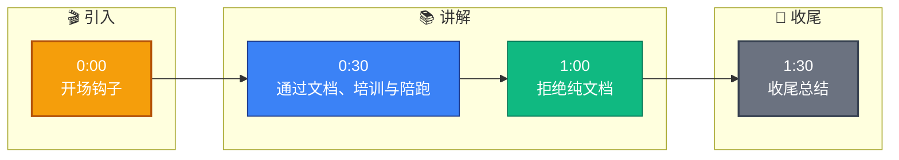

# 项目交付后,如何把 AI 系统的运维知识转移给客户团队

- **AI系统知识转移方案**

- **SOP (标准作业程序)**: 'AI系统知识转移SOP'

- **交付物**
- 技术文档: ['架构图', 'API文档', '运维手册', '数据字典']
- 培训计划: ['Day1:架构与概念', 'Day2:运维实操', 'Day3:故障演练']
- 视频资料: '录制关键操作视频供回看'
- **增强细节**：提供“知识库维护规范”，明确Prompt迭代版本管理（如 Git 流程）和 Bad Case 处理标准流程。

- **关键内容**
- Prompt维护: 讲解如何基于数据反馈调整 Prompt 参数。
- 知识库更新: 数据清洗规范、切片策略、向量化流程。
- 监控指标: QPS、Latency、Token 消耗、模型幻觉率阈值设定。
- 故障处理: LLM API 超时、向量库连接失败、缓存击穿的应急预案。

- **支持保障**
- 2周每日跟进: 陪跑式解决初期上手问题。
- 1月每周复盘: 总结本周遇到的技术瓶颈并优化。
- 建立专属沟通群: 技术专家 + 客户运维 + 项目经理。
- SLA: 紧急2小时响应。

- **避坑指南**
- 拒绝仅文档交付，需实操。
- 文档小白化: 避免使用未解释的行业黑话，假设读者为初级工程师。
- 交接需1-2月过渡: 认知转移存在滞后性，需预留缓冲期。

- **## 常见考点**
1. **知识库更新频率**：如何平衡知识库实时性和系统稳定性？（引出灰度发布和全量更新策略）
2. **故障演练设计**：如何设计一个典型的 LLM 服务降级演练？（如切换备用模型或关闭 Agent 工具调用）
3. **技能考核机制**：如何确认客户团队已经掌握了运维能力？（如要求客户独立完成一次 Prompt 优化或故障恢复）

## 技术原理

知识转移的核心是**降低客户对交付方的依赖度**，让系统在交付后能可持续运行。这本质是一个"能力迁移"过程，遵循布鲁姆认知模型（记忆→理解→应用→分析→评价→创造），每个阶段需要不同的载体：

- **为什么纯文档不够**：文档传递的是显性知识（步骤、参数），但运维能力大量依赖隐性知识——"看到这个告警该怎么判断""Prompt 效果下降怎么定位"。隐性知识靠文档传递效率极低，必须通过实操演练和陪跑，让客户在真实场景中建立判断直觉。
- **三天培训的认知层次设计**：
  - Day1（记忆/理解）：架构与概念讲解——讲清楚 LLM、向量库、Agent 的分层职责，让客户建立心智模型。
  - Day2（应用）：运维实操——动手跑一遍知识库更新、Prompt 调优、监控查看，把知识转化为肌肉记忆。
  - Day3（分析/评价）：故障演练——模拟 LLM 超时、向量库挂掉、幻觉率飙升，让客户独立判断和处置，验证应急能力。
- **陪跑机制的渐进式撤出**：前 2 周每日跟进（高密度支持，解决初期高频问题），后 1 个月每周复盘（降低频率，处理长尾问题），之后按需响应。这种"逐步撤拐杖"的方式让客户有缓冲期建立独立能力，避免交付即失联导致的故障无人处理。
- **技能考核的闭环验证**：培训结束时要求客户独立完成一次 Prompt 优化或故障恢复，由交付方评审。只有通过考核才能确认能力已转移，否则继续陪跑——这是"交付验收"的客观依据。

## 代码示例

知识转移的 SOP 落地（运维手册 + 故障演练脚本 + 监控配置）：

```yaml
# 1. 运维手册的 SOP 结构（交给客户的标准作业程序）
knowledge_transfer:
  deliverables:
    docs:
      - architecture.md          # 架构图 + 组件职责
      - api_reference.md         # API 接口文档
      - ops_runbook.md           # 运维手册（核心）
      - data_dictionary.md       # 数据字典
    training:
      - day1_architecture.mp4    # 架构讲解录像
      - day2_ops_practice.mp4    # 运维实操录像
      - day3_drill.mp4           # 故障演练录像
    support:
      - group_chat: "专属沟通群（技术专家+客户运维+PM）"
      - sla: "紧急 2 小时响应，普通 24 小时"

# 2. 运维手册的核心章节（客户日常查阅）
ops_runbook:
  prompt_maintenance:
    version_control: "Prompt 用 Git 管理，每次改动 PR + 评审 + A/B 测试"
    optimization_flow: "数据反馈 -> 分析 Bad Case -> 调整 Prompt -> 灰度验证 -> 全量发布"
  knowledge_base_update:
    data_cleaning: "去重、去噪、格式标准化"
    chunking_strategy: "按 Markdown 标题切分，300 token/块，50 token 重叠"
    vectorization: "用 BGE-large-zh 模型，变更后全量重建索引"
  monitoring:
    metrics:
      - qps: "每秒请求数，超 1000 告警"
      - latency_p99: "P99 延迟，超 2s 告警"
      - token_cost_daily: "日 Token 消耗，超预算 80% 预警"
      - hallucination_rate: "幻觉率（Bad Case 抽检），超 5% 告警"
```

```python
# 3. 故障演练脚本（Day3 培训用，模拟真实故障）
class IncidentDrill:
    """故障演练：让客户独立处置模拟故障"""
    scenarios = [
        {
            "name": "LLM API 超时",
            "trigger": "mock_llm_timeout(delay=30s)",
            "expected_action": "切换备用模型 / 启用缓存降级 / 返回兜底回答",
            "verification": "服务 1 分钟内恢复可用",
        },
        {
            "name": "向量库连接失败",
            "trigger": "kill_vector_db()",
            "expected_action": "切换只读模式 / 告知用户稍后重试 / 切备用实例",
            "verification": "不产生 5xx，返回友好提示",
        },
        {
            "name": "Prompt 效果下降",
            "trigger": "inject_bad_cases()",
            "expected_action": "查监控发现幻觉率上升 -> 分析 Bad Case -> 回滚 Prompt 版本",
            "verification": "幻觉率回落到阈值内",
        },
    ]

    def run_drill(self, customer_ops):
        """客户独立执行处置，交付方只观察评分"""
        for scenario in self.scenarios:
            print(f"【故障注入】{scenario['name']}")
            self.trigger(scenario["trigger"])
            action = customer_ops.handle()   # 客户独立处置
            passed = self.verify(scenario["verification"])
            print(f"{'通过' if passed else '未通过'}: {action}")
```

## 注意事项

- **拒绝纯文档交付**：只给文档不给培训，客户看不懂也用不起来。必须配套实操演练和录像，让隐性知识通过"做"传递。
- **文档要小白化**：假设读者是初级工程师，避免未解释的行业黑话（如" embedding""chunking"首次出现要加注释）。配截图、配步骤编号。
- **陪跑期至少 1-2 个月**：认知转移有滞后性，交付后立即撤出会让初期小问题累积成大故障。前 2 周每日跟进是密度最高的支持期。
- **技能考核是验收硬指标**：不要凭感觉判断"客户学会了"，要求客户独立完成一次 Prompt 优化或故障恢复，通过才算交付完成。这是避免"交付即失联"争议的客观依据。
- **AI 系统的长期维护成本要提前告知**：模型 API 费用、向量库扩容、知识库持续更新都需要持续投入，不能让客户以为是一次性交付。

## 流程图




## 记忆要点

- 拒绝纯文档：必须包含培训、实操演练和视频资料，避免认知滞后。
- 核心内容：Prompt 维护、知识库更新规范、监控指标解读、故障应急预案。
- 陪跑机制：前两周每日跟进，后一月每周复盘，建立专属沟通群。
- 文档小白化：避免行业黑话，假设读者为初级工程师。
- 技能考核：要求客户独立完成一次 Prompt 优化或故障恢复以验证能力。


## 结构化回答

**30 秒电梯演讲：** 通过文档、培训与陪跑，将运维能力从交付方转移给客户。——打个比方，像卖车后附赠驾驶手册、陪练并在保修期提供 roadside assistance，确保客户能独立安全上路。

**展开框架：**
1. **拒绝纯文档** — 必须包含培训、实操演练和视频资料，避免认知滞后。
2. **核心内容** — Prompt 维护、知识库更新规范、监控指标解读、故障应急预案。
3. **陪跑机制** — 前两周每日跟进，后一月每周复盘，建立专属沟通群。

**收尾：** 以上三点都能配合实战聊。我可以展开任一要点，比如「客户运维能力不足怎么办」这类追问您感兴趣吗？

## 视频脚本

> 预计时长：2 分钟 | 由浅入深

| 时间 | 画面/字幕 | 口播台词 | 讲解要点 |
|------|----------|----------|----------|
| 0:00 | 标题卡 | "项目交付后,如何把 AI 系统的运维知识转移给客户团队，30 秒讲清楚。" | 开场钩子 |
| 0:30 | 概念定义动画 | "一句话：通过文档、培训与陪跑，将运维能力从交付方转移给客户。" | 核心定义 |
| 1:00 | 拒绝纯文档图解 | "必须包含培训、实操演练和视频资料，避免认知滞后。" | 拒绝纯文档 |
| 1:30 | 总结卡 | "记好这几条，面试不慌。下期见。" | 收尾 |

### 视频流程图


