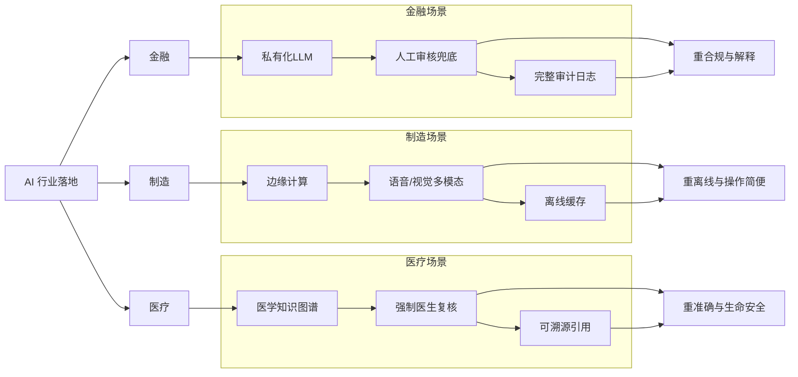

# 你分别服务过金融、制造、医疗三个行业的客户,请总结各行业 AI 落地的特点和坑.

- **三大行业 AI 落地对比**

- **金融行业**
- 场景: 智能投顾、反欺诈、合规审查、信贷风控
- 特点: 数据极度敏感、监管严格(银保监会/人行)
- 坑: 合规审查周期长(3-6 个月)、模型可解释性要求高
- 建议: 用本地部署模型 + 人工审核兜底 + 完整审计日志
- **增强细节**：注意数据不出域，需使用私有化部署的 LLM，并针对金融术语进行增量预训练或 LoRA 微调。

- **制造行业**
- 场景: 设备故障预测、质量检测、生产优化、供应链
- 特点: 工厂环境复杂、IT 基础设施弱、工人接受度低
- 坑: 工厂网络不稳定(需要离线方案)、操作工不会用复杂界面
- 建议: 边缘计算 + 简单界面(按钮/语音)+ 离线缓存
- **增强细节**：噪声环境下的语音识别需专门优化，且多模态（视觉+文本）应用比纯文本应用效果更好。

- **医疗行业**
- 场景: 辅助诊断、病历结构化、药物问答、患者随访
- 特点: 准确性要求极高、涉及生命安全、HIPAA/等保合规
- 坑: 医疗术语复杂、知识库更新频繁、医生不信任 AI
- 建议: AI 只做辅助建议(不做诊断)+ 强制人工复核 + 可溯源引用
- **增强细节**：构建医学知识图谱是关键，需强调“可解释性”和“引用来源”，避免模型幻觉导致的医疗事故。

- **通用经验**
1. 不要用同一套方案服务所有行业
2. 每个行业至少花 1 周学习行业知识
3. 找到行业内的'变革推动者'(愿意尝试新技术的人)
4. 从最小场景切入,用数据说话再扩展

- **## 常见考点**
1. **数据合规**：在医疗或金融场景中，如何处理涉及 PII（个人敏感信息）的数据脱敏？（正则匹配 + NER 模型）
2. **冷启动问题**：在制造行业缺乏历史故障数据时，如何训练预测模型？（引出迁移学习或使用通用大模型+少样本提示）
3. **人机协作模式**：在金融风控中，AI 模型和人工复核的比例如何设定才能平衡效率与风险？

## 技术原理

**金融重合规与可解释性**
金融行业（银行、证券、保险）的核心痛点是监管严格和数据极度敏感。银保监会、人行要求模型决策可解释、可审计，数据不出域。这意味着通用云端 LLM 不可用，必须私有化部署；同时模型需对金融术语增量预训练或 LoRA 微调，并产出完整审计日志以应对合规审查。合规周期通常 3-6 个月，技术方案需提前预留审查时间。

**制造重离线能力与操作简便性**
制造业现场（车间、产线）IT 基础设施弱，网络不稳定甚至无网络，工人接受度低、不会用复杂界面。AI 系统必须支持边缘计算（本地部署小模型）+ 简单交互界面（按钮、语音）+ 离线缓存（断网时仍可工作）。噪声环境下的语音识别需专门优化，多模态（视觉+文本）应用比纯文本更贴合现场。

**医疗重准确性与人工兜底**
医疗场景容错率极低——一次误诊可能涉及生命安全，因此 AI 只能做辅助建议，绝不能做最终诊断。系统必须强制人工复核（医生签字）+ 可溯源引用（每个结论标注文献来源），并构建医学知识图谱应对复杂术语。HIPAA/等保合规要求患者数据脱敏存储和传输加密。

**深入了解业务场景是落地前提**
AI 落地的首要前提不是模型多先进，而是对业务流程的深度理解。每个行业至少花 1 周学习领域知识，与业务专家共创，才能识别出真正有价值的场景（如制造不是预测所有故障，而是聚焦停机代价最大的设备）。

**寻找内部推动者比技术本身更重要**
在保守行业推动 AI，找到一个愿意尝试新技术、能在内部协调资源的"变革推动者"（通常是业务部门的中层）比技术本身更关键。从最小场景切入，用数据证明 ROI，再逐步扩展。

## 代码示例

```yaml
# 金融行业：私有化部署 + 审计日志（Llama-Factory 配置片段）
model_name_or_path: ./models/Qwen2-7B
adapter_name_or_path: ./lora/finance-terms    # 金融术语微调
finetuning_type: lora
template: qwen
# 部署后所有 prompt/response 落审计库
audit_log:
  enabled: true
  storage: opensearch
  retain_days: 365       # 合规要求保留 1 年
```

```python
# 医疗行业：强制人工复核 + 可溯源引用
def generate_diagnosis_draft(symptoms, patient_history):
    # AI 只产出草稿，绝不直接对外
    draft = llm.generate(
        prompt=f"基于症状 {symptoms} 和病史 {patient_history} 给出鉴别诊断建议",
        retrieval_kb=medical_graph,        # 检索医学知识图谱
        require_citation=True              # 强制每个结论标注引用
    )
    draft.status = "PENDING_DOCTOR_REVIEW"  # 必须医生复核
    audit_log.record(draft, citations)      # 记录可溯源链路
    return draft   # 不直接返回患者，进入医生工作台
```

## 注意事项

- 金融：重合规与解释，需私有化部署 + 完整审计日志。
- 制造：环境差网络不稳，需边缘计算 + 简单界面 + 离线缓存。
- 医疗：容错率极低，AI 仅辅助建议，强制人工复核 + 可溯源引用。
- 避坑：不要用同一套方案服务所有行业，需找变革推动者。
- 冷启动：制造缺数据用迁移学习，医疗重知识图谱构建。

## 流程图




## 记忆要点

- 金融：重合规与解释，需私有化部署 + 完整审计日志。
- 制造：环境差网络不稳，需边缘计算 + 简单界面 + 离线缓存。
- 医疗：容错率极低，AI 仅辅助建议，强制人工复核 + 可溯源引用。
- 避坑：不要用同一套方案服务所有行业，需找变革推动者。
- 冷启动：制造缺数据用迁移学习，医疗重知识图谱构建。


## 结构化回答

**30 秒电梯演讲：** 不同行业对数据安全、基础设施和容错率的要求截然不同。——打个比方，像医生、银行家、工厂工人的工作服，各行业AI系统需适配特定的环境与规则。

**展开框架：**
1. **金融** — 重合规与解释，需私有化部署 + 完整审计日志。
2. **制造** — 环境差网络不稳，需边缘计算 + 简单界面 + 离线缓存。
3. **医疗** — 容错率极低，AI 仅辅助建议，强制人工复核 + 可溯源引用。

**收尾：** 以上三点都能配合实战聊。我可以展开任一要点，比如「如何在保守行业推动 AI 落地」这类追问您感兴趣吗？

## 视频脚本

> 预计时长：2 分钟 | 由浅入深

| 时间 | 画面/字幕 | 口播台词 | 讲解要点 |
|------|----------|----------|----------|
| 0:00 | 标题卡 | "你分别服务过金融、制造、医疗三个行业的客户,请总结各行业 AI 落地的特点和坑.，30 秒讲清楚。" | 开场钩子 |
| 0:30 | 概念定义动画 | "一句话：不同行业对数据安全、基础设施和容错率的要求截然不同。" | 核心定义 |
| 1:00 | 金融图解 | "重合规与解释，需私有化部署 + 完整审计日志。" | 金融 |
| 1:30 | 总结卡 | "记好这几条，面试不慌。下期见。" | 收尾 |
