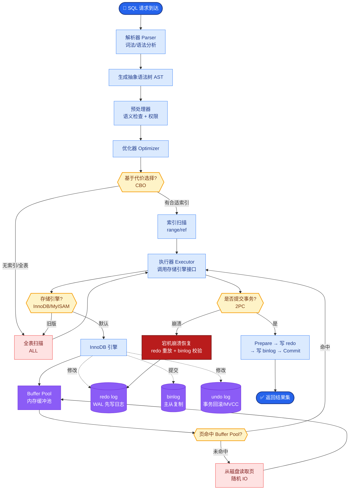
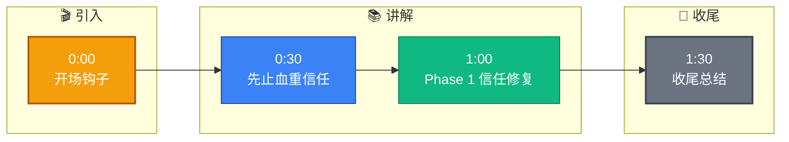

# 你接手了一个'烂尾'AI 项目(前任 FDE 留下的半成品),客户已经不信任了,你怎么扭转局面

- **烂尾 AI 项目扭转 SOP**

- **Phase 1: 信任修复(第 1 周)**
1. **诚实评估**:不说'之前的人做得不行',客观分析现状
2. **快速止血**:找到最影响体验的 3 个 Bug,24 小时内修复
3. **沟通承诺**:给客户一个明确的 2 周改进计划(要保守,能多做就超预期)

- **实战案例**：接手一个法律合同审查项目，因 RAG 检索准确率只有 40%（导致幻觉严重），客户准备起诉退款。我没有急于重写算法，而是先用 2 天时间清洗了客户上传的“乱码格式”旧合同，并将准确率瞬间提升至 70%，成功缓和了客户情绪，为后续争取到了重构的时间窗口。

- **Phase 2: 问题诊断(第 1-2 周)**
1. **代码审查**:梳理技术债,列出必修项 vs 可延后项
2. **数据诊断**:检查知识库质量、向量索引完整性
3. **效果评测**:用客户真实问题跑一轮,量化当前水平
4. **根因定位**:为什么烂尾?技术方案错了?需求理解错了?还是执行力不够?

- **代码示例**（自动化诊断脚本）
```python
# diagnostic_check.py
def check_vector_health(milvus_client):
    stats = milvus_client.get_collection_stats("docs_collection")
    if stats["row_count"] < 100:
        print("CRITICAL: Knowledge base too small!")
    # 检查索引是否存在
    if not milvus_client.has_index("docs_collection"):
        print("ERROR: Vector index missing.")
    return stats
```

- **问题根因对比分析**
| 问题表现 | 数据问题 | 算法/模型问题 | 需求偏差 |
|---------|---------|-------------|---------|
| 典型症状 | 回答答非所问，引用错误文档 | 回答逻辑混乱，格式错乱 | 功能全做，但用户不用 |
| 修复难度 | 低（清洗/重切数据） | 中（Prompt调优/换模型） | 高（需重新定需求） |
| 修复周期 | 3-5 天 | 1-2 周 | 1 个月+ |

- **Phase 3: 快速见效(第 2-4 周)**
1. **选择一个高价值场景**做深度优化(不要全面铺开)
2. **准备 10 个客户最关心的问题**,逐个优化到满意
3. **每周给客户演示进展**,让客户看到持续的改进
4. **收集量化数据**:'准确率从 65% 提升到 85%'

- **Phase 4: 重新奠基(第 4-8 周)**
1. 重构技术架构(如果必要)
2. 建立评估体系(防止再次劣化)
3. 完善文档和知识转移
4. 建立定期沟通机制(每周同步 + 每月评审)

- **关键原则**
- **不要推卸责任**:客户不关心谁的错,只关心你能不能解决
- **先交付再解释**:用结果说话,不用 PPT 说话
- **降低承诺提高交付**:说 2 周做完,实际 1 周做完
- **留痕迹**:每次改进都记录,作为信任重建的证据

- **项目扭转流程图**
```text
┌────────────────────────────────────────────────────────────────────┐
│                        Phase 1: 信任修复                          │
│  ┌─────────────┐   ┌──────────────┐   ┌─────────────────────────┐ │
│  │ 停止甩锅     │ → │ 快速止血     │ → │ 签署“低承诺”SLA        │ │
│  │ (客观评估)   │   │ (修Top 3 Bug)│   │ (保守计划)             │ │
│  └─────────────┘   └──────────────┘   └─────────────────────────┘ │
└───────────────────────────────┬───────────────────────────────────┘
                                │
                                ▼
┌────────────────────────────────────────────────────────────────────┐
│                        Phase 2: 深度诊断                          │
│  ┌──────────────┐  ┌──────────────┐  ┌──────────────────────┐    │
│  │ 代码体检     │  │ 数据质量检查 │  │ 真实场景 Benchmark   │    │
│  │ (技术债清单) │  │ (RAG/索引)   │  │ (量化当前准确率)     │    │
│  └──────┬───────┘  └──────┬───────┘  └──────────┬───────────┘    │
└─────────┼─────────────────┼─────────────────────┼────────────────┘
          │                 │                     │
          └─────────────────┴─────────────────────┘
                                │
                                ▼ (确定根因)
┌────────────────────────────────────────────────────────────────────┐
│                     Phase 3:


## 核心流程图



## 记忆要点

- Phase 1 信任修复：客观评估不甩锅，24小时修Top 3 Bug快速止血。
- Phase 2 问题诊断：查代码债、数据质量、根因定位（数据/算法/需求偏差）。
- Phase 3 快速见效：选高价值场景，优化10个核心问题，量化展示进展。
- Phase 4 重新奠基：重构架构，建评估体系，完善文档与沟通机制。
- 关键原则：先交付再解释，降低承诺提高交付，留痕迹重建信任。


## 结构化回答

**30 秒电梯演讲：** 先止血重信任，再诊断根因，通过小胜重建正向循环。——打个比方，急救车先止血保命，再做手术根治，最后康复训练。

**展开框架：**
1. **Phase 1** — Phase 1 信任修复：客观评估不甩锅，24小时修Top 3 Bug快速止血。
2. **Phase 2** — Phase 2 问题诊断：查代码债、数据质量、根因定位（数据/算法/需求偏差）。
3. **Phase 3** — Phase 3 快速见效：选高价值场景，优化10个核心问题，量化展示进展。

**收尾：** 以上三点都能配合实战聊。我可以展开任一要点，比如「如何判断项目该放弃还是继续」这类追问您感兴趣吗？

## 视频脚本

> 预计时长：2 分钟 | 由浅入深

| 时间 | 画面/字幕 | 口播台词 | 讲解要点 |
|------|----------|----------|----------|
| 0:00 | 标题卡 | "你接手了一个'烂尾'AI 项目(前任 FDE 留下的半成品),客户已经不信任了，30 秒讲清楚。" | 开场钩子 |
| 0:30 | 概念定义动画 | "一句话：先止血重信任，再诊断根因，通过小胜重建正向循环。" | 核心定义 |
| 1:00 | Phase 1 信任修复图解 | "客观评估不甩锅，24小时修Top 3 Bug快速止血。" | Phase 1 信任修复 |
| 1:30 | 总结卡 | "记好这几条，面试不慌。下期见。" | 收尾 |

### 视频流程图


