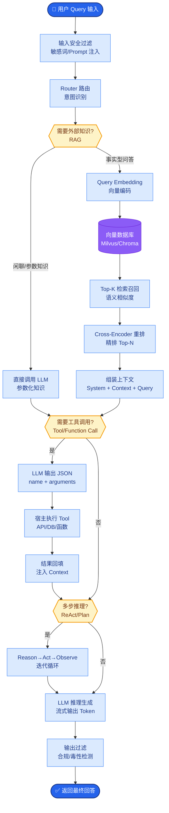

# 作为 FDE,你认为 AI Native 应用和 'AI + 传统软件' 的本质区别是什么?在为客户设计方案时如何体现

- **AI Native vs AI+ 的本质区别**

- **AI+(传统软件 + AI 功能)**
- AI 是'附加功能',不是核心
- 例子:CRM 加一个 AI 写邮件按钮
- 架构:传统 CRUD 为主,AI 是边缘调用
- 体验:用户大多数时候不用 AI 功能

- **AI Native(AI 原生应用)**
- AI 是'核心引擎',所有功能围绕 AI 构建
- 例子:Cursor(AI 代码编辑器)、Perplexity(AI 搜索)
- 架构:AI 是中间件,所有请求先经过 AI 理解和路由
- 体验:没有 AI 这个应用就不存在

- **设计哲学差异**

| 维度 | AI+ | AI Native |
|------|-----|-----------|
| 交互方式 | 点击/表单为主 | 对话/自然语言为主 |
| 数据流 | 用户->DB->展示 | 用户->AI理解->多工具->AI生成 |
| 决策权 | 人决策,AI 辅助 | AI 决策,人监督 |
| 反馈闭环 | 月度/周度 | 实时/每次交互 |

- **FDE 为客户设计时的选择框架**

1. **渐进式(AI+)适合**:
- 客户流程已经成熟,不想大改
- 用户 AI 接受度低
- 合规要求高,需要人主导

2. **革命式(AI Native)适合**:
- 新建系统,没有历史包袱
- 创新型客户,愿意改变工作流
- 场景本身就是 AI 擅长的(搜索/写作/分析)

- **实践建议**
- 不要对传统客户强推 AI Native
- 从 AI+ 切入,逐步增加 AI 权重
- 当用户习惯了 AI 辅助后,再推动 AI Native 的交互方式
- 最好的方案:在同一个系统中同时支持两种模式

- **架构差异对比图**
```text

  AI+ 架构模式                     AI Native 架构模式
  ┌──────────────┐                ┌──────────────┐
  │   用户界面   │                │   用户界面   │
  └──────┬───────┘                └──────┬───────┘
         │                               │
         ▼                               ▼
  ┌──────────────┐                ┌──────────────┐
  │ 业务逻辑层   │                │  AI 代理层   │◄── 核心
  │  (传统代码)  │                │  (LLM Core)  │
  └──────┬───────┘                └──────┬───────┘
         │                               │
    ┌────┴────┐                     ┌─────┴─────┐
    ▼         ▼                     ▼           ▼
 ┌─────┐  ┌─────┐              ┌─────────┐ ┌──────────┐
 │ DB  │  │ API │ ◄── AI只作为│  Tools  │ │ Knowledge│
 └─────┘  └─────┘     补充     └─────────┘ └──────────┘

  [以数据库为中心]               [以模型/推理为中心]
```

- **实战案例**
- **踩坑经验**：某企业内部知识库项目初期按 AI+ 设计（用户搜不到再点“Ask AI”），结果发现查询意图转化率极低（<5%）。重构为 AI Native 后（直接对话式查询，后台自动 RAG 检索），日活提升 300%，但也引入了新问题：幻觉导致错误决策。这引出了 AI Native 必须配套“引用溯源”和“人机审核”机制。

- **代码示例**
```python
# AI+ 模式：传统接口内嵌 AI 调用
def search_docs(keyword):
    results = db.query("SELECT * FROM docs WHERE content LIKE %s", f"%{keyword}%")
    return results  # 仅返回搜索结果

# AI Native 模式：AI 代理理解意图并路由
def agent_query(user_input):
    intent = llm.classify(user_input)  # 1. 理解意图
    if intent == "search":
        context = vector_db.search(user_input)
        return llm.generate(user_input, context=context)  # 2. 生成答案
    elif intent == "create":
        return create_doc_tool(user_input)  # 3. 调用工具
```

- **## 常见考点**
1. **过渡成本**：从 AI+ 迁移到 AI Native，最大的阻力通常是技术还是组织文化？（考察软技能）
2. **错误处理**：AI Native 应用中，当模型产生幻觉或错误时，系统架构应如何设计兜底机制？（考察健壮性设计）
3. **数据依赖**：AI Native 应用对数据的质量和格式要求有何不同？（考察工程细节）
4. **评估指标**：如何用指标量化一个应用是“AI+”还是“AI Native”？（考察概念落地）


## 核心流程图



## 记忆要点

- AI+：AI是附加功能，架构以DB为中心，人决策AI辅助，适合成熟流程。
- AI Native：AI是核心引擎，架构以模型为中心，AI决策人监督，适合创新场景。
- 交互差异：AI+点击表单为主，Native对话自然语言为主，实时反馈闭环。
- 设计建议：传统客户从AI+切入，逐步增加权重，避免强推Native。
- 架构对比：AI+是CRUD为主AI边缘调用，Native是AI理解路由多工具生成。


## 结构化回答

**30 秒电梯演讲：** AI+ 是传统软件加 AI，AI Native 是 AI 为核心重写体验。——打个比方，马车加引擎是 AI+，从头设计的汽车是 AI Native。

**展开框架：**
1. **AI+** — AI是附加功能，架构以DB为中心，人决策AI辅助，适合成熟流程。
2. **AI Nativ** — AI Native：AI是核心引擎，架构以模型为中心，AI决策人监督，适合创新场景。
3. **交互差异** — AI+点击表单为主，Native对话自然语言为主，实时反馈闭环。

**收尾：** 以上三点都能配合实战聊。我可以展开任一要点，比如「如何评估客户适合 AI+ 还是 AI Native」这类追问您感兴趣吗？

## 视频脚本

> 预计时长：2 分钟 | 由浅入深

| 时间 | 画面/字幕 | 口播台词 | 讲解要点 |
|------|----------|----------|----------|
| 0:00 | 标题卡 | "作为 FDE,你认为 AI Native 应用和 'AI + 传统软件' 的本质，30 秒讲清楚。" | 开场钩子 |
| 0:30 | 概念定义动画 | "一句话：AI+ 是传统软件加 AI，AI Native 是 AI 为核心重写体验。" | 核心定义 |
| 1:00 | AI+图解 | "AI是附加功能，架构以DB为中心，人决策AI辅助，适合成熟流程。" | AI+ |
| 1:30 | 总结卡 | "记好这几条，面试不慌。下期见。" | 收尾 |
