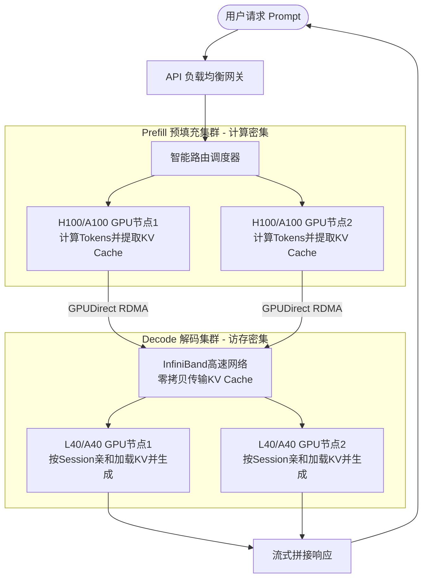

# 什么是Disaggregated Inference（分离式推理）？它为什么被认为是未来超大模型推理的趋势？

分离式推理将大模型的前向过程在逻辑或物理上分为“预填充阶段”和“解码阶段”，并部署在不同的硬件资源组上。预填充阶段是计算密集型，需要高带宽显存和强算力；解码阶段是访存密集型，需要大显存容量。通过将两者分离，可以针对不同阶段优化硬件配置（如解码节点使用高显存低算力的卡），并独立扩容。这解决了耦合部署时，解码阶段占用昂贵的计算资源却利用率低的问题，极大降低了超大模型（如100B+参数）在实时交互场景下的TCO（总拥有成本），提高了整体集群的资源利用率。

**实战案例**：在部署Llama-3-70B服务时，混合使用A100（负责Prefill高算力）和A40（负责Decode高显存）集群，相比全A100部署，不仅吞吐量提升了2倍，硬件成本还降低了40%。

**对比表格**：

| 维度 | 传统耦合部署 | 分离式推理 |
| :--- | :--- | :--- |
| **资源需求** | 单节点需同时满足高算力、大显存 | Prefill需高算力，Decode需大显存 |
| **资源利用率** | Decode阶段算力闲置严重（<10%） | 资源精准匹配，利用率显著提升 |
| **扩容灵活性** | 必须整体扩容，成本高 | 可按阶段独立水平扩容 |
| **网络依赖** | 节点内通信为主 | 依赖节点间高速网络（如InfiniBand） |

**代码示例**：
```python
# 伪代码：分离式推理的任务路由逻辑
if request.stage == "PREFILL":
    # 路由到计算密集型节点组（如 A100/H100）
    node = compute_cluster.schedule(request.model)
    tokens = node.prefill(request.prompt)
    save_kv_cache(tokens, distributed_store)
elif request.stage == "DECODE":
    # 路由到访存密集型节点组（如 A40/MI300）
    node = memory_cluster.schedule(request.session_id)
    node.load_kv_cache(request.session_id)
    token = node.decode_one_step()
```

## 技术原理

分离式推理（Disaggregated Inference）的核心洞察是：**LLM 推理的两个阶段对硬件的需求截然相反**，耦合部署必然导致一种资源浪费：

- **Prefill 和 Decode 的硬件画像对比**：
  - **Prefill（预填充）阶段**：处理用户输入的整个 prompt（可能数千 token），一次性并行计算所有 token 的 KV。这是**计算密集型**——FLOPS 是主要瓶颈，需要高算力卡（如 H100 的 989 TFLOPS）。GPU 算力利用率（MFU）能跑到 60%+，硬件钱花得值。
  - **Decode（解码）阶段**：每次只生成一个新 token，要把之前所有 token 的 KV 读出来算 attention。这是**访存密集型**——HBM 带宽是主要瓶颈，计算单元大部分时间在等数据。典型 MFU 只有 5-10%，95% 的算力在空转。
- **耦合部署的浪费**：传统 vLLM 把 Prefill 和 Decode 放同一批 GPU 上，用 Continuous Batching 混合调度。问题：Decode 阶段占着昂贵的 H100 但算力利用率 <10%，相当于让顶级大厨专门端盘子。A100 单卡 2 万美元，闲置 90% 就是巨大浪费。
- **分离式推理的资源精准匹配**：把 Prefill 部署到 H100（高算力、中等显存），把 Decode 部署到 L40/A40（中等算力、大显存、便宜）。L40 单卡只有 H100 一半价格但显存相同，跑 Decode 性价比极高。整体 TCO（总拥有成本）能降低 30-50%。
- **关键挑战——KV Cache 迁移**：分离后，Prefill 节点算出的 KV Cache 要传给 Decode 节点。70B 模型、4K 上下文的 KV Cache 单请求就要 320MB+，每秒数千请求的传输量是 GB 级。必须用 InfiniBand（200-400 Gbps）或 NVLink，配合 RDMA 零拷贝传输。这是分离式推理的工程难点，也是为什么它依赖高速网络。
- **PD 分离的调度策略**：①Prefill 和 Decode 节点数按负载比例独立扩容（如 1:3）；②用分布式 KV Cache 存储（如 Redis/Ray Object Store）做中间缓冲；③Decode 集群按 session 亲和路由（同一会话复用已加载 KV 的节点）。

## 代码示例

```python
# 分离式推理调度器核心逻辑（PD-Disaggregated 调度）
from dataclasses import dataclass
from typing import Optional
import redis

@dataclass
class PrefillNode:
    node_id: str
    gpu_type: str = "H100"      # 高算力卡
    available_memory: int = 80  # GB

@dataclass
class DecodeNode:
    node_id: str
    gpu_type: str = "L40"       # 高显存、低成本卡
    available_memory: int = 48  # GB
    loaded_sessions: set = None # 已加载 KV 的 session

class DisaggregatedScheduler:
    def __init__(self):
        self.prefill_cluster = [PrefillNode(f"prefill-{i}") for i in range(8)]
        self.decode_cluster = [DecodeNode(f"decode-{i}") for i in range(24)]
        self.kv_store = redis.Redis(host="kv-cache-store", port=6379)

    def handle_request(self, prompt: str, session_id: str) -> str:
        # 阶段1：路由到 Prefill 节点
        prefill_node = self._select_prefill_node()
        kv_cache = prefill_node.prefill(prompt)

        # 把 KV Cache 持久化到分布式存储（用 RDMA/GPU-Direct 传输更高效）
        kv_key = f"kv:{session_id}"
        self.kv_store.set(kv_key, kv_cache.serialize())

        # 阶段2：路由到 Decode 节点（优先选已加载该 session 的节点）
        decode_node = self._select_decode_node(session_id)
        if session_id not in decode_node.loaded_sessions:
            # 通过 InfiniBand/RDMA 从 KV store 拉取
            kv_data = self.kv_store.get(kv_key)
            decode_node.load_kv_cache(session_id, kv_data)

        # 阶段3：自回归解码
        generated = decode_node.decode_loop(session_id, max_tokens=512)
        return generated

    def _select_decode_node(self, session_id: str) -> DecodeNode:
        # Session 亲和性：优先复用已加载 KV 的节点，避免重复传输
        for node in self.decode_cluster:
            if session_id in (node.loaded_sessions or set()):
                return node
        # 否则选负载最低的节点
        return min(self.decode_cluster, key=lambda n: len(n.loaded_sessions or []))
```

```yaml
# 集群部署配置：Prefill 用 H100，Decode 用 L40
prefill_cluster:
  replicas: 8
  nodeSelector:
    gpu-type: H100
  resources:
    limits: { nvidia.com/gpu: 8 }

decode_cluster:
  replicas: 24                # Decode 节点更多（长尾请求多）
  nodeSelector:
    gpu-type: L40             # 低成本大显存卡
  resources:
    limits: { nvidia.com/gpu: 4 }

network:
  type: infiniband            # 200Gbps IB，KV Cache 迁移低延迟
  rdma: enabled               # GPU-Direct RDMA，绕过 CPU 拷贝
```

## 注意事项

- **KV Cache 传输是工程最大难点**：单次请求的 KV 可能几百 MB，高并发下每秒传输 GB 级数据。必须用 InfiniBand + GPUDirect RDMA（绕过 CPU 直接 GPU-to-GPU 传输），否则网络带宽会成为新瓶颈。DeepSeek 的 PD 分离方案专门优化了这点。
- **不是所有场景都该分离**：低并发（<100 QPS）或短上下文（<1K token）时，KV Cache 传输的固定开销可能超过分离带来的收益。分离式推理适合高并发、长上下文、超大模型（70B+）的场景，小模型用 Continuous Batching 更简单。
- **负载比例要动态调整**：Prefill:Decode 节点比例不是固定的，取决于平均 prompt 长度、生成长度、QPS。需要根据监控指标动态扩缩容，否则某阶段会成为整体瓶颈。可以用 KEDA 或自研调度器基于队列长度自动伸缩。
- **Session 亲和性很关键**：多轮对话中，第二轮的 Decode 应该路由到第一轮的 Decode 节点（已加载 KV Cache）。否则每次都要重新传输 KV，延迟和带宽成本爆炸。可以用 consistent hashing 把 session 固定到节点。
- **容错和故障恢复更复杂**：Prefill 或 Decode 节点挂了，对应的请求处理流程中断。需要把 KV Cache 持久化到共享存储（Redis/Object Store），节点故障时能在新节点恢复。这是分离式推理相比单节点推理的额外复杂度。

## 流程图



## 记忆要点

- 定义：将预填充（计算密集）和解码（访存密集）物理分离部署。
- 优势：资源精准匹配，Prefill用高算力卡，Decode用大显存卡，降低TCO。
- 解决痛点：耦合部署时解码阶段算力闲置严重（<10%），资源利用率低。
- 扩容：支持按阶段独立水平扩容，灵活应对负载变化。
- 依赖：分离式推理依赖节点间高速网络（如InfiniBand）传输KV Cache。


## 结构化回答

**30 秒电梯演讲：** 拆解预填充与解码阶段，分别用高算力和高显存硬件独立部署以降低成本。——打个比方，就像餐厅将“备菜”和“上菜”分开，备菜间用猛火灶（高算力）快速处理，服务员（高显存）只负责端盘子，避免了让顶级大厨专门端盘子的人才浪费。

**展开框架：**
1. **定义** — 将预填充（计算密集）和解码（访存密集）物理分离部署。
2. **优势** — 资源精准匹配，Prefill用高算力卡，Decode用大显存卡，降低TCO。
3. **解决痛点** — 耦合部署时解码阶段算力闲置严重（<10%），资源利用率低。

**收尾：** 以上三点都能配合实战聊。您想深入聊哪一块？

## 视频脚本

> 预计时长：2 分钟 | 由浅入深

| 时间 | 画面/字幕 | 口播台词 | 讲解要点 |
|------|----------|----------|----------|
| 0:00 | 标题卡 | "Disaggregated Inference（分离式推理），30 秒讲清楚。" | 开场钩子 |
| 0:30 | 概念定义动画 | "一句话：拆解预填充与解码阶段，分别用高算力和高显存硬件独立部署以降低成本。" | 核心定义 |
| 1:00 | 定义图解 | "将预填充（计算密集）和解码（访存密集）物理分离部署。" | 定义 |
| 1:30 | 总结卡 | "记好这几条，面试不慌。下期见。" | 收尾 |
