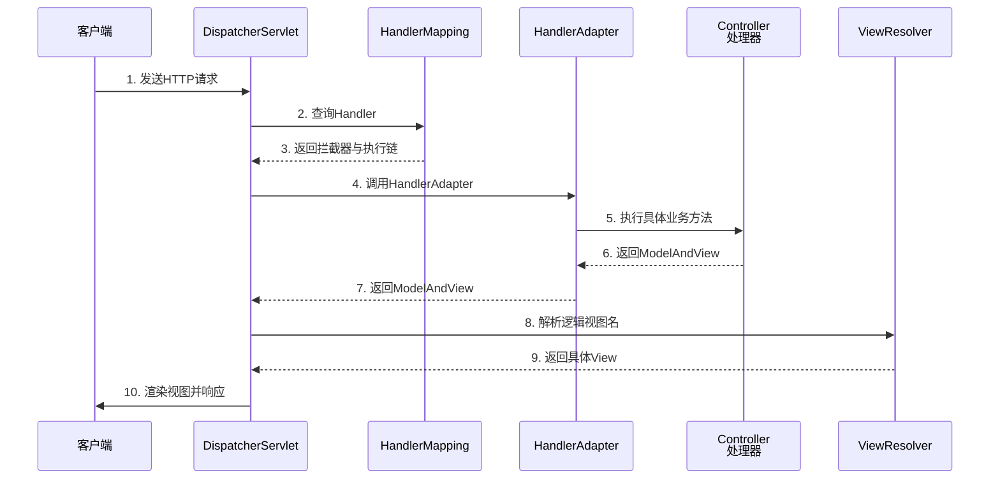

# Spring MVC

### Spring MVC 详解

**1. Spring MVC 执行流程**

1.  用户发送请求至前端控制器 **DispatcherServlet**。
2.  DispatcherServlet 收到请求调用 **HandlerMapping**（处理器映射器）。
3.  处理器映射器找到具体的处理器（可以根据 xml 配置、注解进行查找），生成处理器对象及处理器拦截器（如果有）一并返回给 DispatcherServlet。
4.  DispatcherServlet 调用 **HandlerAdapter**（处理器适配器）。
5.  HandlerAdapter 经过适配调用具体的处理器。
6.  Controller 执行完成返回 **ModelAndView**。
7.  HandlerAdapter 将 controller 执行结果 ModelAndView 返回给 DispatcherServlet。
8.  DispatcherServlet 将 ModelAndView 传给 **ViewResolver**（视图解析器）。
9.  ViewResolver 解析后返回具体 View。
10. DispatcherServlet 根据 View 进行渲染视图（即将模型数据填充至视图中）。
11. DispatcherServlet 响应用户。

### 增强细节：组件职责与参数说明

*   **DispatcherServlet**：前端控制器，是 Spring MVC 的核心，本质是一个 Servlet，负责请求的分发。
*   **HandlerMapping**：负责根据请求的 URL 找到对应的 Handler（即 Controller 方法）。常用实现包括 `RequestMappingHandlerMapping`（支持注解）。
*   **HandlerAdapter**：适配器模式的应用。因为 Controller 的实现方式多种多样（实现接口、注解等），HandlerAdapter 负责调用具体的 Controller 方法，屏蔽实现差异。
*   **ViewResolver**：负责解析逻辑视图名（如 "user/detail"）为具体的物理视图对象（如 JSP、HTML、Thymeleaf 模板）。
*   **ModelAndView**：封装了模型数据和视图名称。

**实战案例**
在处理文件上传接口时，曾遇到 `MaxUploadSizeExceededException` 异常未被全局异常处理器捕获。这是因为异常发生在 `DispatcherServlet` 调用 `HandlerAdapter` 之前的文件解析阶段。解决方案是在 `web.xml` 或配置类中自定义 `MultipartResolver`，并在 `DispatcherServlet` 层面通过实现 `HandlerExceptionResolver` 来捕获此类特定异常。

**代码示例 (自定义异常处理器)**
```java
@ControllerAdvice
public class GlobalExceptionHandler {
    @ExceptionHandler(BusinessException.class)
    public ResponseEntity<String> handleBiz(BusinessException ex) {
        // 实战：记录日志并返回统一错误码，而非直接抛出堆栈
        log.error("Biz Error", ex);
        return ResponseEntity.status(500).body(ex.getMessage());
    }
}
```

**2. 常用注解**

*   **@Controller**：
    *   作用在类上，表明这是一个 Spring MVC 控制器，将其声明为 Spring 的一个 Bean。
    *   DispatcherServlet 会自动扫描并映射到带有 @RequestMapping 的方法上。

*   **@RequestMapping**：
    *   用于映射 Web 请求（URL 和 HTTP 方法）到处理类或方法。
    *   支持类级别和方法级别，方法路径继承类路径。

*   **@ResponseBody**：
    *   作用在方法或返回值上，将返回值直接写入 HTTP response body 中，通常用于返回 JSON 数据（Ajax 请求），而不是解析为视图页面。

*   **@RequestBody**：
    *   作用在参数前，用于读取 HTTP 请求 body 中的数据（如 JSON 字符串），并将其绑定到方法参数上（反序列化为 Java 对象）。

*   **@PathVariable**：
    *   作用在参数前，用于接收 URL 路径中的参数（如 `/user/{id}` 中的 id）。

*   **@RestController**：
    *   这是一个组合注解，相当于 `@Controller` + `@ResponseBody`。使用该注解的类，所有方法默认都返回数据而非视图。

**3. 核心组件**

*   **前端控制器**：整个流程控制的中心，由它调用其它组件处理用户请求，降低了组件之间的耦合性。

### 流程架构图

```text
+--------+     1. Request     +---------------------+
| Client | -----------------> |  DispatcherServlet   |
+--------+                    +----------+----------+
                                          |
                               2. getHandler(URL)
                                          v
                                +---------------------+
                                |   HandlerMapping    |
                                +----------+----------+
                                           |
                                3.返回 HandlerExecutionChain
                                           |
                                           v
                                +---------------------+
                                |   HandlerAdapter    |
                                +----------+----------+
                                           |
                              4. handle(HttpServletRequest,Response)
                                           |
                                           v
                                +---------------------+
                                |     Controller      |
                                +----------+----------+
                                           |
                                5. 返回 ModelAndView / String
```

| 组件 | 实现类示例 (Spring Boot 默认) | 职责简述 |
| :--- | :--- | :--- |
| **HandlerMapping** | `RequestMappingHandlerMapping` | 建立 URL 与 Controller 方法的映射关系 |
| **HandlerAdapter** | `RequestMappingHandlerAdapter` | 调用 Controller 方法，处理参数绑定、返回值 |
| **ViewResolver** | `ContentNegotiatingViewResolver` | 根据视图名和内容类型解析视图 |
| **HandlerExceptionResolver** | `ExceptionHandlerExceptionResolver` | 解析处理过程中的异常，转向错误视图 |

## 流程图



## 核心知识点图


## 记忆要点

- 核心中枢：请求必经DispatcherServlet，它负责统一调度其他核心组件
- 三大组件：HandlerMapping找控制器，HandlerAdapter执行控制器，ViewResolver解析视图
- 注解记忆：@RestController等于@Controller加@ResponseBody，直接返回JSON数据而非页面
- 执行闭环：请求进 -> 找适配器执行Controller -> 返回ModelAndView -> 解析渲染视图 -> 响应出

## 结构化回答

**30 秒电梯演讲：** 基于MVC模式，将Web请求分发到对应Controller处理并返回响应。打个比方，像餐厅前台，接待顾客(请求)并分配给对应厨师(Controller)做菜，最后上菜(响应)。

**展开框架：**
1. **核心中枢** — 请求必经DispatcherServlet，它负责统一调度其他核心组件
2. **三大组件** — HandlerMapping找控制器，HandlerAdapter执行控制器，ViewResolver解析视图
3. **注解记忆** — @RestController等于@Controller加@ResponseBody，直接返回JSON数据而非页面

**收尾：** 这三点都能配合实战聊。您想深入聊原理、对比还是避坑？

## 视频脚本

> 预计时长：4 分钟 | 由浅入深

| 时间 | 画面/字幕 | 口播台词 | 讲解要点 |
|------|----------|----------|----------|
| 0:00 | 标题卡：Spring MVC | "Spring MVC？一句话——像餐厅前台，接待顾客(请求)并分配给对应厨师(Controller)做菜，最后上菜(响应)。" | 开场钩子 |
| 0:48 | 概念动画/示意图 | "基于MVC模式，将Web请求分发到对应Controller处理并返回响应——像餐厅前台，接待顾客(请求)并分配给对应厨师(Controller)做菜，最后上菜(响应)" | 核心定义 |
| 1:36 | 核心中枢示意 | "请求必经DispatcherServlet，它负责统一调度其他核心组件" | 要点1 |
| 2:24 | 三大组件示意 | "HandlerMapping找控制器，HandlerAdapter执行控制器，ViewResolver解析视图" | 要点2 |
| 3:12 | 注解记忆示意 | "@RestController等于@Controller加@ResponseBody，直接返回JSON数据而非页面" | 要点3 |
| 4:00 | 总结卡 | "记住这几条，面试不慌。下期讲进阶追问。" | 收尾 |
