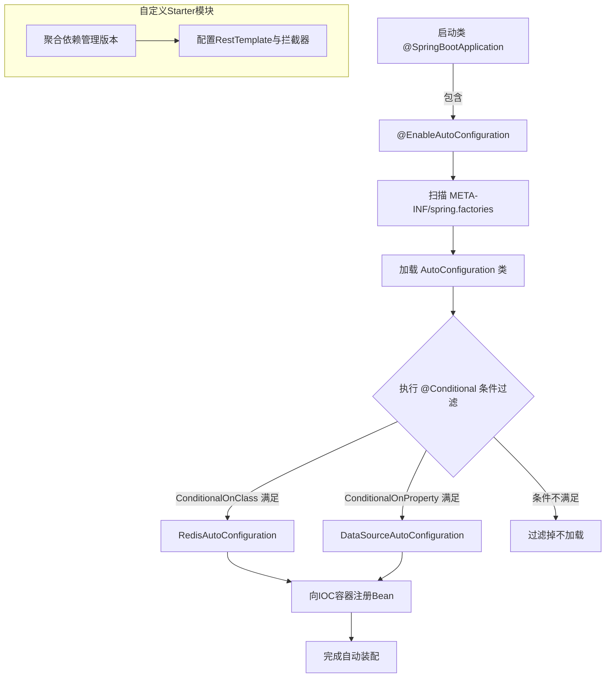

# SpringBoot

### Spring Boot 详解

**1. Spring Boot Starter 的作用**

Spring Boot Starter 的作用是简化和加速项目的配置和依赖管理。

*   **预配置模块**：它将特定功能（如 Web、JPA、Security）所需的依赖项和配置打包在一起。开发者只需引入对应的 Starter 依赖，无需手动编写大量的 XML 配置或 Java Config。
*   **依赖管理**：Starter 管理了相关功能的依赖版本，确保第三方库协同工作，避免版本冲突。
*   **模块化开发**：支持创建自定义 Starter，以便在项目中共享特定功能的配置和依赖。

**实战案例**
在开发支付模块时，我们自定义了 `payment-spring-boot-starter`。它自动配置了 `RestTemplate` 的连接池和超时时间，并封装了统一的签名拦截器。业务方只需引入依赖并配置 AppID，无需关注底层 HTTP 客户端细节，极大降低了接入成本并避免了因配置错误导致的偶发性超时。

**2. Spring Boot 常用注解**

1.  **@SpringBootApplication**：标识主应用类，组合了 `@Configuration`、`@EnableAutoConfiguration` 和 `@ComponentScan`。
2.  **@RestController**：组合了 `@Controller` 和 `@ResponseBody`，用于开发 RESTful 接口，返回数据而非视图。
3.  **@RequestMapping**：映射 HTTP 请求到处理方法。
4.  **@Autowired**：自动注入 Spring 容器中的 Bean。
5.  **@Service**、`@Repository`、`@Controller`：分别用于标识服务层、数据访问层和控制层的组件。
6.  **@Configuration**：标识配置类，等同于 XML 配置文件。
7.  **@Value**：从配置文件中读取值并注入。
8.  **@ConfigurationProperties**：批量将配置文件中的属性映射到 Java Bean，支持松散绑定（如 `context-path` 绑定到 `contextPath`）。
9.  **@Profile**：指定不同环境（如 dev, test）下的配置生效。
10. **@Async**：标识方法为异步执行。

**代码示例 (自定义 Starter 配置)**
```java
@Configuration
@ConditionalOnClass(RestTemplate.class) // 仅当类路径存在 RestTemplate 时生效
@EnableConfigurationProperties(PaymentProperties.class)
public class PaymentAutoConfiguration {
    
    @Bean
    @ConditionalOnMissingBean // 允许用户覆盖
    public RestTemplate paymentRestTemplate(PaymentProperties props) {
        return new RestTemplateBuilder()
               .setConnectTimeout(props.getTimeout())
               .build();
    }
}
```

**3. Spring Boot 自动装配原理**

Spring Boot 的自动装配是其核心魔法，大致过程如下：

1.  **启动**：通过 `@SpringBootApplication` 注解中的 `@EnableAutoConfiguration` 开启自动配置。
2.  **加载**：Spring Boot 在启动时扫描类路径下所有的 `META-INF/spring.factories`（Spring Boot 2.7 及以下）或 `META-INF/spring/org.springframework.boot.autoconfigure.AutoConfiguration.imports`（Spring Boot 3.0+）文件，加载其中注册的 `AutoConfiguration` 类。
3.  **过滤**：根据 `@Conditional` 系列注解（如 `@ConditionalOnClass`、`@ConditionalOnMissingBean`、`@ConditionalOnProperty` 等）判断这些配置类是否满足生效条件。例如，只有当类路径下存在 `RedisTemplate` 类时，Redis 的自动配置才会生效。
4.  **注册**：满足条件的配置类会被实例化，并根据其定义向 Spring 容器中注册相应的 Bean，从而完成依赖框架的自动集成。

| 阶段 | 关键动作 | 涉及核心类/注解 |
| :--- | :--- | :--- |
| **1. 收集候选** | 扫描 classpath 下的配置文件 | `spring.factories` / `.imports` 文件 |
| **2. 过滤筛选** | 按条件判断是否加载配置类 | `@ConditionalOnClass`, `@ConditionalOnMissingBean` |
| **3. 注册 Bean** | 将配置类中定义的 Bean 注册到容器 | `@Bean`, `@Configuration` |
| **4. 属性绑定** | 将 application.yml 配置绑定到 Bean | `@ConfigurationProperties` |

## 流程图




## 记忆要点

- Starter是预配置模块，因为聚合依赖并管理版本，所以能简化配置开箱即用。
- @SpringBootApplication三合一：因为组合了Configuration、EnableAutoConfig、ComponentScan。
- 自动装配四步曲：因为扫描imports文件加载配置，所以配合@Conditional按条件动态注册Bean。

## 结构化回答

**30 秒电梯演讲：** 通过约定大于配置和自动装配，快速搭建独立的Spring应用。打个比方，像精装修房，拎包入住（引入Starter），无需自己买家具（配置依赖）。

**展开框架：**
1. **Starter是预配置模块** — 因为聚合依赖并管理版本，所以能简化配置开箱即用。
2. **@SpringBootApplication三合一：因为组合了Configuration、E** — nableAutoConfig、ComponentScan。
3. **自动装配四步曲** — 因为扫描imports文件加载配置，所以配合@Conditional按条件动态注册Bean。

**收尾：** 我在项目里踩过坑——在开发支付模块时，我们自定义了 `payment-spring-boot-starter`。您想深入聊哪一段：原理、避坑还是对比选型？

## 视频脚本

> 预计时长：4 分钟 | 由浅入深

| 时间 | 画面/字幕 | 口播台词 | 讲解要点 |
|------|----------|----------|----------|
| 0:00 | 标题卡：SpringBoot | "SpringBoot？一句话——像精装修房，拎包入住（引入Starter），无需自己买家具（配置依赖）。" | 开场钩子 |
| 0:48 | 概念动画/示意图 | "通过约定大于配置和自动装配，快速搭建独立的Spring应用——像精装修房，拎包入住（引入Starter），无需自己买家具（配置依赖）" | 核心定义 |
| 1:36 | 要点1图解示意 | "因为聚合依赖并管理版本，所以能简化配置开箱即用。" | 要点1 |
| 2:24 | 要点2图解示意 | "@SpringBootApplication三合一：因为组合了Configuration、E" | 要点2 |
| 3:12 | 自动装配四步曲示意 | "因为扫描imports文件加载配置，所以配合@Conditional按条件动态注册Bean。" | 要点3 |
| 4:00 | 总结卡 | "记住这几条，面试不慌。下期讲进阶追问。" | 收尾 |
