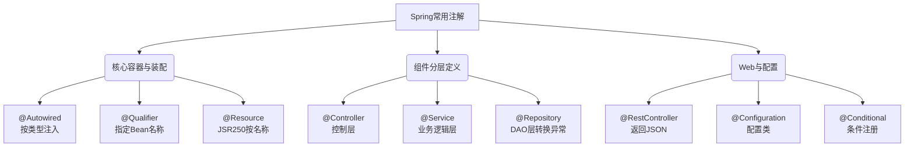

# Spring中常用的注解有哪些？

### Spring 常用注解

Spring 提供了大量的注解来简化 Bean 的注入与装配，替代繁琐的 XML 配置。常用的注解主要分为以下几类：

**1. 核心容器注解**
*   **@Autowired**：自动装配 Bean，默认按类型装配。如果有多个相同类型的 Bean，可以结合 `@Qualifier` 按名称装配。可用于构造器、字段、Setter 方法。
    *   *补充细节*：默认情况下，`@Autowired` 要求依赖必须存在（required=true），如果允许为 null，需设置 `required=false`。它在 Spring 5.0+ 支持基于构造器的注入，这也被视为最佳实践。
*   **@Qualifier**：当有多个相同类型的 Bean 时，指定需要注入的 Bean 名称。
*   **@Primary**：当有多个相同类型的 Bean 时，标记其中一个为首选的 Bean，避免使用 `@Qualifier` 的繁琐。
*   **@Resource**：JSR-250 注解，默认按名称装配（byName），当找不到名称匹配的 Bean 时才按类型装配（byType）。
    *   *补充细节*：`@Resource` 是 JDK 标准注解，而 `@Autowired` 是 Spring 特有的。`@Resource` 只能作用于字段和 Setter 方法，不能作用于构造器。
*   **@Value**：用于注入配置文件中的属性值（如 `@Value("${app.name}")`），也支持 SpEL 表达式（如 `@Value("#{systemProperties['user.os']}")`）。

| 注解 | 来源 | 装配策略 | 作用位置 | 推荐场景 |
| :--- | :--- | :--- | :--- | :--- |
| **@Autowired** | Spring | ByType (默认) | 构造器、字段、方法 | Spring 生态项目，强制依赖推荐构造器注入 |
| **@Resource** | JSR-250 (JDK) | ByName (默认) | 字段、Setter 方法 | 需要减少对 Spring 依赖，按名称精准匹配 |
| **@Primary** | Spring | 优先级标记 | 类或方法 (返回Bean) | 解决多个同类型 Bean 的默认选择问题 |

**2. 组件定义注解**
*   **@Component**：通用的组件注解，标注一个类为 Spring 管理的 Bean。
*   **@Repository**：用于标注数据访问层（DAO）组件。
    *   *补充细节*：它作为 DAO 层的标记，还能将平台特定的异常（如 Hibernate 异常）转换为 Spring 的统一数据访问异常体系（`DataAccessException`）。
*   **@Service**：用于标注服务层组件，用于封装业务逻辑。
*   **@Controller**：用于标注控制层组件（Spring MVC），处理 HTTP 请求，结合 `@ResponseBody` 可返回 JSON 数据。

**3. 配置相关注解**
*   **@Configuration**：标注一个类为配置类，相当于 XML 配置文件。该类本身也会被注册为一个 Bean。
*   **@Bean**：用于在配置类中手动注册 Bean 对象，通常配合 `@Configuration` 使用。
    *   *补充细节*：`@Bean` 支持指定初始化（`initMethod`）和销毁（`destroyMethod`）方法。默认情况下，Bean 名称与方法名相同。
*   **@ComponentScan**：自动扫描指定包路径下的带有 `@Component` 等注解的类并注册为 Bean。支持自定义过滤器（Include/Exclude）。
*   **@Import**：导入额外的配置类或普通类到 Spring 容器中。
    *   *补充细节*：支持三种导入方式：直接导入配置类、导入 `ImportSelector` 实现类（动态选择）、导入 `ImportBeanDefinitionRegistrar`（手动注册 BeanDefinition）。
*   **@Conditional**：基于条件判断是否注册 Bean（Spring Boot 核心原理），如 `@ConditionalOnClass`、`@ConditionalOnMissingBean`。
*   **@Scope**：指定 Bean 的作用域（Singleton, Prototype, Request, Session, GlobalSession）。

**4. Web MVC 注解**
*   **@RestController**：`@Controller` + `@ResponseBody` 的组合，返回 JSON 数据。
*   **@RequestMapping** / **@GetMapping** 等：映射 HTTP 请求 URL 到方法。
*   **@RequestBody** / **@ResponseBody**：将 HTTP 请求体/响应体与 Java 对象绑定。
*   **@PathVariable** / **@RequestParam**：获取 URL 路径变量和请求参数。

**实战案例**
在集成第三方 SDK（如阿里云 OSS）时，如果直接使用 `@Autowired` 注入 SDK 自带的 Bean，可能会遇到 Bean 名称冲突或配置不灵活的问题。最佳实践是创建一个 `@Configuration` 类，利用 `@Bean` 方法封装 SDK 的初始化逻辑，并结合 `@ConditionalOnProperty` 控制是否加载该 Bean（例如仅在配置文件中填写了 AccessKey 时才加载），从而避免在测试环境中报错。

**代码示例 (条件化配置)**
```java
@Configuration
public class OssConfig {
    
    @Bean
    @ConditionalOnProperty(name = "oss.enabled", havingValue = "true")
    public OSS ossClient(@Value("${oss.endpoint}") String endpoint) {
        return new OSSClientBuilder().build(endpoint, "id", "secret");
    }
}
```

## 流程图



## 核心知识点图


## 记忆要点

- 因为@Autowired默认按类型(ByType)注入，所以多实现时需配合@Qualifier指定名称。
- 对比记忆：@Autowired是Spring特有按类型，而@Resource是JDK标准默认按名称。
- 因为@Repository能转换底层异常，所以它是DAO层专属，而@Service和@Controller各司其职。

## 结构化回答

**30 秒电梯演讲：** 使用注解替代XML，声明Bean的注册、装配和配置。打个比方，给零件贴标签，Spring工厂看到标签就自动按规则组装。

**展开框架：**
1. **多实现时需配合@Qualifier指定名称** — 因为@Autowired默认按类型(ByType)注入，所以多实现时需配合@Qualifier指定名称。
2. **对比记忆** — @Autowired是Spring特有按类型，而@Resource是JDK标准默认按名称。
3. **它是DAO层专属** — 因为@Repository能转换底层异常，所以它是DAO层专属，而@Service和@Controller各司其职。

**收尾：** 这三点都能配合实战聊。您想深入聊原理、对比还是避坑？

## 视频脚本

> 预计时长：2 分钟 | 由浅入深

| 时间 | 画面/字幕 | 口播台词 | 讲解要点 |
|------|----------|----------|----------|
| 0:00 | 标题卡：Spring中常用的注解有哪些 | "Spring中常用的注解有哪些？一句话——给零件贴标签，Spring工厂看到标签就自动按规则组装。" | 开场钩子 |
| 0:40 | 概念动画/示意图 | "使用注解替代XML，声明Bean的注册、装配和配置——给零件贴标签，Spring工厂看到标签就自动按规则组装" | 核心定义 |
| 1:20 | 要点1图解示意 | "因为@Autowired默认按类型(ByType)注入，所以多实现时需配合@Qualifier指定名称。" | 要点1 |
| 2:00 | 总结卡 | "记住这几条，面试不慌。下期讲进阶追问。" | 收尾 |
