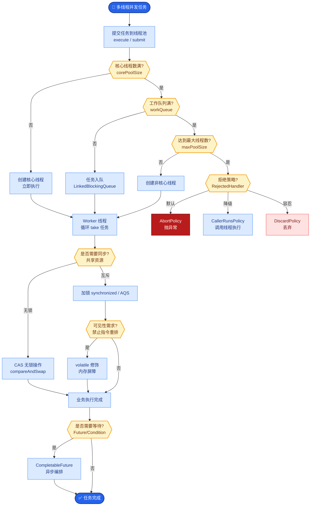

# Tomcat的架构和请求处理流程是怎样的？

### Tomcat 架构与请求处理流程

**1. Tomcat 总体架构**

Tomcat 的核心设计分为两个主要组件：**Connector**（连接器）和 **Container**（容器）。

*   **Connector**：负责处理与客户端的连接、网络通信（I/O 模型）、协议解析（如 HTTP/AJP）。它将接收到的 TCP 请求解析为 Request 对象，并将 Response 对象封装成 TCP 响应返回。
*   **Container**：负责内部业务逻辑处理，管理 Servlet 的生命周期，并调用具体的业务逻辑。Container 主要分为四个层级：
    1.  **Engine**：整个 Catalina Servlet 引擎，包含多个 Host。
    2.  **Host**：虚拟主机，例如 localhost。
    3.  **Context**：Web 应用，对应一个 Web 项目。
    4.  **Wrapper**：单个 Servlet 的包装器。

**2. 架构图解**

```text
┌─────────────────────────────────────────────────────┐
│                     Server (Tomcat)                  │
│  ┌──────────────────────────────────────────────┐   │
│  │               Service                         │   │
│  │  ┌────────────────┐        ┌──────────────┐  │   │
│  │  │   Connector    │◄──────►│   Container  │  │   │
│  │  │ (Coyote)       │        │  (Catalina)  │  │   │
│  │  │ - Protocol     │        │              │  │   │
│  │  │ - Endpoint     │        │ ┌──────────┐ │  │   │
│  │  │   (NIO/APR)    │        │ │ Engine   │ │  │   │
│  │  └────────────────┘        │ ├──────────┤ │  │   │
│  │                           │ │ Host     │ │  │   │
│  │                           │ ├──────────┤ │  │   │
│  │                           │ │ Context  │ │  │   │
│  │                           │ ├──────────┤ │  │   │
│  │                           │ │ Wrapper  │ │  │   │
│  │                           │ └──────────┘ │  │   │
│  └──────────────────────────────────────────────┘   │
└─────────────────────────────────────────────────────┘
```

**3. 请求处理流程**

1.  **请求接收**：用户发送 HTTP 请求，Tomcat 的 **Connector** 接收连接，通过 Endpoint（基于 I/O 模型如 NIO）读取 Socket 字节流。
2.  **解析请求**：Connector 的 Processor 组件将原始字节流解析为 Tomcat 内部的 `Request` 和 `Response` 对象。
3.  **传递给容器**：Connector 通过 `CoyoteAdapter` 将请求适配传递给 **Engine**（容器最外层）。
4.  **层层映射**：请求流经 Engine -> Host -> Context -> **Wrapper**。
    *   **Mapper** 组件（维护路由规则）根据 Host 名称找到对应的 Host。
    *   Host 根据 URL 路径找到对应的 Context（应用）。
    *   Context 根据 Servlet 映射规则找到对应的 Wrapper（Servlet）。
5.  **执行 Filter 链**：在调用 Servlet 之前，Tomcat 会先执行该 Context 下配置的所有 Filter（过滤器链）。
6.  **调用 Servlet**：Wrapper 容器加载并实例化 Servlet，调用其 `service` 方法，最终执行开发者的业务代码。
7.  **返回响应**：业务逻辑处理完毕后，Response 对象被逆向传递回 Connector，Connector 将其封装为 HTTP 响应报文发送给客户端。

**实战案例**
在一次大促压测中，服务出现大量 `Timeout waiting for idle object` 错误。排查发现是因为 Tomcat 的 `maxThreads` 设置过小（默认 200），而 Connector 的 `acceptCount`（等待队列）已满。实战调优时，建议将 `maxThreads` 调整至 CPU 核心数 * 200 + 伺服线程数，并适当增大 `acceptCount`（如 100），同时将 Protocol 从 BIO 切换至 NIO 以大幅提升并发处理能力。

**代码示例 (server.xml 核心配置片段)**
```xml
<Connector port="8080" protocol="HTTP/1.1"
           connectionTimeout="20000"
           redirectPort="8443"
           maxThreads="500"    <!-- 实战：根据压测结果调整 -->
           acceptCount="300"   <!-- 实战：增加等待队列长度 -->
           executor="tomcatThreadPool" />
```


## 核心流程图



## 记忆要点

- 架构双核心：Connector负责通信解析，而Container负责内部业务逻辑。
- Container四层级：因为自顶向下路由，所以依次经过Engine、Host、Context、Wrapper。
- 请求流转：因为Connector解析字节流生成Request，所以Mapper层层路由最终交给Servlet。

## 结构化回答

**30 秒电梯演讲：** Connector负责网络交互，Container负责Servlet管理，分层处理请求。打个比方，像餐厅，Connector是迎宾员负责接待客人，Container是后厨负责做菜。

**展开框架：**
1. **架构双核心** — Connector负责通信解析，而Container负责内部业务逻辑。
2. **Container四层级** — 因为自顶向下路由，所以依次经过Engine、Host、Context、Wrapper。
3. **请求流转** — 因为Connector解析字节流生成Request，所以Mapper层层路由最终交给Servlet。

**收尾：** 这三点都能配合实战聊。您想深入聊原理、对比还是避坑？

## 视频脚本

> 预计时长：2 分钟 | 由浅入深

| 时间 | 画面/字幕 | 口播台词 | 讲解要点 |
|------|----------|----------|----------|
| 0:00 | 标题卡：Tomcat的架构和请求处理流程是怎… | "Tomcat的架构和请求处理流程是怎样的？一句话——像餐厅，Connector是迎宾员负责接待客人，Container是后厨负责做菜。" | 开场钩子 |
| 0:40 | 概念动画/示意图 | "Connector负责网络交互，Container负责Servlet管理，分层处理请求——像餐厅，Connector是迎宾员负责接待客人，Container是后厨负责做菜" | 核心定义 |
| 1:20 | 架构双核心示意 | "Connector负责通信解析，而Container负责内部业务逻辑。" | 要点1 |
| 2:00 | 总结卡 | "记住这几条，面试不慌。下期讲进阶追问。" | 收尾 |
