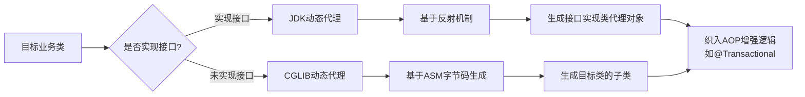

# 什么是AOP两种代理方式？

### AOP 的两种代理方式

Spring AOP 主要通过动态代理技术实现，根据目标类是否实现接口，采用不同的代理策略：

**1. JDK 动态代理**
*   **原理**：利用 Java 反射机制，实现 `InvocationHandler` 接口，并通过 `Proxy.newProxyInstance` 创建一个实现目标接口的代理对象。
*   **特点**：
    *   目标类必须**实现一个或多个接口**。
    *   代理对象是接口的实现类的实例，只能拦截接口中定义的方法。
*   **核心组件**：`java.lang.reflect.Proxy`, `java.lang.reflect.InvocationHandler`。
*   **流程示意**：
    ```text
    Client -> Proxy (Interface) -> InvocationHandler.invoke() -> Target Method
    ```

**2. CGLIB 动态代理**
*   **原理**：基于字节码操作库（如 ASM），在运行时动态生成一个被代理类的**子类**，并重写父类的方法来织入增强逻辑。
*   **特点**：
    *   目标类**不需要实现接口**。
    *   通过继承实现，因此无法代理 final 修饰的类或方法。
    *   Spring AOP 中，CGLIB 代理对象是目标类的子类。
*   **核心组件**：`org.springframework.cglib.proxy.Enhancer`, `MethodInterceptor`。
*   **流程示意**：
    ```text
    Client -> Proxy (Subclass) -> MethodInterceptor.intercept() -> Target Method (via super)
    ```

**3. Spring 的选择策略**
*   如果目标对象实现了接口，默认使用 **JDK 动态代理**（Spring Boot 2.x 及之后默认倾向于 CGLIB，但在纯 Spring 环境下仍看配置）。
*   如果目标对象没有实现接口，则强制使用 **CGLIB**。
*   可以通过配置 `@EnableAspectJAutoProxy(proxyTargetClass = true)` 强制全部使用 CGLIB 代理。

#### 实战案例
在 `@Transactional` 事务管理中，同类方法调用（如 `methodA` 调用同类内部的 `methodB`）会导致事务失效，因为这是通过 `this` 对象调用而非代理对象调用。常见的解决方案是注入自身或使用 `AopContext.currentProxy()` 获取代理对象来调用。

#### 关键代码示例
```java
// 获取当前代理对象进行同类调用，确保事务生效
public void methodA() {
    // methodB(); // 直接调用，事务失效
    ((Service) AopContext.currentProxy()).methodB(); // 代理调用，事务生效
}
@Transactional
public void methodB() { ... }
```

#### 对比表格
| 特性 | JDK 动态代理 | CGLIB 动态代理 |
| :--- | :--- | :--- |
| **实现原理** | 反射机制，实现接口 | 字节码操作（ASM），继承子类 |
| **前提条件** | 目标类必须实现接口 | 目标类不能是 final 类/方法 |
| **代理对象** | 接口的实现类实例 | 目标类的子类实例 |
| **性能 (JDK8+)** | 较高（JDK8 优化后） | 略低（生成字节码耗时），但执行效率高 |
| **Spring 默认** | 有接口时优先 | 无接口时强制 / 可配置强制 |

**## 常见考点**
1.  **JDK 动态代理 vs CGLIB**：性能对比（JDK 8 后 JDK 动态代理性能大幅提升）、使用限制（CGLIB 不能代理 final 类/方法）。
2.  **Spring AOP 中的循环依赖**：为什么三级缓存能解决 AOP 代理对象的循环依赖（第三级缓存存放的是工厂对象，延迟生成代理，确保最终注入的是代理而非原始对象）。
3.  **AspectJ 的区别**：Spring AOP 是运行时增强，基于代理；AspectJ 是编译时增强，性能更强但更复杂。

## 流程图




## 记忆要点

- JDK代理靠反射实现接口，而CGLIB靠字节码继承生成子类。
- 选择策略：有接口默认用JDK，无接口强制用CGLIB，可配置强制全部用CGLIB。
- 因为CGLIB基于继承机制，所以无法代理final修饰的类或方法。

## 结构化回答

**30 秒电梯演讲：** 通过创建代理对象拦截方法调用，实现横切逻辑。打个比方，像明星的经纪人（代理），粉丝（调用者）找明星办事都得先过经纪人这一关。

**展开框架：**
1. **JDK代理靠反射实现接口** — 而CGLIB靠字节码继承生成子类。
2. **选择策略** — 有接口默认用JDK，无接口强制用CGLIB，可配置强制全部用CGLIB。
3. **无法代理final修饰的类或方法** — 因为CGLIB基于继承机制，所以无法代理final修饰的类或方法。

**收尾：** 我在项目里踩过坑——在 `@Transactional` 事务管理中，同类方法调用（如 `methodA` 调用同类内部的 `methodB`）会导致事务失效，因为这是通过 `this` 对象调用而非代理对象调用。您想深入聊哪一段：原理、避坑还是对比选型？

## 视频脚本

> 预计时长：2 分钟 | 由浅入深

| 时间 | 画面/字幕 | 口播台词 | 讲解要点 |
|------|----------|----------|----------|
| 0:00 | 标题卡：什么是AOP两种代理方式 | "什么是AOP两种代理方式？一句话——像明星的经纪人（代理），粉丝（调用者）找明星办事都得先过经纪人这一关。" | 开场钩子 |
| 0:40 | 概念动画/示意图 | "通过创建代理对象拦截方法调用，实现横切逻辑——像明星的经纪人（代理），粉丝（调用者）找明星办事都得先过经纪人这一关" | 核心定义 |
| 1:20 | JDK代理靠反射实现接口示意 | "而CGLIB靠字节码继承生成子类。" | 要点1 |
| 2:00 | 总结卡 | "记住这几条，面试不慌。下期讲进阶追问。" | 收尾 |
