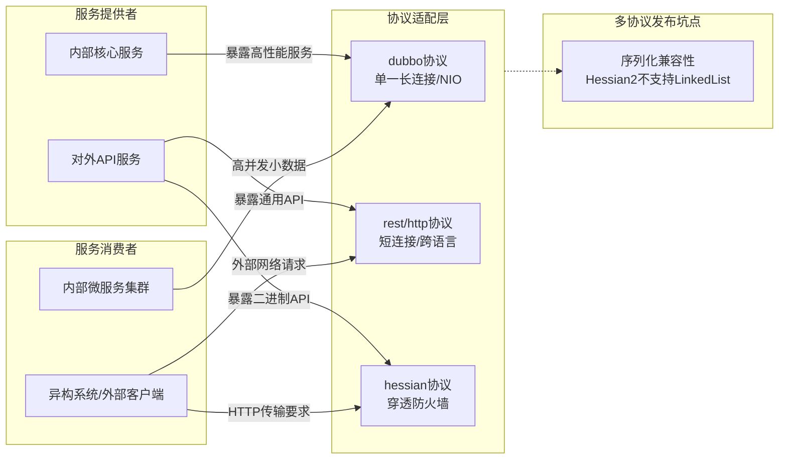

# Dubbo支持哪些协议，每种协议的应用场景，优缺点?

### Dubbo 支持的协议及应用场景

Dubbo 默认支持多种协议，不同的协议适用于不同的场景。以下是主要协议的对比：

#### 协议对比表
| 协议 | 传输层 | 序列化 | 连接方式 | 优点 | 缺点 | 适用场景 |
| :--- | :--- | :--- | :--- | :--- | :--- | :--- |
| **dubbo** | TCP | Hessian2 | 长连接 NIO | 吞吐量高，连接数少 | 大数据包传输受限 | 内部微服务高并发调用 |
| **rmi** | TCP | Java 序列化 | 短连接 (阻塞) | JDK 原生支持，穿透好 | 性能一般，安全性漏洞 | 老系统互操作，Java 间调用 |
| **hessian** | HTTP | Hessian | 短连接 | 穿透防火墙，跨语言 | 依赖 Servlet 容器 | 跨语言调用，HTTP 传输需求 |
| **http** | HTTP | JSON/Form | 短连接 | 通用性极强，调试方便 | 性能低，包体积大 | 对接异构系统，外部接口 |
| **rest** | HTTP | JSON/XML | 短连接 | 标准 RESTful，适合前端 | 性能低于 Dubbo 协议 | 开放 API 平台，移动端对接 |
| **webservice**| HTTP | SOAP (XML) | 短连接 | 标准化高，WSDL 描述 | 性能最差，消息臃肿 | 银行/金融，遗留系统集成 |

**1. dubbo 协议（默认）**
*   **特点**：单一长连接，NIO 异步通讯，Hessian2 序列化。
*   **优点**：连接数少，适合大并发小数据量的场景，性能高，吞吐量大。
*   **缺点**：不适合传输大数据包；在大文件传输时不如 HTTP 灵活；建立长连接可能导致服务端连接数受限（需调整服务端 `accepts` 参数）。
*   **适用场景**：常规远程服务调用，消费者远大于提供者，内部微服务通信。

**2. rmi 协议**
*   **特点**：采用 JDK 标准的 `java.rmi` 协议，阻塞式短连接，Java 标准序列化。
*   **优点**：原生支持，无需引入额外依赖，可传递文件，穿透性较好。
*   **缺点**：偶发服务端口占用；Java 序列化存在安全漏洞（如低版本 Common-Collections）；性能一般；只支持 Java 语言。
*   **适用场景**：消费者和提供者个数差不多，常规服务调用，且需与老系统 RMI 互操作。

**3. hessian 协议**
*   **特点**：基于 HTTP 协议传输，Hessian 序列化。
*   **优点**：穿过防火墙方便，兼容性好，二进制传输比原生 HTTP 文本快。
*   **缺点**：Hessian 序列化需单独的可序列化类（不支持某些 Java 特性如枚举等早期版本）；基于 Servlet 暴露，性能受限于 Servlet 容器。
*   **适用场景**：需通过 HTTP 传输，或对穿透性有要求的场景，非 Java 语言调用（如 Python 通过 Hessian 协议调用 Java）。

**4. http 协议**
*   **特点**：基于 Spring `HttpInvoker` 或标准 HTTP 表单/JSON。
*   **优点**：通用性极强，跨语言调用方便，调试简单。
*   **缺点**：性能相对较低，消息包较大（文本或 XML），短连接开销大。
*   **适用场景**：外部系统集成，非 Dubbo 体系的客户端调用，由于兼容性极好，常用于对接异构系统。

**5. webservice (soap) 协议**
*   **特点**：基于 SOAP 协议。
*   **优点**：标准化程度最高，跨语言、跨平台能力强，有完善的 WSDL 描述。
*   **缺点**：性能最差，消息臃肿（XML），复杂度高。
*   **适用场景**：传统的系统集成，对接遗留系统或金融/银行系统。

**6. rest (restful) 协议**
*   **特点**：基于标准的 HTTP RESTful 风格，通常使用 JSON 序列化。
*   **特点**：比标准 HTTP 协议更适合现代 Web 架构，天然与前端或移动端对接。
*   **适用场景**：提供开放 API 接口，对接非 Java 客户端。

#### 实战案例
在需要同时支持内部高性能调用（Dubbo 协议）和外部合作伙伴调用（HTTP 协议）时，可以在同一个 Service 上配置多协议发布，避免维护两套代码。但需注意，不同协议的序列化机制不同，如 `Hessian2` 不支持 `LinkedList`，需使用 `ArrayList`，否则会报序列化异常。

#### 关键代码示例
```xml
<!-- 同一服务暴露多协议 -->
<dubbo:service interface="com.example.Api" ref="apiImpl" protocol="dubbo,hessian" />

<dubbo:protocol name="dubbo" port="20880" />
<dubbo:protocol name="hessian" port="8080" server="servlet" />
```

**## 常见考点**
1.  **为什么 Dubbo 协议默认使用单一长连接**：减少 TCP 握手挥手开销，但在处理大请求时会阻塞其他请求（除非配合 HTTP/2 或 Multiplexing），适合高并发小数据包。
2.  **序列化选择**：Hessian2 vs Kryo vs Fst vs Protobuf，为什么 Dubbo 默认选 Hessian2（平衡了性能和兼容性）。
3.  **多协议发布**：同一个服务是否可以同时暴露多种协议？（可以，配置多 `<dubbo:protocol>`，以满足不同调用方的需求）。

## 流程图




## 记忆要点

- 默认dubbo协议：因为基于TCP单一长连接和NIO，所以适合高并发小数据量内部调用。
- 对比HTTP类：因为短连接穿透性好，所以rest或http协议多用于外部API或异构系统对接。
- 实战坑点：因为不同协议序列化机制不同，所以多协议暴露时注意集合类型兼容性（如Hessian不认LinkedList）。

## 结构化回答

**30 秒电梯演讲：** 提供多种通信协议，平衡性能、通用性和穿透性。打个比方，像快递公司提供空运、陆运、海运，根据货物大小和急缓程度选择。

**展开框架：**
1. **默认dubbo协议** — 因为基于TCP单一长连接和NIO，所以适合高并发小数据量内部调用。
2. **对比HTTP类** — 因为短连接穿透性好，所以rest或http协议多用于外部API或异构系统对接。
3. **实战坑点** — 因为不同协议序列化机制不同，所以多协议暴露时注意集合类型兼容性（如Hessian不认LinkedList）。

**收尾：** 我在项目里踩过坑——在需要同时支持内部高性能调用（Dubbo 协议）和外部合作伙伴调用（HTTP 协议）时，可以在同一个 Service 上配置多协议发布，避免维护两套代码。您想深入聊哪一段：原理、避坑还是对比选型？

## 视频脚本

> 预计时长：2 分钟 | 由浅入深

| 时间 | 画面/字幕 | 口播台词 | 讲解要点 |
|------|----------|----------|----------|
| 0:00 | 标题卡：Dubbo支持哪些协议，每种协议的应… | "Dubbo支持哪些协议，每种协议的应用场景，优缺点？一句话——像快递公司提供空运、陆运、海运，根据货物大小和急缓程度选择。" | 开场钩子 |
| 0:40 | 概念动画/示意图 | "提供多种通信协议，平衡性能、通用性和穿透性——像快递公司提供空运、陆运、海运，根据货物大小和急缓程度选择" | 核心定义 |
| 1:20 | 默认dubbo协议示意 | "因为基于TCP单一长连接和NIO，所以适合高并发小数据量内部调用。" | 要点1 |
| 2:00 | 总结卡 | "记住这几条，面试不慌。下期讲进阶追问。" | 收尾 |
