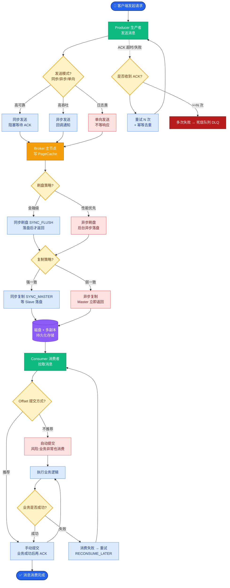

# Dubbo的工作流程是什么？

### Dubbo 的工作流程

Dubbo 的工作流程主要包含服务注册与发现的完整生命周期，具体步骤如下：

**1. 启动容器**
服务提供者和服务消费者启动，分别加载 Spring 配置（或注解配置），初始化上下文。

**2. 服务注册**
*   **Provider**：服务提供者在启动时，向 **注册中心**（如 Zookeeper、Nacos、Redis）发送请求，注册自己提供的服务地址（IP、端口）、接口名称及版本号。

**3. 服务订阅**
*   **Consumer**：服务消费者在启动时，向注册中心订阅自己所需的服务列表。

**4. 地址通知**
*   注册中心将服务提供者的地址列表返回给消费者。
*   **变更推送**：注册中心与消费者保持长连接。如果提供者地址发生变化（如宕机、新增、下线），注册中心会基于 **Push** 模式主动推送变更数据给消费者，更新本地缓存。

**5. 服务调用**
*   消费者拿到地址列表后，基于负载均衡策略（如 Random、RoundRobin、LeastActive）选择一个提供者地址。
*   基于 **RPC 协议**（如 Dubbo 协议）发起远程调用。内部过程包括：序列化请求 -> 网络传输 -> 提供者反序列化 -> 执行本地逻辑 -> 序列化结果 -> 网络返回。

**6. 服务监控**
*   调用次数和调用时间会异步发送给 **监控中心**，用于统计监控（调用成功率、耗时等）。监控中心不影响业务流程。

**架构流程图**

```text
  ┌──────────────┐                              ┌──────────────┐
  │   Container  │                              │   Container  │
  │              │                              │              │
  │   ┌───────┐  │        2.Register           │   ┌───────┐  │
  │   │Provider│──┼────────────────────────────▶│  Zookeeper │  │
  │   └───────┘  │                              │ (Registry) │  │
  └──────────────┘                              └─────────────┘
         ▲  5.RPC Invoke                               │
         │                                             │ 3.Subscribe
         │                                             │ 4.Notify
  ┌──────┴───────┐                                    │
  │              │                                    │
  │   ┌───────┐  │                              ┌─────┴─────┐
  │   │Consumer│──┼────────────────────────────▶│   Monitor │
  │   └───────┘  │        6.Stat (Async)         └───────────┘
  └──────────────┘
```

#### 实战案例
在生产环境中，遇到过注册中心（如 Zookeeper）集群短暂宕机的情况。由于 Consumer 端本地缓存了 Provider 地址列表，业务调用完全未受影响，体现了 Dubbo 架构中注册中心“去中心化”的健壮性。但在此期间新上线的服务无法被感知到，直到注册中心恢复。

#### 关键代码示例
```java
// 消费端配置：启动时检查 (check=false) 防止注册中心不可用时启动失败
// &lazy=true 延迟连接，用到时才创建长连接
@Reference(check = false, lazy = true, timeout = 1000)
private UserService userService;
```

**## 常见考点**
1.  **注册中心宕机怎么办**：注册中心只负责注册和发现，消费者本地会缓存提供者列表。注册中心宕机不影响已运行的调用，但会影响新服务上线和变更的感知。
2.  **负载均衡策略**：Random（加权随机）、RoundRobin（加权轮询）、LeastActive（最小活跃数，即响应快的服务分配更多请求）、ConsistentHash（一致性哈希，参数相同路由到同一提供者）。
3.  **集群容错策略**：Failover（自动重试，默认）、Failfast（快速失败，只调用一次）、Failsafe（失败不报错）、Failback（失败自动恢复）。


## 核心流程图



## 记忆要点

- 启动交互流程：Provider注册 -> Consumer订阅 -> 注册中心推送通知 -> RPC调用。
- 高可用特性：因为Consumer本地缓存了Provider列表，所以注册中心宕机不影响已有调用。
- 解耦设计：监控中心只异步收集统计数据，因为不参与核心链路，所以不影响业务流程。

## 结构化回答

**30 秒电梯演讲：** 基于注册中心实现服务发布与订阅，完成远程RPC调用。打个比方，像去餐厅吃饭，先看菜单(注册中心)找到店址，然后直接去店里吃饭(直接调用)。

**展开框架：**
1. **启动交互流程** — Provider注册 -> Consumer订阅 -> 注册中心推送通知 -> RPC调用。
2. **高可用特性** — 因为Consumer本地缓存了Provider列表，所以注册中心宕机不影响已有调用。
3. **解耦设计** — 监控中心只异步收集统计数据，因为不参与核心链路，所以不影响业务流程。

**收尾：** 我在项目里踩过坑——在生产环境中，遇到过注册中心（如 Zookeeper）集群短暂宕机的情况。您想深入聊哪一段：原理、避坑还是对比选型？

## 视频脚本

> 预计时长：2 分钟 | 由浅入深

| 时间 | 画面/字幕 | 口播台词 | 讲解要点 |
|------|----------|----------|----------|
| 0:00 | 标题卡：Dubbo的工作流程是什么 | "Dubbo的工作流程是什么？一句话——像去餐厅吃饭，先看菜单(注册中心)找到店址，然后直接去店里吃饭(直接调用)。" | 开场钩子 |
| 0:40 | 概念动画/示意图 | "基于注册中心实现服务发布与订阅，完成远程RPC调用——像去餐厅吃饭，先看菜单(注册中心)找到店址，然后直接去店里吃饭(直接调用)" | 核心定义 |
| 1:20 | 启动交互流程示意 | "Provider注册 -> Consumer订阅 -> 注册中心推送通知 -> RPC调用。" | 要点1 |
| 2:00 | 总结卡 | "记住这几条，面试不慌。下期讲进阶追问。" | 收尾 |
