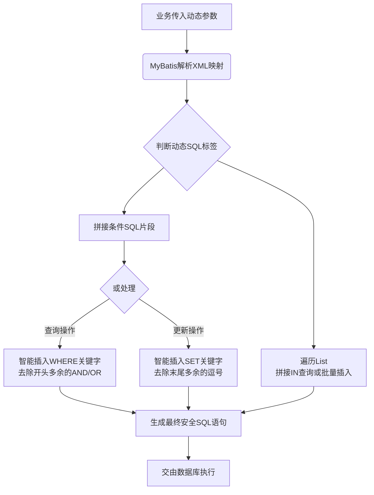

# Mybatis动态sql是做什么的?都有哪些动态sql?

### MyBatis 动态 SQL

**1. 动态 SQL 的作用**

MyBatis 的动态 SQL 允许在 XML 映射文件中，使用标签形式编写逻辑判断，从而根据不同的入参条件动态拼接 SQL 语句。这极大地解决了多条件查询时的复杂拼接问题，避免了手动拼接 SQL 导致的空格遗漏、语法错误（如多出的 AND/OR）以及 SQL 注入风险。

**2. 常用动态 SQL 标签**

*   **<if>**：
    *   用于简单的条件判断。如果 test 属性中的条件为真，则拼接标签内的 SQL 片段。
    *   **关键细节**：test 表达式中使用 OGNL 表达式，可直接访问参数对象的属性（如 `user.name != null`）。在判断字符串时，常需配合 `!= ''` 一起判断，避免空字符串传递。
    *   示例：`<if test="name != null and name != ''"> AND name = #{name}</if>`

*   **<where>**：
    *   用于处理 WHERE 子句。它会智能处理 SQL 拼接问题：
        *   如果内部标签有内容，则自动插入 `WHERE` 关键字。
        *   会自动去除内部语句**开头**多余的 `AND` 或 `OR`。
        *   如果内部没有任何条件满足，它不会插入 `WHERE` 关键字。

*   **<set>**：
    *   用于处理 UPDATE 语句中的 SET 子句。
    *   **关键细节**：自动添加 `SET` 关键字，并去除末尾多余的逗号。如果没有任何内容，会报 SQL 语法错误（因为没有 SET 内容），因此通常至少保留一个必更新字段或使用 `<if>` 包裹所有字段并在业务层控制。

*   **<trim>**（增强补充）：
    *   <where> 和 <set> 的底层实现，功能更灵活。通过 `prefix`、`suffix`、`prefixOverrides`、`suffixOverrides` 属性定制拼接规则。

*   **<foreach>**：
    *   用于循环集合（如 List、Set、Map），通常用于 IN 查询或批量插入。
    *   **关键细节**：
        *   `collection` 属性：若参数为 List，默认名为 `list`；若为数组，默认名为 `array`；若为 Map，则为 key 值；也可通过 `@Param("自定义名")` 指定。
        *   `separator`：分隔符。
        *   `item`：当前元素名。
        *   `open/close`：包裹字符串。

#### 实战案例
在一个多条件搜索报表中，使用 `<where>` 标签成功避免了当所有查询条件为空时生成无效的 `WHERE 1=1` SQL，以及在第一个条件为空第二个条件不为空时产生的 SQL 语法错误（如 `WHERE AND name = 'xxx'`）。

#### 关键代码示例
```xml
<select id="findUsers" resultType="User">
    SELECT * FROM user
    <where>
        <!-- 自动处理 AND 前缀 -->
        <if test="name != null and name != ''">
            AND name LIKE CONCAT('%', #{name}, '%')
        </if>
        <if test="status != null">
            AND status = #{status}
        </if>
    </where>
</select>

<!-- 批量插入 -->
<insert id="batchInsert">
    INSERT INTO user (name, age) VALUES 
    <foreach collection="list" item="user" separator=",">
        (#{user.name}, #{user.age})
    </foreach>
</insert>
```

**## 常见考点**
1.  **<foreach> 性能**：当 IN 子句中元素过多（如超过 1000 或 2000，取决于数据库）时，可能会导致 SQL 执行效率急剧下降或报错（如 Oracle 的 1000 限制），此时应分批查询或改用临时表。
2.  **OGNL 表达式**：在 `<if test="...">` 中如何判断字符串、集合是否为空（如 `list != null and list.size() > 0`）。
3.  **SQL 注入防护**：MyBatis 动态 SQL 本身配合 `#{}` 可以防止注入，但 `${}` 属于字符串拼接，需谨慎使用。

## 流程图




## 记忆要点

- 动态SQL作用：因为根据参数动态拼接语句，所以解决了多条件查询时的拼接错乱问题。
- 智能标签：<where>自动去头尾AND/OR，而<set>自动去末尾多余逗号。
- 循环标签：<foreach>常用于IN查询或批量插入，因为受限于DB的IN长度，所以大批量需分批。

## 结构化回答

**30 秒电梯演讲：** 根据条件动态拼接SQL语句，处理多条件查询和更新。打个比方，像搭积木，根据需求拼装不同形状（SQL片段）。

**展开框架：**
1. **动态SQL作用** — 因为根据参数动态拼接语句，所以解决了多条件查询时的拼接错乱问题。
2. **智能标签** — <where>自动去头尾AND/OR，而<set>自动去末尾多余逗号。
3. **循环标签** — <foreach>常用于IN查询或批量插入，因为受限于DB的IN长度，所以大批量需分批。

**收尾：** 我在项目里踩过坑——在一个多条件搜索报表中，使用 `<where>` 标签成功避免了当所有查询条件为空时生成无效的 `WHERE 1=1` SQL，以及在第一个条件为空第二个条件不为空时产生的 SQL 语法错误（如 `WHERE AND name = 'xxx'`）。您想深入聊哪一段：原理、避坑还是对比选型？

## 视频脚本

> 预计时长：2 分钟 | 由浅入深

| 时间 | 画面/字幕 | 口播台词 | 讲解要点 |
|------|----------|----------|----------|
| 0:00 | 标题卡：Mybatis动态sql是做什么的?… | "Mybatis动态sql是做什么的?都有哪些动态sql？一句话——像搭积木，根据需求拼装不同形状（SQL片段）。" | 开场钩子 |
| 0:40 | 概念动画/示意图 | "根据条件动态拼接SQL语句，处理多条件查询和更新——像搭积木，根据需求拼装不同形状（SQL片段）" | 核心定义 |
| 1:20 | 动态SQL作用示意 | "因为根据参数动态拼接语句，所以解决了多条件查询时的拼接错乱问题。" | 要点1 |
| 2:00 | 总结卡 | "记住这几条，面试不慌。下期讲进阶追问。" | 收尾 |
