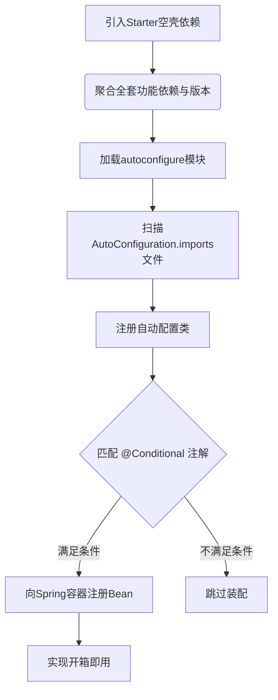

# Spring Boot Starter有什么用？

### Spring Boot Starter有什么用？

Spring Boot Starter的作用是简化和加速项目的配置和依赖管理。

Spring Boot Starter可以理解为一种预配置的模块，它封装了特定功能的依赖项和配置。开发者只需引入相关的Starter依赖，无需手动配置大量的参数和依赖项。

Starter还管理了相关功能的依赖项，包括其他Starter和第三方库，确保它们能够良好地协同工作，避免版本冲突和依赖问题。

Spring Boot Starter的设计使得应用可以通过引入不同的Starter来实现模块化的开发。每个Starter都关注一个特定的功能领域，如数据库访问、消息队列、Web开发等。

开发者可以创建自定义的Starter，以便在项目中共享和重用特定功能的配置和依赖。

#### 实战案例
在微服务架构中，团队内部统一封装 `company-log-spring-boot-starter`，集成 ELK 日志上报与 TraceId 链路追踪。新服务只需引入此依赖，无需修改代码即可接入公司统一日志平台，避免了每个项目重复配置 Logback XML 的痛点。

#### 代码示例
**自定义 Starter 关键配置类**
```java
@Configuration
@ConditionalOnClass(DogService.class) // 类路径存在指定类才生效
@EnableConfigurationProperties(DogProperties.class)
public class DogAutoConfiguration {
    @Bean
    @ConditionalOnMissingBean // 容器中没有该Bean时才创建
    public DogService dogService(DogProperties properties) {
        return new DogService(properties.getName());
    }
}
```
**文件：META-INF/spring/org.springframework.boot.autoconfigure.AutoConfiguration.imports**
```text
com.example.DogAutoConfiguration
```

#### 对比表格：Starter vs 普通 Maven 依赖

| 特性 | Spring Boot Starter | 普通 Maven 依赖 |
| :--- | :--- | :--- |
| **依赖管理** | 聚合了功能所需的一整套依赖，并解决版本冲突 | 仅包含自身的代码和直接依赖，需开发者手动管理版本兼容性 |
| **自动配置** | 开箱即用，利用 `spring.factories` 自动注入 Bean | 需要手动编写 XML 或 Java Config 来注册 Bean |
| **约定优于配置** | 提供默认配置，支持 `application.yml` 简单覆盖 | 无默认配置，配置逻辑分散在项目代码中 |

**## 常见考点**
1.  **Starter 的原理**：为什么引入依赖就能自动配置？
    *   答：利用了 Spring Boot 的 `spring.factories`（旧版）或 `org.springframework.boot.autoconfigure.AutoConfiguration.imports`（新版 2.7+）机制。启动时扫描 classpath 下的 jar 包，加载配置类，结合 `@Conditional` 系列注解按需装配 Bean。
2.  **Starter 与普通 Jar 包的区别**：
    *   答：Starter 是一个空的 Jar 包，主要充当“依赖集合”的载体（pom.xml 定义了大量依赖），真正的代码和自动配置逻辑在另一个 `autoconfigure` 包中（通常 Maven 依赖中会包含这个 autoconfigure 模块）。
3.  **如何自定义 Starter？
    *   答：需要遵循命名规范（`xxx-spring-boot-starter`），编写自动配置类（`@Configuration`），使用 `@EnableConfigurationProperties` 绑定配置，并在 `META-INF/spring/...` 文件中注册配置类。
4.  **`spring-boot-starter-parent` 的作用**：提供依赖管理（统一版本）、插件管理（如打包插件）、资源过滤（profile 配置）等基础功能。

## 流程图




## 记忆要点

- 核心作用：因为聚合了某功能全套依赖并自动配置，所以实现了真正的开箱即用。
- 底层原理：因为扫描imports文件加载配置类，所以配合@Conditional能按需注册Bean。
- 对比普通Jar：Starter充当依赖集合的空壳，而真正的自动配置逻辑在autoconfigure模块中。

## 结构化回答

**30 秒电梯演讲：** 封装依赖与配置的“开箱即用”集成模块。打个比方，像买电脑套装，直接拎走就能用，不用自己买零件组装。

**展开框架：**
1. **核心作用** — 因为聚合了某功能全套依赖并自动配置，所以实现了真正的开箱即用。
2. **底层原理** — 因为扫描imports文件加载配置类，所以配合@Conditional能按需注册Bean。
3. **对比普通Jar** — Starter充当依赖集合的空壳，而真正的自动配置逻辑在autoconfigure模块中。

**收尾：** 我在项目里踩过坑——在微服务架构中，团队内部统一封装 `company-log-spring-boot-starter`，集成 ELK 日志上报与 TraceId 链路追踪。您想深入聊哪一段：原理、避坑还是对比选型？

## 视频脚本

> 预计时长：2 分钟 | 由浅入深

| 时间 | 画面/字幕 | 口播台词 | 讲解要点 |
|------|----------|----------|----------|
| 0:00 | 标题卡：Spring Boot Starte… | "Spring Boot Starter有什么用？一句话——像买电脑套装，直接拎走就能用，不用自己买零件组装。" | 开场钩子 |
| 0:40 | 概念动画/示意图 | "封装依赖与配置的“开箱即用”集成模块——像买电脑套装，直接拎走就能用，不用自己买零件组装" | 核心定义 |
| 1:20 | 核心作用示意 | "因为聚合了某功能全套依赖并自动配置，所以实现了真正的开箱即用。" | 要点1 |
| 2:00 | 总结卡 | "记住这几条，面试不慌。下期讲进阶追问。" | 收尾 |
