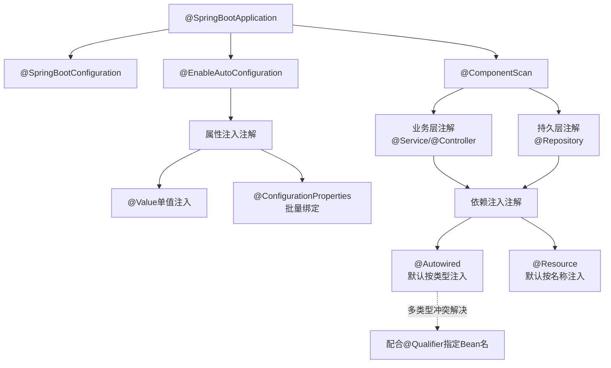
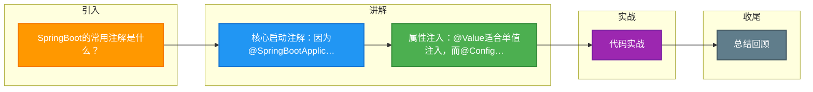

# SpringBoot的常用注解是什么？

### SpringBoot的常用注解是什么？

SpringBoot常用注解大全
1. **@SpringBootApplication**：
用于标识主应用程序类，通常位于项目的顶级包中。这个注解包含了@Configuration、@EnableAutoConfiguration和@ComponentScan。
2. **@Controller**：
用于标识类作为Spring MVC的Controller。
3. **@RestController**：
类似于@Controller，但它是专门用于RESTful Web服务的。它包含了@Controller和@ResponseBody，意味着所有方法返回 JSON 而非视图。
4. **@RequestMapping**：
用于将HTTP请求映射到Controller的处理方法。可以用在类级别和方法级别。支持 GET, POST, PUT, DELETE 等 HTTP 方法属性。
5. **@Autowired**：
用于自动注入Spring容器中的Bean，可以用在构造方法、字段、Setter方法上。建议优先使用构造器注入。
6. **@Service**：
用于标识类作为服务层的Bean。
7. **@Repository**：
用于标识类作为数据访问层的Bean，通常用于与数据库交互。它还能将平台特定的异常转换为 Spring 的统一数据访问异常体系。
8. **@Component**：
通用的组件注解，用于标识任何Spring托管的Bean。
9. **@Configuration**：
用于定义配置类，类中可能包含一些@Bean注解用于定义Bean。相当于传统的 XML 配置文件。
10. **@EnableAutoConfiguration**：
用于启用Spring Boot的自动配置机制，根据项目的依赖和配置自动配置Spring应用程序。
11. **@Value**：
用于从属性文件或配置中读取值，将值注入到成员变量中。支持 SpEL 表达式（如 `#{systemProperties['user.os']}`）。
12. **@Qualifier**：
与@Autowired一起使用，指定注入时使用的Bean名称，用于解决有多个相同类型 Bean 时的冲突。
13. **@ConfigurationProperties**：
用于将配置文件中的属性（如 prefix="spring.datasource"）批量绑定到Java Bean。支持 JSR-303 数据校验。
14. **@Profile**：
用于定义不同环境下的配置，可以标识在类或方法上。只有当激活的环境匹配时，对应的 Bean 才会被注册。
15. **@Async**：
用于将方法标记为异步执行，需配合 `@EnableAsync` 使用。

#### 实战案例
在多数据源切换场景中，曾遇到 `@Autowired` 默认按类型注入导致启动报错（NoUniqueBeanDefinitionException）。通过组合使用 `@Qualifier("dataSourceMaster")` 明确指定注入的 Bean 名称，解决了 Spring 容器中存在多个 DataSource 类型 Bean 时的冲突问题。

#### 代码示例
**配置属性绑定与校验**
```java
@Component
@ConfigurationProperties(prefix = "app.mail")
@Validated // 开启 JSR-303 校验
public class MailProperties {
    @NotBlank(message = "Host cannot be empty")
    private String host;
    
    @Min(1025) @Max(65536)
    private int port;
    // getters and setters
}
```

#### 对比表格：@Autowired vs @Resource

| 特性 | @Autowired | @Resource |
| :--- | :--- | :--- |
| **来源** | Spring 特有注解 | JDK (JSR-250) 标准注解 |
| **注入策略** | 默认按 **类型** (ByType) 匹配；若多个Bean则按 **@Qualifier** 指定名称 | 默认按 **名称** (ByName) 匹配；若未指定名称则按类型；支持 `name` 属性显式指定 |
| **适用场景** | 适用于 Spring 生态通用注入，配合 `@Primary` 或 `@Qualifier` 使用灵活 | 想要直接通过 JNDI 名称注入 Bean，或者不依赖 Spring 特定 API 时使用 |
| **依赖注入位置** | 构造器、方法、字段、参数 | 方法、字段 |

**## 常见考点**
1.  **@SpringBootApplication 的三个核心注解**：
    *   `@SpringBootConfiguration`：标识为配置类。
    *   `@EnableAutoConfiguration`：开启自动配置。
    *   `@ComponentScan`：自动扫描组件（默认扫描当前包及其子包）。
2.  **构造器注入 vs 字段注入**：为什么 Spring 官方推荐构造器注入？（保证依赖不可变、能方便地测试出空指针、避免循环依赖检测复杂化）。
3.  **@Autowired 和 @Resource 的区别**：
    *   `@Autowired` 是 Spring 的注解，默认按类型注入，配合 `@Qualifier` 按名称。
    *   `@Resource` 是 JDK (JSR-250) 注解，默认按名称注入，找不到再按类型。
4.  **@Import 注解的作用**：用于快速导入配置类或普通类到 Spring 容器中，常用于在自定义 Starter 或配置类中批量注册 Bean。

## 流程图




## 记忆要点

- 核心启动注解：因为@SpringBootApplication三合一，所以包含了配置、自动装配和组件扫描。
- 属性注入：@Value适合单值注入，而@ConfigurationProperties适合批量绑定与校验。
- 注入对比：@Autowired是Spring按类型注入，而@Resource是JDK标准默认按名称。

## 结构化回答

**30 秒电梯演讲：** 利用注解声明Bean定义及依赖关系，简化配置。打个比方，给代码贴标签，告诉Spring扫描器这是什么、该怎么用。

**展开框架：**
1. **核心启动注解** — 因为@SpringBootApplication三合一，所以包含了配置、自动装配和组件扫描。
2. **属性注入** — @Value适合单值注入，而@ConfigurationProperties适合批量绑定与校验。
3. **注入对比** — @Autowired是Spring按类型注入，而@Resource是JDK标准默认按名称。

**收尾：** 我在项目里踩过坑——在多数据源切换场景中，曾遇到 `@Autowired` 默认按类型注入导致启动报错（NoUniqueBeanDefinitionException）。您想深入聊哪一段：原理、避坑还是对比选型？

## 视频脚本

> 预计时长：2 分钟 | 由浅入深

| 时间 | 画面/字幕 | 口播台词 | 讲解要点 |
|------|----------|----------|----------|
| 0:00 | 标题卡：SpringBoot的常用注解是什么 | "SpringBoot的常用注解是什么？一句话——给代码贴标签，告诉Spring扫描器这是什么、该怎么用。" | 开场钩子 |
| 0:40 | 概念动画/示意图 | "利用注解声明Bean定义及依赖关系，简化配置——给代码贴标签，告诉Spring扫描器这是什么、该怎么用" | 核心定义 |
| 1:20 | 核心启动注解示意 | "因为@SpringBootApplication三合一，所以包含了配置、自动装配和组件扫描。" | 要点1 |
| 2:00 | 总结卡 | "记住这几条，面试不慌。下期讲进阶追问。" | 收尾 |

### 视频流程图



