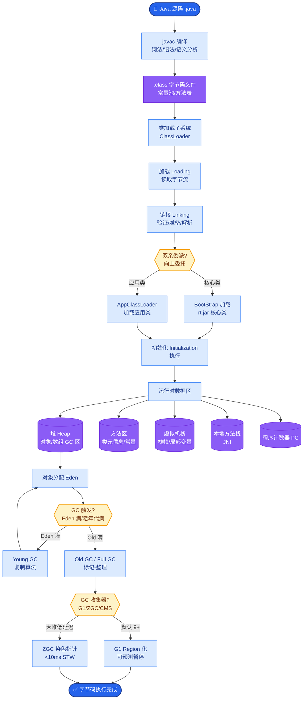
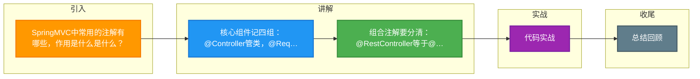

# SpringMVC中常用的注解有哪些，作用是什么是什么？

### SpringMVC中常用的注解有哪些，作用是什么是什么？

1. **@Controller**
@Controller注解在类上，表明这个类是Spring MVC里的Controller，将其声明为Spring的一个 Bean，Dispatcher Servlet会自动扫描注解了此注解的类，并将Web请求映射到注解了 @RequestMapping的方法上。需要注意的是，在Spring MVC声明控制器Bean的时候，只能使用 @Controller。

2. **@RequestMapping**
@RequestMapping注解是用来映射Web请求(访问路径和参数)、处理类和方法的。它可以注解 在类和方法上。注解在方法上的@RequestMapping路径会继承注解在类上的路径。 @RequestMapping支持Servlet的request和response作为参数，也支持对它们的媒体类型进行配置。

**代码示例**：
```java
@Controller // 声明此类是一个控制器
@RequestMapping("/anno") // 映射此类的访问路径是 /anno
public class DemoAnnoController {}
```

**补充常用注解**：
3. **@GetMapping / @PostMapping / @PutMapping / @DeleteMapping**：
    *   `@RequestMapping` 的组合注解，分别对应 HTTP 的 GET, POST, PUT, DELETE 方法，简化配置，使代码意图更清晰。
4. **@RequestParam**：
    *   用于将请求参数绑定到控制器方法的参数上。
    *   **关键细节**：`required` 属性默认为 true，参数缺失会报错；`defaultValue` 可设置默认值。
5. **@PathVariable**：
    *   用于绑定 URL 模板中的变量（如 `/user/{id}`）。
6. **@RequestBody**：
    *   用于读取 Request 请求的 body 部分（通常是 JSON/XML），通过 HttpMessageConverter 解析为 Java 对象。
    *   **关键细节**：一个方法只能有一个 @RequestBody 参数。
7. **@ResponseBody**：
    *   用于将方法的返回值直接写入 HTTP response body 中，通常用于返回 JSON 数据。
8. **@RestController**：
    *   组合注解 = `@Controller` + `@ResponseBody`。

**SpringMVC核心流程**：
1. 用户发送请求至前端控制器DispatcherServlet。
2. DispatcherServlet收到请求调用HandlerMapping处理器映射器。
3. 处理器映射器找到具体的处理器(可以根据xml配置、注解进行查找)，生成处理器对象及处理器拦截器(如果有则生成)一并返回给DispatcherServlet。
4. DispatcherServlet调用HandlerAdapter处理器适配器。
5. HandlerAdapter经过适配调用具体的处理器(Controller，也叫后端控制器)。
6. Controller执行完成返回ModelAndView。
7. HandlerAdapter将controller执行结果ModelAndView返回给DispatcherServlet。
8. DispatcherServlet将ModelAndView传给ViewReslover视图解析器。
9. ViewReslover解析后返回具体View。
10. DispatcherServlet根据View进行渲染视图(即将模型数据填充至视图中)。
11. DispatcherServlet响应用户。

**SpringMVC 核心架构流程图**：

```text
┌─────────────┐
│   Request   │
└──────┬──────┘
       │
       ▼
┌─────────────────────────────────┐
│     DispatcherServlet           │
│      (前端控制器)                │
└──────┬──────────────────────────┘
       │
       ▼
┌───────────
```

**实战案例**：
在高并发场景下，若直接在 Controller 方法参数中使用 `@RequestBody` 接收超大 JSON 文件（如 10MB+），容易导致内存溢出或解析超时。实战中通常结合 `MultipartFile` 进行流式处理或限制请求体大小（`spring.servlet.max-request-size`）。

**代码示例（@RequestParam 与 @PathVariable 混用）**：
```java
@GetMapping("/users/{id}/details")
public User getUserDetail(
    @PathVariable("id") Long userId, 
    @RequestParam(value = "verbose", required = false, defaultValue = "false") boolean isVerbose) {
    // 根据ID查询用户，verbose控制是否返回详细信息
    return userService.findById(userId, isVerbose);
}
```


## 核心流程图



## 记忆要点

- 核心组件记四组：@Controller管类，@RequestMapping管路由，@RequestParam收参数，@PathVariable拿路径。
- 组合注解要分清：@RestController等于@Controller加@ResponseBody，@GetMapping等简化了Method限定。
- 三大取值注解对比：@RequestParam拿问号参数，@PathVariable拿URL斜杠变量，@RequestBody拿请求体JSON并转对象。

## 结构化回答

**30 秒电梯演讲：** 将HTTP请求映射到Java方法的元数据。打个比方，像门牌号和快递员的对应关系，包裹按地址送到具体房间。

**展开框架：**
1. **核心组件记四组** — @Controller管类，@RequestMapping管路由，@RequestParam收参数，@PathVariable拿路径。
2. **组合注解要分清** — @RestController等于@Controller加@ResponseBody，@GetMapping等简化了Method限定。
3. **三大取值注解对比** — @RequestParam拿问号参数，@PathVariable拿URL斜杠变量，@RequestBody拿请求体JSON并转对象。

**收尾：** 我在项目里踩过坑——在高并发场景下，若直接在 Controller 方法参数中使用 `@RequestBody` 接收超大 JSON 文件（如 10MB+），容易导致内存溢出或解析超时。您想深入聊哪一段：原理、避坑还是对比选型？

## 视频脚本

> 预计时长：2 分钟 | 由浅入深

| 时间 | 画面/字幕 | 口播台词 | 讲解要点 |
|------|----------|----------|----------|
| 0:00 | 标题卡：SpringMVC中常用的注解有哪些… | "SpringMVC中常用的注解有哪些，作用是什么是什么？一句话——像门牌号和快递员的对应关系，包裹按地址送到具体房间。" | 开场钩子 |
| 0:40 | 概念动画/示意图 | "将HTTP请求映射到Java方法的元数据——像门牌号和快递员的对应关系，包裹按地址送到具体房间" | 核心定义 |
| 1:20 | 核心组件记四组示意 | "@Controller管类，@RequestMapping管路由，@RequestParam收参数，@PathVariable拿路径。" | 要点1 |
| 2:00 | 总结卡 | "记住这几条，面试不慌。下期讲进阶追问。" | 收尾 |

### 视频流程图



