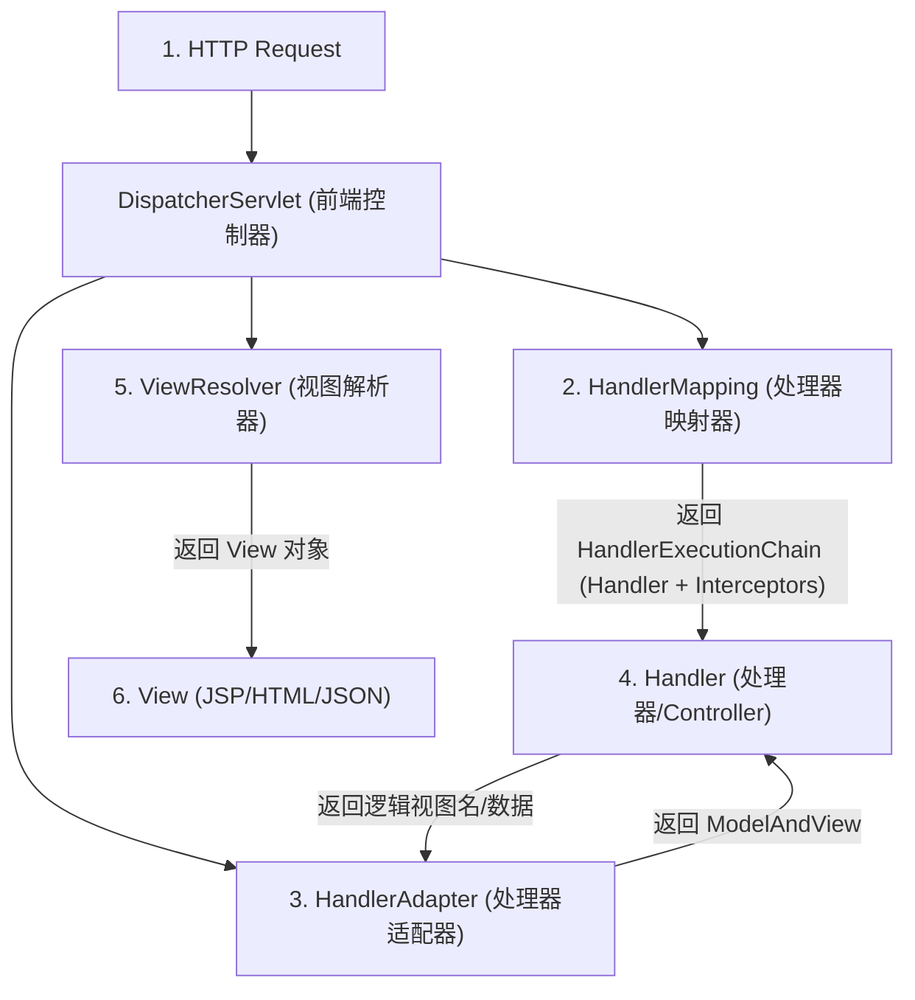

# SpringMVC中的组件有哪些是什么？

### SpringMVC中的组件有哪些是什么？

SpringMVC 的核心组件通过 **DispatcherServlet** 协同工作，典型的请求处理流程如下：



**实战案例**：
在微服务架构中，若HandlerMapping配置不当（如大量模糊匹配的 `/**` 规则），会导致路由查找性能下降。实战中应避免过度使用通配符，并利用 `PathMatchConfigurer` 配置尾部斜杠匹配策略以解决 `GET /api/user` 和 `GET /api/user/` 路由不一致的问题。

**代码示例（自定义拦截器 Interceptor）**：
```java
public class LoginInterceptor implements HandlerInterceptor {
    @Override
    public boolean preHandle(HttpServletRequest request, HttpServletResponse response, Object handler) {
        // 实战：Token 校验逻辑
        String token = request.getHeader("Authorization");
        if (StringUtils.isEmpty(token)) {
            response.setStatus(401);
            return false; // 阻止流程
        }
        return true;
    }
}
```


## 记忆要点

- 核心调度器：DispatcherServlet是唯一前端控制器，统一接收和响应所有请求。
- 三大核心组件：HandlerMapping找控制器，HandlerAdapter执行控制器，ViewResolver解析视图。
- 执行链路要记牢：因为Controller实现多样，所以需HandlerMapping返回执行链，再交HandlerAdapter统一适配执行。

## 结构化回答

**30 秒电梯演讲：** 协作完成请求处理与响应渲染的各部件集合。打个比方，像工厂流水线，各司其职（接单、加工、打包、发货）。

**展开框架：**
1. **核心调度器** — DispatcherServlet是唯一前端控制器，统一接收和响应所有请求。
2. **三大核心组件** — HandlerMapping找控制器，HandlerAdapter执行控制器，ViewResolver解析视图。
3. **执行链路要记牢** — 因为Controller实现多样，所以需HandlerMapping返回执行链，再交HandlerAdapter统一适配执行。

**收尾：** 我在项目里踩过坑——在微服务架构中，若HandlerMapping配置不当（如大量模糊匹配的 `/` 规则），会导致路由查找性能下降。您想深入聊哪一段：原理、避坑还是对比选型？

## 视频脚本

> 预计时长：2 分钟 | 由浅入深

| 时间 | 画面/字幕 | 口播台词 | 讲解要点 |
|------|----------|----------|----------|
| 0:00 | 标题卡：SpringMVC中的组件有哪些是什… | "SpringMVC中的组件有哪些是什么？一句话——像工厂流水线，各司其职（接单、加工、打包、发货）。" | 开场钩子 |
| 0:40 | 概念动画/示意图 | "协作完成请求处理与响应渲染的各部件集合——像工厂流水线，各司其职（接单、加工、打包、发货）" | 核心定义 |
| 1:20 | 核心调度器示意 | "DispatcherServlet是唯一前端控制器，统一接收和响应所有请求。" | 要点1 |
| 2:00 | 总结卡 | "记住这几条，面试不慌。下期讲进阶追问。" | 收尾 |
