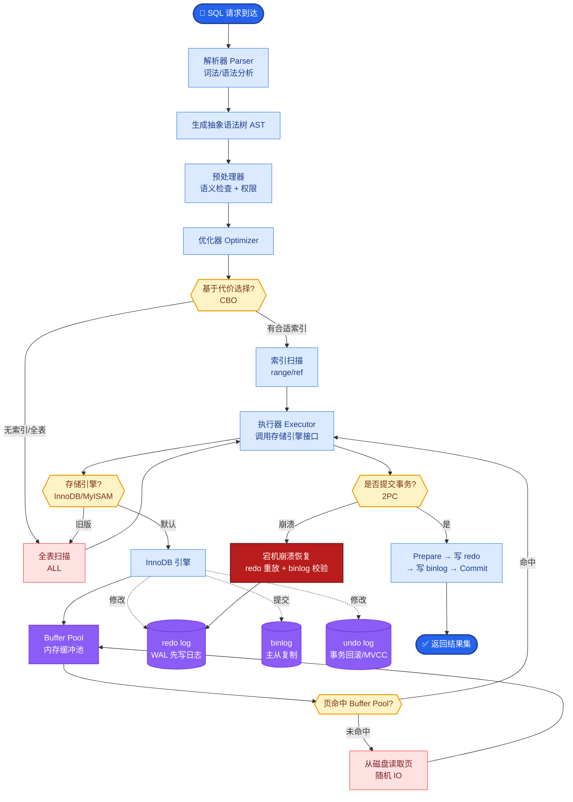

# 为什么需要AOP？

### 为什么需要AOP？

1.  **什么是AOP**
    *   **定义**：AOP (Aspect Orient Programming)，直译过来就是面向切面编程。AOP 是一种编程思想，是面向对象编程（OOP）的一种补充。面向对象编程将程序抽象成各个层次的对象，而面向切面编程是将程序抽象成各个切面。

2.  **为什么需要AOP（核心痛点与解决）**
    *   **OOP 的局限性**：虽然通过封装、继承等机制实现了代码的重用，但是对于分散在各个业务逻辑中的相同公共行为（如日志记录、性能监控、事务管理、安全校验），无法实现完美的复用。这些分散在各个业务逻辑中的公共行为被称为 **横切关注点**。
    *   **代码冗余与耦合**：如果直接在每个业务方法中编写这些重复代码，会导致代码冗余度高、维护困难（修改一处需修改多处），且业务逻辑与公共逻辑强耦合。
    *   **AOP 的解决方案**：AOP 采取的是 **横向抽取** 的机制（相对于 OOP 的纵向继承），将横切关注点从业务逻辑代码中剥离出来，封装成独立的切面。
    *   **实现原理**：通过 **代理模式**，在不修改源代码的情况下，在程序运行期间动态地将增强代码织入到目标方法的特定位置（如前置、后置、异常抛出时）。

**AOP 架构图示**：

```text
业务执行时间轴
│
├─ 方法 A 开始
│  └─ [核心业务逻辑]
│  └─ [日志] <- 传统做法：硬编码
│
├─ 方法 B 开始
│  └─ [核心业务逻辑]
│  └─ [日志] <- 传统做法：硬编码
│
──────────────────────────────────────────────

采用 AOP 后：
│
├─ 方法 A 开始
│  ├─ [核心业务逻辑] ─┐
└────────────────────┤ 动态代理织入
                     ▼
            ┌──────────────────┐
            │   切面           │
            │ 1. @Before 日志  │◀──┐
            │ 2. @After  事务  │   │ 统一管理
            │ 3. @Around 性能  │   │
            └──────────────────┘   │
                     │            │
├─ 方法 B 开始      │            │
│  ├─ [核心业务逻辑]│────────────┘
│  └────────────────┘
```

**AOP 核心术语**：
- **Joinpoint (连接点)**：程序执行的某个特定位置，如方法调用时、异常抛出时。
- **Pointcut (切点)**：匹配连接点的断言，即“在哪些地方执行 AOP 逻辑”。
- **Advice (通知)**：在切点的某个特定位置执行的动作，如 `@Before`, `@After`, `@Around`。
- **Aspect (切面)**：切点和通知的结合。
- **Weaving (织入)**：将切面应用到目标对象并创建代理对象的过程。

## 常见考点

1.  **AOP 的实现原理是什么？**
    *   答：Spring AOP 主要是通过动态代理实现的。如果是接口，使用 JDK 动态代理；如果是类，使用 CGLIB 字节码生成。而 AspectJ 可以通过编译期织入和类加载期织入，更强大但更复杂。
2.  **@Around 环绕通知的执行顺序？**
    *   答：环绕通知拥有最大的控制权，它可以在目标方法前后都执行，甚至决定目标方法是否执行（通过 `ProceedingJoinPoint.proceed()`）。
3.  **AOP 的失效场景？**
    *   答：同类方法调用、private 方法调用、final 方法、static 方法通常无法触发 AOP，因为这些都绕过了代理对象，直接调用目标对象本身的方法。

**实战案例**：
在一个支付系统中，需要记录所有涉及资金变动的接口耗时和异常。使用 `@Around` 切面可以统一捕获异常并记录日志，避免了在每个 Service 方法中手动编写 try-catch，但踩过的坑是：如果切面抛出异常，事务可能会因异常被意外回滚，需谨慎处理异常传播。

**代码示例（自定义注解实现权限控制切面）**：
```java
@Aspect
@Component
public class PermissionCheckAspect {
    @Around("@annotation(requireAuth)")
    public Object checkPermission(ProceedingJoinPoint pjp, RequireAuth requireAuth) throws Throwable {
        // 实战：从上下文获取用户权限
        if (!currentUser.hasRole(requireAuth.value())) {
            throw new AccessDeniedException("无权限访问");
        }
        return pjp.proceed();
    }
}
```


## 核心流程图



## 记忆要点

- 核心痛点：OOP纵向继承无法解决日志、事务等横切关注点的代码冗余，所以需要AOP横向抽取。
- 本质原理：AOP基于动态代理，在不改源码前提下，将公共逻辑动态织入目标方法的特定位置。
- 四大术语与失效：切面是切点与通知的结合；同类内部方法调用或调private会绕过代理导致AOP失效。

## 结构化回答

**30 秒电梯演讲：** 将横跨多个业务逻辑的公共功能剥离出来。打个比方，像给切好的面包片抹果酱，不管面包什么形状，抹酱动作一样。

**展开框架：**
1. **核心痛点** — OOP纵向继承无法解决日志、事务等横切关注点的代码冗余，所以需要AOP横向抽取。
2. **本质原理** — AOP基于动态代理，在不改源码前提下，将公共逻辑动态织入目标方法的特定位置。
3. **四大术语与失效** — 切面是切点与通知的结合；同类内部方法调用或调private会绕过代理导致AOP失效。

**收尾：** 我在项目里踩过坑——在一个支付系统中，需要记录所有涉及资金变动的接口耗时和异常。您想深入聊哪一段：原理、避坑还是对比选型？

## 视频脚本

> 预计时长：2 分钟 | 由浅入深

| 时间 | 画面/字幕 | 口播台词 | 讲解要点 |
|------|----------|----------|----------|
| 0:00 | 标题卡：为什么需要AOP | "为什么需要AOP？一句话——像给切好的面包片抹果酱，不管面包什么形状，抹酱动作一样。" | 开场钩子 |
| 0:40 | 概念动画/示意图 | "将横跨多个业务逻辑的公共功能剥离出来——像给切好的面包片抹果酱，不管面包什么形状，抹酱动作一样" | 核心定义 |
| 1:20 | 核心痛点示意 | "OOP纵向继承无法解决日志、事务等横切关注点的代码冗余，所以需要AOP横向抽取。" | 要点1 |
| 2:00 | 总结卡 | "记住这几条，面试不慌。下期讲进阶追问。" | 收尾 |
