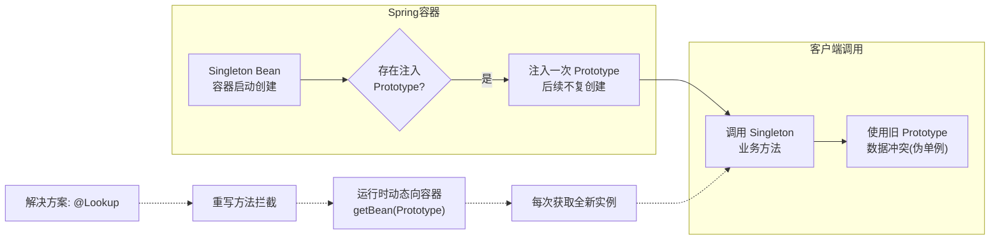

# 什么是prototyoe？

### 什么是prototype？

在 Spring 中，Scope（作用域）决定了 Bean 实例的创建和生命周期策略。除了 Singleton 和 Prototype，还有 request、session、application、websocket 等基于 Web 的作用域。

**Singleton (单例) - 唯一bean实例**

当一个 bean 的作用域为 Singleton，Spring IoC 容器中只会存在一个共享的 bean 实例。所有对该 bean 的请求（只要 id 匹配）都只会返回同一个实例。

*   **特点**：容器启动时（默认情况下）就会自动创建并初始化该 bean 对象（懒加载除外）。
*   **适用场景**：无状态的对象（如 Service、DAO、工具类），因为它们不保存特定用户的会话信息，可以共享。
*   **注意**：Singleton 是 Spring 中的缺省作用域。

**Prototype (原型) - 多例模式**

当一个 bean 的作用域为 Prototype，表示一个 bean 定义对应多个对象实例。每次对该 bean 请求（将其注入到另一个 bean 中，或者以程序的方式调用容器的 `getBean()` 方法）时，容器都会创建一个**全新的** bean 实例。

*   **特点**：容器启动时并不会实例化 Prototype bean，只有在真正获取时才创建。
*   **生命周期管理**：**非常重要**：Spring 容器只负责创建 Prototype Bean，一旦创建完成并交给调用者之后，容器就不再跟踪其生命周期。因此，Prototype Bean 的销毁回调（如 `destroy-method`）不会被执行，必须由客户端代码负责清理资源。
*   **适用场景**：有状态的对象（如持有用户会话信息的对象），每次调用需要独立的副本。

**实战案例**：
在开发命令行工具或批处理任务时，每个任务可能需要独立的 `ReportGenerator` 对象来存储临时的报表数据和进度，避免多线程并发时的数据冲突，此时需将 Scope 设为 Prototype。**踩坑经验**：Prototype Bean 如果被注入到一个 Singleton Bean 中，那个依赖只会注入一次，后续使用该 Singleton Bean 时，里面的 Prototype Bean 还是旧的那个（失效）。解决方法是在 Singleton 中使用 `ApplicationContextAware` 手动 `getBean` 或使用 `@Lookup` 注解。

**代码示例（使用 @Lookup 解决注入失效问题）**：
```java
@Component
public class TaskService {
    // 每次调用 getProcessor() 都会返回一个新的 Prototype Bean
    @Lookup
    public Processor getProcessor() {
        return null; // Spring 会重写此方法
    }
    
    public void execute() {
        Processor p = getProcessor(); // 获取新实例
        p.process();
    }
}
```

**XML配置示例**：
```xml
<!-- Singleton -->
<bean id="ServiceImpl" class="cn.csdn.service.ServiceImpl" scope="singleton">

<!-- Prototype -->
<bean id="ServiceImpl" class="cn.csdn.service.ServiceImpl" scope="prototype">
```

**注解配置示例**：
```java
@Service
@Scope("prototype") // 默认是 singleton
public class ServiceImpl{
}
```

**生命周期对比图**：

```text
Singleton:
容器启动 ──> 实例化 ──> 初始化 ──> [缓存] ──> 每次getBean返回同一个对象 ──> 容器关闭 ──> 销毁

Prototype:
容器启动 ──> (不操作)
用户getBean ──> 实例化 ──> 初始化 ──> 返回新对象 ──> (Spring不再管理) ──> GC回收/JVM结束
```

## 常见考点
1.  **Prototype Bean 在容器关闭时会执行销毁方法吗？**（不会，需要手动处理）
2.  **Singleton Bean 注入 Prototype Bean 会有什么问题？**（Singleton 中的 Prototype 依赖只会被注入一次，变成了“伪单例”，解决方案是使用 `@Lookup` 注解或 `ObjectProvider`）
3.  **如何自定义 Scope？**（实现 `Scope` 接口并注册到容器）

## 流程图




## 记忆要点

- 生命周期对比：Singleton容器启动即创建且管理销毁，Prototype每次获取才新建且不管理销毁。
- 适用场景：无状态对象用Singleton共享，有状态对象用Prototype保证数据独立隔离。
- 单例注入陷阱：因为单例只初始化一次，所以注入的Prototype会退化为伪单例，需用@Lookup动态获取。

## 结构化回答

**30 秒电梯演讲：** 非单例作用域，每次获取Bean都创建新实例。打个比方，像用一次性纸杯，用完即弃，每次用的都是新的。

**展开框架：**
1. **生命周期对比** — Singleton容器启动即创建且管理销毁，Prototype每次获取才新建且不管理销毁。
2. **适用场景** — 无状态对象用Singleton共享，有状态对象用Prototype保证数据独立隔离。
3. **单例注入陷阱** — 因为单例只初始化一次，所以注入的Prototype会退化为伪单例，需用@Lookup动态获取。

**收尾：** 这三点都能配合实战聊。您想深入聊原理、对比还是避坑？

## 视频脚本

> 预计时长：2 分钟 | 由浅入深

| 时间 | 画面/字幕 | 口播台词 | 讲解要点 |
|------|----------|----------|----------|
| 0:00 | 标题卡：什么是prototyoe | "什么是prototyoe？一句话——像用一次性纸杯，用完即弃，每次用的都是新的。" | 开场钩子 |
| 0:40 | 概念动画/示意图 | "非单例作用域，每次获取Bean都创建新实例——像用一次性纸杯，用完即弃，每次用的都是新的" | 核心定义 |
| 1:20 | 生命周期对比示意 | "Singleton容器启动即创建且管理销毁，Prototype每次获取才新建且不管理销毁。" | 要点1 |
| 2:00 | 总结卡 | "记住这几条，面试不慌。下期讲进阶追问。" | 收尾 |
