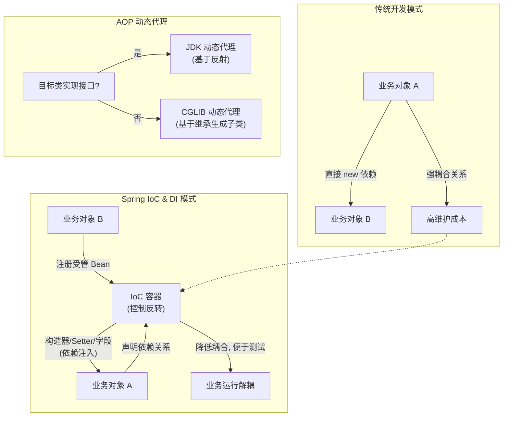

# 介绍一下Spring中的IOC和DI？

### IOC (Inversion of Control)

**1. 什么是IOC**
IOC 即控制反转，不是一种技术，而是一种设计思想。在 Java 开发中，IOC 意味着将你设计好的对象交给容器控制，而不是在对象内部直接控制（如直接 `new` 对象）。

*   **传统方式**：对象由程序本身（如 main 方法或业务类）主动创建和管理。
*   **IOC 方式**：对象由 Spring 容器创建、组装和管理。控制权从程序代码转移到了外部容器，因此称为“控制反转”。

**2. IOC的好处**
使用 IOC 后，我们不需要自己去创建某个类的实例，而由 IOC 容器去创建。当我们需要使用某个对象时，直接到容器中获取即可。这大大降低了对象之间的耦合度（依赖关系由容器管理），便于维护和测试（可以轻松替换依赖实现）。

**3. 什么是DI (Dependency Injection)**
DI（依赖注入）是 IOC 设计的具体实现模式。IOC 容器在创建 Bean 的时候，去读取配置文件或注解，将对象所依赖的属性自动注入进来。

*   **依赖注入方式对比**：

| 方式 | 语法 | 优点 | 缺点 | 适用场景 |
| :--- | :--- | :--- | :--- | :--- |
| **构造器注入** | 构造函数 | 依赖不可变，保证对象初始化完全；无 NPE 风险 | 参数过多时代码臃肿 | 强依赖、必须的依赖 |
| **Setter 注入** | Setter 方法 | 灵活，可选依赖；支持重新注入 | 依赖可为空，对象可能处于不完整状态 | 可选依赖、需要动态变更 |
| **字段注入** | `@Autowired` 字段 | 代码简洁，写法快 | 破坏封装，无法单元测试（Mock 困难）；容易 NPE | 仅用于 Spring 管理的代码，不推荐 |

**实战案例**：
在微服务架构中，不同环境可能连接不同的数据源。通过构造器注入 `DataSource`，我们可以轻松在单元测试中 Mock 一个内存数据库进行测试，而无需修改业务代码。**踩坑经验**：字段注入（`@Autowired` 直接写在字段上）虽然方便，但会导致类在不通过 Spring 容器实例化时（如普通 `new` 或工具类反射），依赖对象为 null，难以排查空指针异常；且无法将该类标记为 `final`，影响不可变性设计。

**代码示例（推荐：构造器注入 + Lombok 简化）**：
```java
@Service
@RequiredArgsConstructor // Lombok 生成包含所有 final 字段的构造函数
public class UserService {
    private final UserRepository userRepository; // 强依赖
    
    @Autowired
    private EmailService emailService; // 可选依赖（混合使用不推荐，此处演示区别）
}
```

**IOC 与 DI 的关系**：IOC 是设计思想，DI 是实现这种思想的具体手段。DI 不能脱离 IOC 存在。

**原答案补充：Spring AOP 代理机制**

Spring AOP 主要通过动态代理实现，有两种方式：
1.  **JDK 动态代理**：针对**接口**代理。核心是 `InvocationHandler` 接口和 `Proxy` 类，通过反射调用目标代码。要求目标类必须实现接口。
2.  **CGLIB 动态代理**：针对**类**代理。通过继承（字节码生成）方式生成子类，覆盖方法并增强。如果类被标记为 `final`，则无法使用 CGLIB 代理。
    *   *注意*：Spring Boot 2.x 之后默认倾向于使用 CGLIB（若配置了 `spring.aop.proxy-target-class=true` 或未实现接口）。

## 常见考点
1.  **IOC 和 DI 的区别是什么？**（思想 vs 实现）
2.  **依赖注入的三种方式及优缺点？**（构造器注入推荐理由）
3.  **JDK 动态代理和 CGLIB 动态代理的区别？**（接口 vs 类继承、性能差异）
4.  **Spring 是如何解决循环依赖的？**（三级缓存，构造器循环依赖无法解决）

## 流程图



## 核心知识点图


## 记忆要点

- 思想与实现：IoC是控制反转的设计思想，DI依赖注入是其具体的代码实现方式。
- 注入方式对比：构造器注入（推荐，不可变防NPE），Setter注入（可选灵活），字段注入（极不推荐）。
- 代理机制区分：JDK动态代理基于接口反射，CGLIB基于继承生成子类，SpringBoot 2.x默认倾向CGLIB。

## 结构化回答

**30 秒电梯演讲：** 将对象的创建和管理权交给容器，实现解耦。打个比方，就像去餐厅点菜，你只需要点菜（声明依赖），做菜（创建对象）交给厨师（容器）。

**展开框架：**
1. **思想与实现** — IoC是控制反转的设计思想，DI依赖注入是其具体的代码实现方式。
2. **注入方式对比** — 构造器注入（推荐，不可变防NPE），Setter注入（可选灵活），字段注入（极不推荐）。
3. **代理机制区分** — JDK动态代理基于接口反射，CGLIB基于继承生成子类，SpringBoot 2.x默认倾向CGLIB。

**收尾：** 这三点都能配合实战聊。您想深入聊原理、对比还是避坑？

## 视频脚本

> 预计时长：2 分钟 | 由浅入深

| 时间 | 画面/字幕 | 口播台词 | 讲解要点 |
|------|----------|----------|----------|
| 0:00 | 标题卡：介绍一下Spring中的IOC和DI | "介绍一下Spring中的IOC和DI？一句话——就像去餐厅点菜，你只需要点菜（声明依赖），做菜（创建对象）交给厨师（容器）。" | 开场钩子 |
| 0:40 | 概念动画/示意图 | "将对象的创建和管理权交给容器，实现解耦——就像去餐厅点菜，你只需要点菜（声明依赖），做菜（创建对象）交给厨师（容器）" | 核心定义 |
| 1:20 | 思想与实现示意 | "IoC是控制反转的设计思想，DI依赖注入是其具体的代码实现方式。" | 要点1 |
| 2:00 | 总结卡 | "记住这几条，面试不慌。下期讲进阶追问。" | 收尾 |
