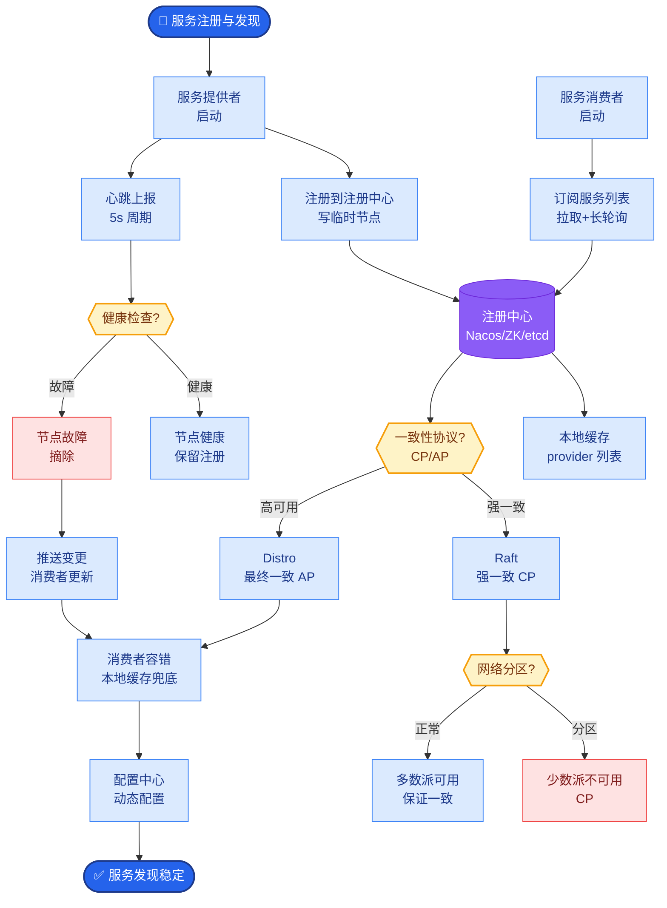
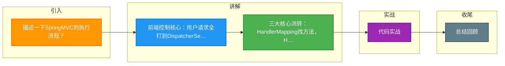

# 描述一下SpringMVC的执行流程？

### SpringMVC 执行流程

Spring MVC 的核心组件是 `DispatcherServlet`，它是整个流程的调度中心（前端控制器）。执行流程如下：

1.  **请求发送**：用户发送请求至前端控制器 `DispatcherServlet`。
2.  **处理器映射**：`DispatcherServlet` 调用 `HandlerMapping`，根据请求 URL（或其他条件）查找具体的 `Handler`（即 Controller 方法）。
3.  **处理器适配**：`DispatcherServlet` 调用 `HandlerAdapter`，去执行找到的 `Handler`。之所以需要 Adapter，是因为 Controller 的实现方式多种多样（接口、注解等），Adapter 统一了调用方式。
4.  **业务处理**：`Handler` 执行具体的业务逻辑，返回一个 `ModelAndView` 对象（包含模型数据和视图名称）或直接返回数据（如 `@ResponseBody`）。
5.  **视图解析**：`DispatcherServlet` 调用 `ViewResolver`，根据逻辑视图名解析成真正的物理视图（View 对象）。
6.  **视图渲染**：`DispatcherServlet` 调用 `View` 的渲染方法，将模型数据填充到视图中（如 JSP、HTML 模板）。
7.  **响应返回**：`DispatcherServlet` 将渲染后的页面响应给用户。

**组件架构图**：

```text
Request ──> DispatcherServlet (大管家)
               │
               ├─> HandlerMapping (寻找执行链：Handler + Interceptor)
               │       │
               │       └──> 返回 HandlerExecutionChain
               │
               ├─> HandlerAdapter (适配执行)
               │       │
               │       └──> Controller (执行业务逻辑) ──> ModelAndView
               │
               ├─> ViewResolver (解析视图)
               │       │
               │       └──> View
               │
               └─> View (渲染模型数据)
                       │
                       └──> Response (HTML/JSON)
```

**实战案例**：
在做接口鉴权时，我们可以自定义拦截器 `HandlerInterceptor`，在 `preHandle` 方法中校验 Token。如果校验失败，直接返回 `false` 并写入响应，后续流程不再执行。**踩坑经验**：如果 `HandlerInterceptor` 的 `preHandle` 返回 true 但 `postHandle` 抛出异常，可能会导致视图渲染失败或未捕获异常。对于 RESTful API，通常建议使用 `@ControllerAdvice` + `@ExceptionHandler` 进行全局异常处理，而不是依赖拦截器处理异常。

**代码示例（自定义拦截器）**：
```javanpublic class LoginInterceptor implements HandlerInterceptor {
    @Override
    public boolean preHandle(HttpServletRequest request, HttpServletResponse response, Object handler) {
        // 校验用户登录状态
        if (request.getSession().getAttribute("user") == null) {
            response.sendRedirect("/login");
            return false; // 中断流程
        }
        return true; // 继续流程
    }
}
```

**原答案勘误：事务隔离级别与脏读/幻读**

*原答案中关于事务隔离级别和并发问题的描述属于数据库事务范畴，虽非 MVC 流程直接内容，但为了保证知识库质量，修正如下：*

*   **脏读**：读到了未提交的数据。
*   **不可重复读**：同一事务内两次读取数据不一致（被修改了）。
*   **幻读**：同一事务内，前后查询得到的记录数不一致（被增删了）。
*   **隔离级别**：Read Uncommitted（读未提交）、Read Committed（读已提交，防脏读）、Repeatable Read（可重复读，防脏读+不可重复读）、Serializable（串行化，防所有并发问题）。

## 常见考点
1.  **DispatcherServlet 的作用是什么？**
2.  **什么是 HandlerAdapter？为什么要用它？**（解耦，支持多种 Controller 类型）
3.  **SpringMVC 如何处理静态资源？**（`<mvc:default-servlet-handler/>` 或 WebJars）
4.  **@RestController 和 @Controller 的区别？**（自动序列化为 JSON vs 返回视图）


## 核心流程图



## 记忆要点

- 前端控制核心：用户请求全打到DispatcherServlet，由它统筹分配并最终响应。
- 三大核心流转：HandlerMapping找方法，HandlerAdapter执行业务返回ModelAndView，ViewResolver解析视图。
- RESTful简化：若方法标注@ResponseBody，则跳过ViewResolver视图渲染，直接经转换器将结果转JSON响应。

## 结构化回答

**30 秒电梯演讲：** 通过前端控制器统一调度请求处理。打个比方，像公司的前台（DispatcherServlet），负责接听电话，转接给对应部门（Handler），最后再回复客户。

**展开框架：**
1. **前端控制核心** — 用户请求全打到DispatcherServlet，由它统筹分配并最终响应。
2. **三大核心流转** — HandlerMapping找方法，HandlerAdapter执行业务返回ModelAndView，ViewResolver解析视图。
3. **RESTful简化** — 若方法标注@ResponseBody，则跳过ViewResolver视图渲染，直接经转换器将结果转JSON响应。

**收尾：** 这三点都能配合实战聊。您想深入聊原理、对比还是避坑？

## 视频脚本

> 预计时长：2 分钟 | 由浅入深

| 时间 | 画面/字幕 | 口播台词 | 讲解要点 |
|------|----------|----------|----------|
| 0:00 | 标题卡：描述一下SpringMVC的执行流程 | "描述一下SpringMVC的执行流程？一句话——像公司的前台（DispatcherServlet），负责接听电话，转接给对应部门（Handler），最后再回复客户。" | 开场钩子 |
| 0:40 | 概念动画/示意图 | "通过前端控制器统一调度请求处理——像公司的前台（DispatcherServlet），负责接听电话，转接给对应部门（Handler），最后再回复客户" | 核心定义 |
| 1:20 | 前端控制核心示意 | "用户请求全打到DispatcherServlet，由它统筹分配并最终响应。" | 要点1 |
| 2:00 | 总结卡 | "记住这几条，面试不慌。下期讲进阶追问。" | 收尾 |

### 视频流程图



