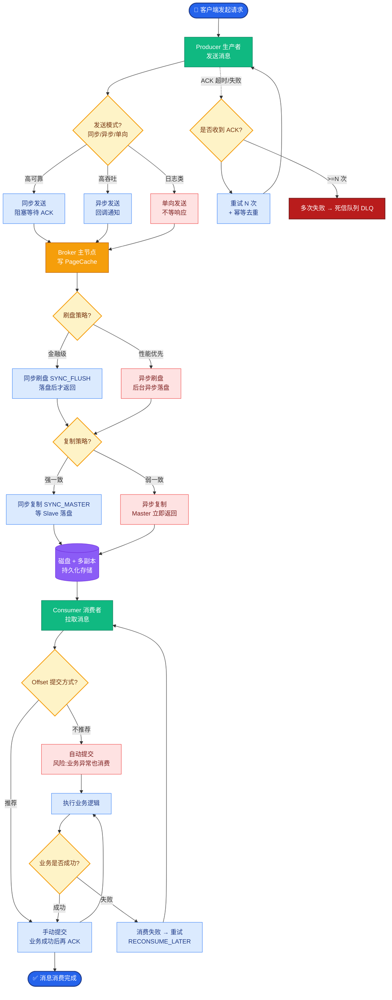

# ApplicationContext Bean生命周期是什么？

### ApplicationContext Bean 生命周期

在 ApplicationContext 容器中，Bean 的生命周期流程如下（仅针对 Singleton 且非懒加载的 Bean）：

1.  **实例化**：容器扫描 BeanDefinition，通过构造器反射实例化 Bean 对象。
2.  **属性赋值**：注入 Bean 的属性值和依赖的 Bean（如 `@Autowired`）。
3.  **BeanNameAware**：如果 Bean 实现了该接口，调用 `setBeanName()` 传入 Bean 的 ID。
4.  **BeanFactoryAware**：如果 Bean 实现了该接口，调用 `setBeanFactory()` 传入 BeanFactory 容器实例。
5.  **ApplicationContextAware**：如果 Bean 实现了该接口，调用 `setApplicationContext()` 传入 ApplicationContext 容器实例。
6.  **BeanPostProcessor (Before)**：调用所有注册的 `BeanPostProcessor` 的 `postProcessBeforeInitialization()` 方法。
7.  **InitializingBean**：如果 Bean 实现了该接口，调用 `afterPropertiesSet()` 方法。
8.  **init-method**：如果在配置中定义了 `init-method`（或 `@PostConstruct`），则执行指定的初始化方法。
9.  **BeanPostProcessor (After)**：调用所有注册的 `BeanPostProcessor` 的 `postProcessAfterInitialization()` 方法（此处是 AOP 代理生成的关键节点）。此时 Bean 已经就绪，可以被使用了。
10. **使用 Bean**：应用从容器中获取 Bean 进行使用。
11. **DisposableBean**：容器关闭时，如果 Bean 实现了该接口，调用 `destroy()` 方法。
12. **destroy-method**：如果在配置中定义了 `destroy-method`（或 `@PreDestroy`），则执行指定的销毁方法。

**生命周期流程图：**

```text
┌──────────────┐
│ 1. 实例化      │ BeanDefinition -> 构造器
└──────┬───────┘
       ↓
┌──────────────┐
│ 2. 属性赋值      │ Setter/Field 注入
└──────┬───────┘
       ↓
┌──────────────┐
│ 3-5. Aware接口 │ (BeanName, BeanFactory, ApplicationContext)
└──────┬───────┘
       ↓
┌──────────────┐
│ 6. 初始化前      │ BeanPostProcessor.postProcessBeforeInitialization
└──────┬───────┘
       ↓
┌──────────────┐
│ 7-8. 初始化      │ InitializingBean.afterPropertiesSet / @PostConstruct
└──────┬───────┘
       ↓
┌──────────────┐
│ 9. 初始化后      │ BeanPostProcessor.postProcessAfterInitialization (AOP 代理)
└──────┬───────┘
       ↓
┌──────────────┐
│ 10. 使用       │ 处于就绪状态
└──────┬───────┘
       ↓ (容器关闭)
┌──────────────┐
│ 11-12. 销毁     │ DisposableBean.destroy / @PreDestroy
└──────────────┘
```

**实战案例**：
在开发中，常利用 `BeanPostProcessor` 在第9步解决循环依赖的早期引用暴露问题，或者通过实现 `InitializingBean` 接口校验关键配置（如连接池参数）是否缺失，避免在运行时才报错。例如，在 RocketMQ 客户端 Bean 初始化时，必须检查 `namesrvAddr` 是否已注入，否则抛出异常阻断启动。

**代码示例**：
```java
@Component
public class ConfigValidator implements InitializingBean {
    @Value("${app.api-key}")
    private String apiKey;

    @Override
    public void afterPropertiesSet() throws Exception {
        if (StringUtils.isEmpty(apiKey)) {
            throw new IllegalStateException("api-key 未配置，服务启动中止");
        }
    }
}
```

**注**：对于 Prototype 作用域的 Bean，容器只负责创建和初始化，不管理销毁过程。

## 常见考点
1.  **BeanPostProcessor 和 BeanFactoryPostProcessor 的区别？**（前者针对 Bean 实例化前后，后者针对 BeanDefinition 定义阶段）
2.  **循环依赖是**


## 核心流程图



## 记忆要点

- 核心口诀：实例化 -> 属性赋值 -> Aware接口 -> 前置处理 -> 初始化 -> 后置处理 -> 使用 -> 销毁
- Aware回调阶段：依次注入BeanName、BeanFactory、ApplicationContext底层组件
- 初始化顺序：BeanPostProcessor前置 -> InitializingBean -> init-method/@PostConstruct
- 关键考点：AOP动态代理发生在BeanPostProcessor的后置处理阶段
- 销毁顺序：与初始化同理，先DisposableBean后destroy-method/@PreDestroy

## 结构化回答

**30 秒电梯演讲：** Bean从创建到销毁的完整管理过程。打个比方，像员工入职：招聘（实例化）、培训（初始化）、上岗（使用）、离职（销毁）。

**展开框架：**
1. **核心口诀** — 实例化 -> 属性赋值 -> Aware接口 -> 前置处理 -> 初始化 -> 后置处理 -> 使用 -> 销毁
2. **Aware回调阶段** — 依次注入BeanName、BeanFactory、ApplicationContext底层组件
3. **初始化顺序** — BeanPostProcessor前置 -> InitializingBean -> init-method/@PostConstruct

**收尾：** 我在项目里踩过坑——在开发中，常利用 `BeanPostProcessor` 在第9步解决循环依赖的早期引用暴露问题，或者通过实现 `InitializingBean` 接口校验关键配置（如连接池参数）是否缺失，避免在运行时才报错。您想深入聊哪一段：原理、避坑还是对比选型？

## 视频脚本

> 预计时长：3 分钟 | 由浅入深

| 时间 | 画面/字幕 | 口播台词 | 讲解要点 |
|------|----------|----------|----------|
| 0:00 | 标题卡：ApplicationContext… | "ApplicationContext Bean生命周期是什么？一句话——像员工入职：招聘（实例化）、培训（初始化）、上岗（使用）、离职（销毁）。" | 开场钩子 |
| 0:45 | 概念动画/示意图 | "Bean从创建到销毁的完整管理过程——像员工入职：招聘（实例化）、培训（初始化）、上岗（使用）、离职（销毁）" | 核心定义 |
| 1:30 | 核心口诀示意 | "实例化 -> 属性赋值 -> Aware接口 -> 前置处理 -> 初始化 -> 后置处理 -> 使用 -> 销毁" | 要点1 |
| 2:15 | Aware回调阶段示意 | "依次注入BeanName、BeanFactory、ApplicationContext底层组件" | 要点2 |
| 3:00 | 总结卡 | "记住这几条，面试不慌。下期讲进阶追问。" | 收尾 |
