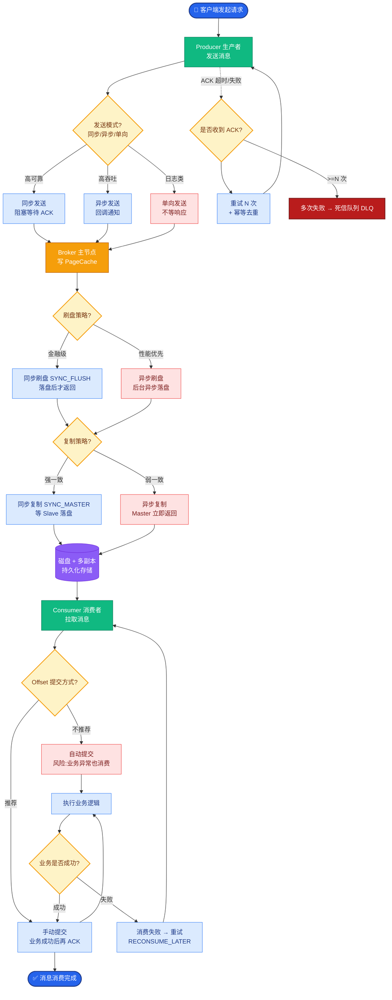

# MyBatis的一级缓存和二级缓存原理是什么？

### MyBatis 一级缓存和二级缓存原理

**1. 一级缓存 (SqlSession 级别)**
*   **原理**：基于 `SqlSession`，默认开启。MyBatis 在执行查询时，先查询缓存（底层是 Map 结构）。Key 由 Mapper ID + SQL 语句 + 参数等组成。
*   **机制**：同一个 SqlSession 中执行相同的 SQL，直接从缓存取。如果期间执行了 `commit`（增删改操作），缓存会被清空，以防止脏读。

**2. 二级缓存 (Mapper/Namespace 级别)**
*   **原理**：基于 `Mapper` 的命名空间，跨 SqlSession 共享。默认不开启，需要配置。
*   **机制**：通过 `CacheExecutor` 装饰器实现。多个 SqlSession 操作同一个 Mapper 时，可以共享二级缓存中的数据。当 Mapper 命名空间下的 SqlSession 执行了 `commit` 操作后，该命名空间下的二级缓存会被清空。

**二级缓存执行流程图：**

```text
SqlSession1 (查询)              SqlSession2 (查询)
     │                              │
     ▼                              ▼
┌─────────────────┐        ┌─────────────────┐
│ 1. 查询二级缓存 │──Miss──▶│ 1. 查询二级缓存 │──Hit──▶ 直接返回
└────────┬────────┘        └─────────────────┘
         │ Miss
         ▼
┌─────────────────┐
│ 2. 查询一级缓存 │
└────────┬────────┘
         │ Miss
         ▼
┌─────────────────┐
│ 3. 数据库查询   │
└────────┬────────┘
         │
         ▼
┌─────────────────┐
│ 4. 结果写入     │
│    (L1 + L2)    │
└─────────────────┘
```

**实战案例**：
在一个订单系统中，如果在一个 Service 方法内先查询订单，随后更新了订单状态，一级缓存会在更新后自动清空，保证下次查询读到最新数据。但如果是跨 Service 方法调用且没有事务，可能会读取到过期的一级缓存数据，导致数据不一致。此外，开启二级缓存时，若多表联合查询涉及多个 Mapper，需非常小心脏读问题。

**代码示例**：
```xml
<!-- Mapper.xml 中开启二级缓存 -->
<cache eviction="LRU" flushInterval="60000" size="512" readOnly="true"/>

<!-- 查询语句指定不使用二级缓存（针对易变数据） -->
<select id="selectHotItems" resultType="Item" useCache="false">
    SELECT * FROM items WHERE status = 1
</select>
```

**补充关键细节：**
*   **一级缓存的数据结构**：一级缓存实际上是 `BaseExecutor` 中的一个属性，类型为 `PerpetualCache`，内部维护了一个 `HashMap<Object, Object>`。Key 是 `CacheKey` 对象，Value 是查询结果对象。
*   **一级缓存失效的边界条件**：除了 `commit`/`rollback`/`close` 之外，手动调用 `sqlSession.clearCache()` 也会清空缓存。此外，如果 SqlSession 配置了 `flushCache=true`，查询也会先清空缓存。
*   **二级缓存的装饰器模式**：MyBatis 的二级缓存实现使用了装饰器模式，核心实现是 `PerpetualCache`，然后可以根据配置叠加 LRU、FIFO、Soft/Weak 引用等装饰器，以及 Logging、Scheduled 等装饰器。
*   **二级缓存的使用条件**：
    1.  全局配置 `cacheEnabled=true`。
    2.  在 Mapper XML 中配置 `<cache />` 标签。
    3.  POJO 对象必须实现 `Serializable` 接口（因为缓存可能存储在磁盘或分布式内存中）。

## 常见考点
1.  **Spring 整合后一级缓存失效**：在 Spring + MyBatis 整合环境下，如果没有事务管理，每次查询可能都是新的 SqlSession，导致一级缓存无法复用。只有在同一个 `@Transactional` 方法内，SqlSession 才是共享的。
2.  **二级缓存的脏读问题**：如果多表关联查询，且涉及多个 Mapper Namespace，只有其中一个 Namespace 更新了数据，可能会导致其他 Namespace 的二级缓存数据不一致（脏读）。解决方法是使用 `<cache-ref>` 引用同一个缓存或禁用二级缓存。
3.  **CacheKey 的构成**：它是如何生成的？通常包含：MappedStatement ID、Offset（分页偏移）、Limit（分页大小）、SQL 语句本身、以及所有的查询参数。


## 核心流程图



## 记忆要点

- 一级缓存：SqlSession级别，默认开启，底层是HashMap，Session关闭即销毁
- 二级缓存：Mapper(Namespace)级别，需手动开启，跨SqlSession共享数据
- 失效机制：执行增删改commit后会清空缓存，防止脏读
- 查询顺序：先查二级 -> 再查一级 -> 最后查数据库
- Spring整合坑：无事务环境下每次查询新建SqlSession，导致一级缓存失效

## 结构化回答

**30 秒电梯演讲：** 通过缓存减少数据库查询次数，提升性能。打个比方，一级缓存是草稿纸（本次会话有效），二级缓存是公共笔记本（多人共享）。

**展开框架：**
1. **一级缓存** — SqlSession级别，默认开启，底层是HashMap，Session关闭即销毁
2. **二级缓存** — Mapper(Namespace)级别，需手动开启，跨SqlSession共享数据
3. **失效机制** — 执行增删改commit后会清空缓存，防止脏读

**收尾：** 我在项目里踩过坑——在一个订单系统中，如果在一个 Service 方法内先查询订单，随后更新了订单状态，一级缓存会在更新后自动清空，保证下次查询读到最新数据。您想深入聊哪一段：原理、避坑还是对比选型？

## 视频脚本

> 预计时长：3 分钟 | 由浅入深

| 时间 | 画面/字幕 | 口播台词 | 讲解要点 |
|------|----------|----------|----------|
| 0:00 | 标题卡：MyBatis的一级缓存和二级缓存原… | "MyBatis的一级缓存和二级缓存原理是什么？一句话——一级缓存是草稿纸（本次会话有效），二级缓存是公共笔记本（多人共享）。" | 开场钩子 |
| 0:45 | 概念动画/示意图 | "通过缓存减少数据库查询次数，提升性能——一级缓存是草稿纸（本次会话有效），二级缓存是公共笔记本（多人共享）" | 核心定义 |
| 1:30 | 一级缓存示意 | "SqlSession级别，默认开启，底层是HashMap，Session关闭即销毁" | 要点1 |
| 2:15 | 二级缓存示意 | "Mapper(Namespace)级别，需手动开启，跨SqlSession共享数据" | 要点2 |
| 3:00 | 总结卡 | "记住这几条，面试不慌。下期讲进阶追问。" | 收尾 |
